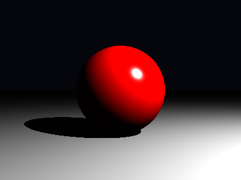

# INF2608 — Fundamentos da Computação Gráfica (2026.1) — PUC-Rio

> **Aluno:** Yang Miranda

## 📋 Visão Geral

Este repositório implementa um **renderizador de traçado de raios** utilizando raios geométricos para simular a propagação da luz em uma cena digital. A implementação segue os conceitos teóricos apresentados nas aulas do Prof. Waldemar Celes, com modelagem de câmera pinhole, geometria de esferas e planos, modelo de iluminação de Phong com sombras e suporte a transformações afins por instanciação.

O pipeline principal segue a sequência **pixel → câmera → raio → interseção → material → iluminação**, produzindo uma imagem 2D salva como [render_final.png](render_final.png).

## 🔗 Navegação Rápida

- [Resultado Atual](#-resultado-atual)
- [Setup e Execução](#-setup-e-execução)
- [Estrutura do Projeto](#-estrutura-do-projeto)
- [Pipeline de Execução](#-pipeline-de-execução)
- [Teoria e Implementação](#-teoria-e-implementação)
- [Correções Técnicas Já Aplicadas](#-correções-técnicas-já-aplicadas)
- [Materiais de Apoio](#-materiais-de-apoio)
- [Próximos Passos](#-próximos-passos)
- [Observações Finais](#-observações-finais)

## 🖼️ Resultado Atual



A cena atual, definida em [src/main.py](src/main.py), contém uma esfera vermelha iluminada por uma luz pontual e renderizada sobre um fundo escuro.

## 🚀 Setup e Execução

### Opção 1: ambiente com asdf

Se você já utiliza [asdf](https://asdf-vm.com/), este é o fluxo sugerido para reproduzir o ambiente do projeto:

```bash
asdf plugin add python
asdf install python 3.13.9
asdf local python 3.13.9
python -m venv .venv
source .venv/bin/activate
pip install --upgrade pip
pip install -r requirements.txt
```

### Opção 2: qualquer ambiente Python 3.13+

Se preferir, qualquer instalação compatível de Python 3.13 ou superior também funciona:

```bash
python3 -m venv .venv
source .venv/bin/activate
pip install --upgrade pip
pip install -r requirements.txt
```

As dependências estão listadas em [requirements.txt](requirements.txt).

### Executar a renderização

```bash
python src/main.py
```

O programa salva a imagem final em [render_final.png](render_final.png).

## 🧱 Estrutura do Projeto

| Arquivo                            | Papel no renderizador                                                                                 |
| ---------------------------------- | ----------------------------------------------------------------------------------------------------- |
| [src/main.py](src/main.py)         | ponto de entrada; monta câmera, cena, material, esfera e luz; percorre os pixels; salva a imagem      |
| [src/camera.py](src/camera.py)     | implementa a câmera pinhole e a geração de raios primários                                            |
| [src/ray.py](src/ray.py)           | define a estrutura básica de um raio com origem e direção normalizada                                 |
| [src/scene.py](src/scene.py)       | gerencia objetos, luzes e o traçado de um raio na cena                                                |
| [src/shape.py](src/shape.py)       | implementa `Shape`, `Sphere`, `Plane` e `Instance`                                                    |
| [src/hit.py](src/hit.py)           | armazena os dados de interseção mais próxima                                                          |
| [src/material.py](src/material.py) | define `Material` e `PhongMaterial`                                                                   |
| [src/light.py](src/light.py)       | define `Light` e `PointLight`                                                                         |
| [src/film.py](src/film.py)         | encapsula um buffer de pixels em ponto flutuante; existe na base, mas ainda não é usado por `main.py` |

## 🔄 Pipeline de Execução

1. [src/main.py](src/main.py) define resolução, câmera, objetos, material e luz.
2. Para cada pixel, [src/camera.py](src/camera.py) calcula um raio primário com `generate_ray`.
3. [src/scene.py](src/scene.py) procura a interseção visível mais próxima usando `compute_intersection`.
4. [src/shape.py](src/shape.py) resolve a geometria do raio com esfera, plano ou instância transformada.
5. [src/material.py](src/material.py) avalia a cor local com o modelo de Phong.
6. [src/light.py](src/light.py) fornece posição e potência da fonte luminosa.
7. [src/main.py](src/main.py) converte a cor para `uint8` e salva o resultado como PNG.

## 🧭 Matriz de Rastreabilidade

| Conceito                      | Implementação principal                                          | Slides                                                                                                  |
| ----------------------------- | ---------------------------------------------------------------- | ------------------------------------------------------------------------------------------------------- |
| Câmera pinhole                | [src/camera.py](src/camera.py)                                   | [4.tracado_de_raios.pdf](materiais/traçado_de_raios/4.tracado_de_raios.pdf#page=14), pág. 14            |
| Geração de raios primários    | [src/camera.py](src/camera.py), [src/ray.py](src/ray.py)         | [4.tracado_de_raios.pdf](materiais/traçado_de_raios/4.tracado_de_raios.pdf#page=25), págs. 25–29        |
| Interseção com esfera         | [src/shape.py](src/shape.py)                                     | [4.tracado_de_raios.pdf](materiais/traçado_de_raios/4.tracado_de_raios.pdf#page=15), págs. 15–18        |
| Interseção com plano          | [src/shape.py](src/shape.py)                                     | [4.tracado_de_raios.pdf](materiais/traçado_de_raios/4.tracado_de_raios.pdf#page=11), págs. 11–12        |
| Estrutura de hit              | [src/hit.py](src/hit.py)                                         | [4.tracado_de_raios.pdf](materiais/traçado_de_raios/4.tracado_de_raios.pdf#page=5), págs. 5–6           |
| Traçado do raio na cena       | [src/scene.py](src/scene.py)                                     | [4.tracado_de_raios.pdf](materiais/traçado_de_raios/4.tracado_de_raios.pdf#page=35), págs. 35, 47–48    |
| Phong local                   | [src/material.py](src/material.py)                               | [4.tracado_de_raios.pdf](materiais/traçado_de_raios/4.tracado_de_raios.pdf#page=42), págs. 42–43, 49    |
| Sombras                       | [src/material.py](src/material.py), [src/scene.py](src/scene.py) | [4.tracado_de_raios.pdf](materiais/traçado_de_raios/4.tracado_de_raios.pdf#page=38), págs. 38–39, 51–52 |
| Luz pontual e atenuação       | [src/light.py](src/light.py), [src/material.py](src/material.py) | [4.tracado_de_raios.pdf](materiais/traçado_de_raios/4.tracado_de_raios.pdf#page=40), pág. 40            |
| Instanciação e transformações | [src/shape.py](src/shape.py)                                     | [4.tracado_de_raios.pdf](materiais/traçado_de_raios/4.tracado_de_raios.pdf#page=44), págs. 44–46        |
| Buffer de imagem              | [src/film.py](src/film.py), [src/main.py](src/main.py)           | [4.tracado_de_raios.pdf](materiais/traçado_de_raios/4.tracado_de_raios.pdf#page=24), págs. 24–28        |

## 🎓 Teoria e Implementação

### Câmera pinhole

A implementação em [src/camera.py](src/camera.py) segue o modelo de câmera pinhole descrito em [4.tracado_de_raios.pdf](materiais/traçado_de_raios/4.tracado_de_raios.pdf#page=14), pág. 14. A câmera é definida por posição do olho, ponto de interesse, vetor `up`, campo de visão e proporção da imagem. O método `generate_ray` projeta o centro do pixel no plano da câmera e converte esse ponto para o espaço do mundo com a inversa de `lookAt`.

Referências úteis:

- [4.tracado_de_raios.pdf](materiais/traçado_de_raios/4.tracado_de_raios.pdf#page=14), pág. 14
- [2.introducao.pdf](materiais/introdução/2.introducao.pdf)

### Interseções com objetos

A visibilidade é resolvida em [src/scene.py](src/scene.py) e [src/shape.py](src/shape.py), em linha com [4.tracado_de_raios.pdf](materiais/traçado_de_raios/4.tracado_de_raios.pdf#page=15), págs. 15–18.

Na esfera, a interseção é obtida pela solução da equação quadrática. A implementação atual trata corretamente as duas raízes e escolhe o menor `t` positivo acima de `0.001`, o que evita perder interseções quando o raio começa dentro da esfera ou quando a primeira raiz cai atrás da origem do raio.

No plano, a interseção usa o produto escalar entre a normal e a direção do raio para determinar `t`, rejeitando casos paralelos e impactos atrás da origem.

O objeto de retorno desse processo é [src/hit.py](src/hit.py), responsável por armazenar a menor distância válida, a posição do impacto, a normal local e a referência ao material associado ao objeto atingido.

Referências úteis:

- [4.tracado_de_raios.pdf](materiais/traçado_de_raios/4.tracado_de_raios.pdf#page=15), págs. 15–18
- [4.tracado_de_raios.pdf](materiais/traçado_de_raios/4.tracado_de_raios.pdf#page=11), págs. 11–12

### Instanciação e transformações afins

A classe `Instance`, em [src/shape.py](src/shape.py), implementa o padrão descrito em [4.tracado_de_raios.pdf](materiais/traçado_de_raios/4.tracado_de_raios.pdf#page=44), págs. 44–46: em vez de transformar a geometria, o código transforma o raio para o espaço local do objeto com a matriz inversa, executa a interseção e depois reconstrói ponto e normal no espaço do mundo.

A normal é corretamente transformada com a transposta da inversa, o que preserva o comportamento geométrico mesmo com escalas não uniformes.

Na implementação atual, a construção dos vetores homogêneos ainda é feita manualmente a partir dos componentes `x`, `y` e `z`, o que mantém o comportamento correto, embora exista espaço para simplificação futura com construtores mais diretos do PyGLM.

Referências úteis:

- [4.tracado_de_raios.pdf](materiais/traçado_de_raios/4.tracado_de_raios.pdf#page=44), págs. 44–46
- [3.cpp_oo.pdf](materiais/introdução/3.cpp_oo.pdf)

### Iluminação de Phong e sombras

O material implementado em [src/material.py](src/material.py) segue o modelo de Phong apresentado em [4.tracado_de_raios.pdf](materiais/traçado_de_raios/4.tracado_de_raios.pdf#page=42), págs. 42–43, 49 e 54–55.

A cor final combina:

- componente ambiente: $m_{amb} \cdot l_{amb}$
- componente difusa: $m_{dif} \cdot L_i \cdot \max(0, \hat{n} \cdot \hat{l})$
- componente especular: $m_{spe} \cdot L_i \cdot \max(0, \hat{r} \cdot \hat{v})^{shi}$

Antes da iluminação direta, o código lança um raio de sombra com deslocamento de `0.001` para evitar auto-interseção, conforme o tratamento mostrado em [4.tracado_de_raios.pdf](materiais/traçado_de_raios/4.tracado_de_raios.pdf#page=38), págs. 38–39 e 51–52.

Referências úteis:

- [4.tracado_de_raios.pdf](materiais/traçado_de_raios/4.tracado_de_raios.pdf#page=42), págs. 42–43
- [4.tracado_de_raios.pdf](materiais/traçado_de_raios/4.tracado_de_raios.pdf#page=49), pág. 49
- [4.tracado_de_raios.pdf](materiais/traçado_de_raios/4.tracado_de_raios.pdf#page=54), págs. 54–55
- [4.tracado_de_raios.pdf](materiais/traçado_de_raios/4.tracado_de_raios.pdf#page=38), págs. 38–39, 51–52

### Cena, luzes e imagem final

A classe [src/scene.py](src/scene.py) organiza os objetos e uma lista de luzes do tipo `list[Light]`. Já [src/light.py](src/light.py) define uma luz base com posição e potência, além de `PointLight`, que é o tipo usado pela cena atual em [src/main.py](src/main.py).

A atenuação por distância segue a relação $L_i = P / r^2$, alinhada com [4.tracado_de_raios.pdf](materiais/traçado_de_raios/4.tracado_de_raios.pdf#page=40), pág. 40 e com as seções de iluminação direta do mesmo material.

A classe [src/film.py](src/film.py) já existe e representa um buffer em ponto flutuante, mas a implementação atual ainda renderiza diretamente em um `numpy.ndarray` em [src/main.py](src/main.py). Essa distinção é importante para manter a documentação fiel ao código atual.

Em termos de fluxo, [src/main.py](src/main.py) atualmente acumula o papel de coordenar a renderização e armazenar a imagem final, enquanto [src/film.py](src/film.py) permanece como uma abstração pronta para ser integrada em uma próxima refatoração.

Referências úteis:

- [4.tracado_de_raios.pdf](materiais/traçado_de_raios/4.tracado_de_raios.pdf#page=35), págs. 35, 47–48
- [4.tracado_de_raios.pdf](materiais/traçado_de_raios/4.tracado_de_raios.pdf#page=24), págs. 24–28

## 📚 Materiais de Apoio

### Introdução e base conceitual

- [1.apresentacao.pdf](materiais/introdução/1.apresentacao.pdf)
- [2.introducao.pdf](materiais/introdução/2.introducao.pdf)
- [3.cpp_oo.pdf](materiais/introdução/3.cpp_oo.pdf)

### Traçado de raios

- [4.tracado_de_raios.pdf](materiais/traçado_de_raios/4.tracado_de_raios.pdf)
- [5.tracado_de_raios2.pdf](materiais/traçado_de_raios/5.tracado_de_raios2.pdf)
- [6.estrutura_aceleracao.pdf](materiais/traçado_de_raios/6.estrutura_aceleracao.pdf)

## 🔭 Próximos Passos

O projeto já está em um bom ponto para evoluir para recursos mais avançados estudados nos slides:

1. Antialiasing por múltiplas amostras por pixel, conforme [5.tracado_de_raios2.pdf](materiais/traçado_de_raios/5.tracado_de_raios2.pdf#page=4), págs. 4–5.
2. Reflexão recursiva, conforme [5.tracado_de_raios2.pdf](materiais/traçado_de_raios/5.tracado_de_raios2.pdf#page=51), pág. 51.
3. Refração e materiais transparentes, também como continuação natural do módulo de materiais.
4. Estruturas de aceleração para cenas maiores, conforme [6.estrutura_aceleracao.pdf](materiais/traçado_de_raios/6.estrutura_aceleracao.pdf).
5. Integração efetiva de [src/film.py](src/film.py) ao pipeline principal para separar melhor armazenamento e exportação da imagem.
