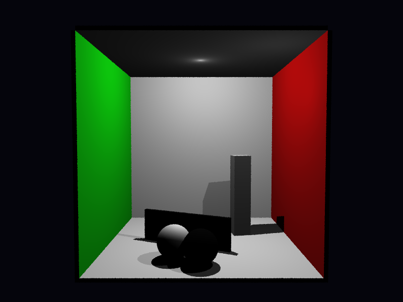
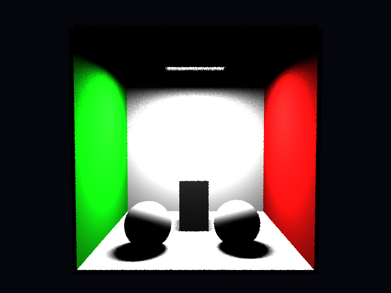
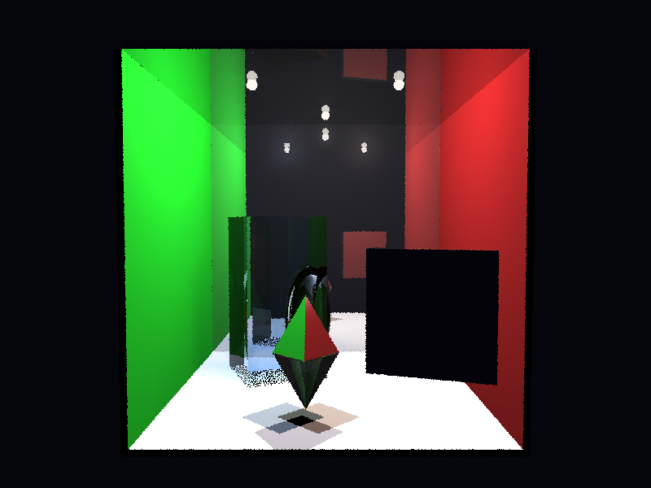
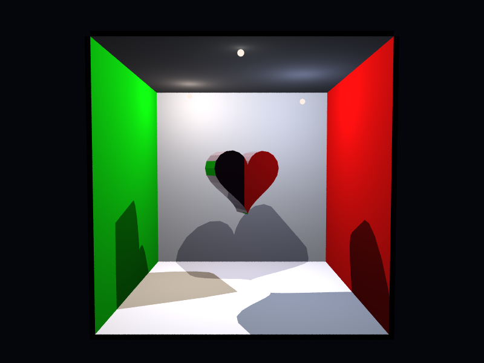
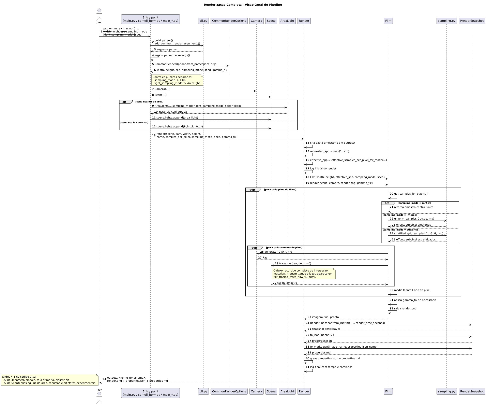
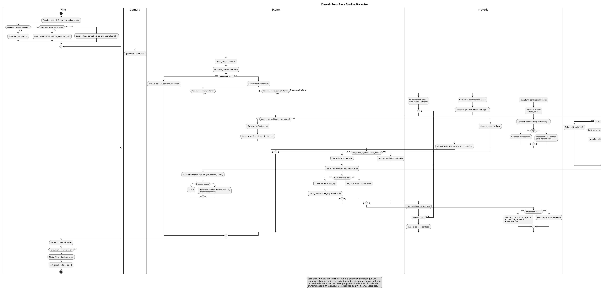
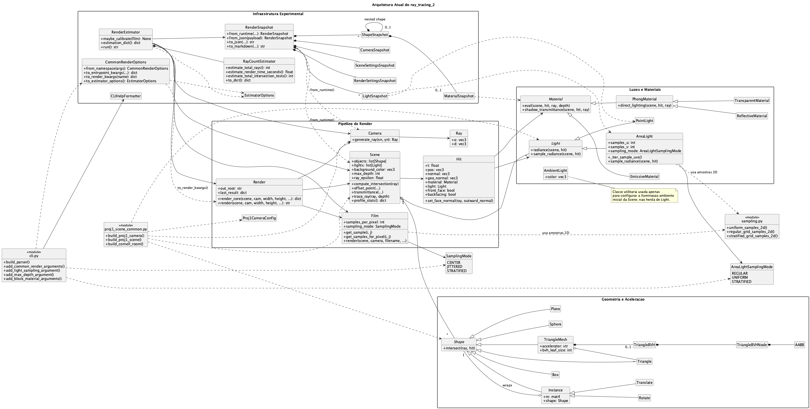

# INF2608 — Fundamentos da Computação Gráfica (2026.1) — PUC-Rio

> **Aluno:** Yang Miranda

## Visão Geral

Este repositório concentra a implementação do projeto de traçado de raios em `src/ray_tracing_2`. O renderer cobre o núcleo do projeto com câmera pinhole, interseções geométricas, sombreamento local de Phong, anti-aliasing, instanciação, luz de área, reflexão, refração, malhas triangulares e uma BVH local para `TriangleMesh`.

Cada execução gera uma pasta timestamped em `outputs/` com pelo menos:

- `render.png`
- `properties.json`
- `properties.md`

## Informações Técnicas

Para detalhes técnicos, decisões de modelagem, referências teóricas e rastreabilidade, consulte:

- `latex/inf2608-proj1.v3.pdf`
- `materiais/traçado_de_raios/4.tracado_de_raios.pdf`
- `materiais/traçado_de_raios/5.tracado_de_raios2.pdf`
- `materiais/traçado_de_raios/6.estrutura_aceleracao.pdf`

## Setup

### Opção 1: script do projeto

```bash
./scripts/setup_dev.sh
source .venv/bin/activate
```

O script cria `.venv`, instala `requirements.txt` e roda `pip install -e .`.

### Opção 2: setup manual

```bash
python3 -m venv .venv
source .venv/bin/activate
pip install --upgrade pip
pip install -r requirements.txt
pip install -e .
```

## Execução

Depois de ativar o ambiente e instalar o pacote em modo editável, execute como módulo:

```bash
python -m ray_tracing_2
```

## Cenas de Referência

Os exemplos abaixo refletem as cenas usadas no relatório. Cada comando gera uma nova pasta em `outputs/`; ao lado de cada cena há um artefato real já existente no repositório, que pode ser usado como referência visual rápida.

### Núcleo do projeto

`proj1_req1_geometry` mostra geometria básica, instanciação e câmera canônica.

```bash
python -m ray_tracing_2.proj1_req1_geometry --width 800 --height 600 --sampling_mode center --spp 1
```

Exemplo de saída já gerada:

- [render.png](outputs/proj1_req1_geometry_20260502_121509/render.png)
- [properties.md](outputs/proj1_req1_geometry_20260502_121509/properties.md)


`proj1_req2_point_lights` destaca múltiplas luzes pontuais e resposta especular dos materiais.

```bash
python -m ray_tracing_2.proj1_req2_point_lights --width 800 --height 600 --sampling_mode center --spp 1
```

Exemplo de saída já gerada:

- [render.png](outputs/proj1_req2_point_lights_20260502_121731/render.png)
- [properties.md](outputs/proj1_req2_point_lights_20260502_121731/properties.md)


`proj1_req3_phong_shadows` cobre o shading local de Phong com sombras diretas.

```bash
python -m ray_tracing_2.proj1_req3_phong_shadows --width 800 --height 600 --sampling_mode center --spp 1
```

Exemplo de saída já gerada:

- [render.png](outputs/proj1_req3_phong_shadows_20260502_121809/render.png)
- [properties.md](outputs/proj1_req3_phong_shadows_20260502_121809/properties.md)


`proj1_req4_sampling` compara anti-aliasing no mesmo enquadramento.

```bash
python -m ray_tracing_2.proj1_req4_sampling --width 800 --height 600 --sampling_mode center --spp 1
python -m ray_tracing_2.proj1_req4_sampling --width 800 --height 600 --sampling_mode jittered --spp 4 --seed 42
python -m ray_tracing_2.proj1_req4_sampling --width 800 --height 600 --sampling_mode stratified --spp 4 --seed 42
```

Exemplos de saída já gerados:

- [center render.png](outputs/proj1_req4_sampling_20260502_122009/render.png)
- [center properties.md](outputs/proj1_req4_sampling_20260502_122009/properties.md)
- [jittered render.png](outputs/proj1_req4_sampling_20260506_211723/render.png)
- [stratified render.png](outputs/proj1_req4_sampling_20260506_211923/render.png)





### Extensões

`proj1_rext_area_light` mostra penumbra com emissor retangular amostrado.

```bash
python -m ray_tracing_2.proj1_rext_area_light --width 800 --height 600 --sampling_mode center --spp 1 --light_sampling_mode stratified
```

Exemplo de saída já gerada:

- [render.png](outputs/proj1_rext_area_light_20260502_150206/render.png)
- [properties.md](outputs/proj1_rext_area_light_20260502_150206/properties.md)



`proj1_rext_bvh` mostra malha triangular com BVH local.

```bash
python -m ray_tracing_2.proj1_rext_bvh --width 800 --height 600 --sampling_mode center --spp 1
```

Exemplo de saída já gerada:

- [render.png](outputs/proj1_rext_bvh_20260502_131902/render.png)
- [properties.md](outputs/proj1_rext_bvh_20260502_131902/properties.md)


`proj1_rext_refractive` mostra refração com Snell, TIR e Beer-Lambert.

```bash
python -m ray_tracing_2.proj1_rext_refractive --width 800 --height 600 --sampling_mode center --spp 1
```

Exemplo de saída já gerada:

- [render.png](outputs/proj1_rext_refractive_20260502_132340/render.png)
- [properties.md](outputs/proj1_rext_refractive_20260502_132340/properties.md)


### Cenas integradas

`proj1_final` e `proj1_final_v2` combinam materiais recursivos, malhas e iluminação em cenas finais maiores.

```bash
python -m ray_tracing_2.proj1_final --width 800 --height 600 --spp 1
python -m ray_tracing_2.proj1_final_v2 --width 800 --height 600 --spp 1
```

Exemplos de saída já gerados:

- [proj1_final render.png](outputs/proj1_final_20260502_201946/render.png)
- [proj1_final properties.md](outputs/proj1_final_20260502_201946/properties.md)
- [proj1_final_v2 render.png](outputs/proj1_final_v2_20260502_202707/render.png)
- [proj1_final_v2 properties.md](outputs/proj1_final_v2_20260502_202707/properties.md)




`proj1_heart_trianglemesh` destaca a malha cardíaca triangulada com BVH local.

```bash
python -m ray_tracing_2.proj1_heart_trianglemesh --width 800 --height 600 --spp 25 --sampling_mode jittered
```

Exemplo de saída já gerada:

- [render.png](outputs/proj1_heart_trianglemesh_20260502_205136/render.png)
- [properties.md](outputs/proj1_heart_trianglemesh_20260502_205136/properties.md)



Nos entrypoints com `AreaLight`:

- `--sampling_mode` controla apenas o anti-aliasing do filme
- `--light_sampling_mode` controla apenas o padrão 2D usado na integração sobre a fonte de área

Se preferir não instalar o pacote, use `PYTHONPATH=src` na raiz do repositório:

```bash
PYTHONPATH=src python -m ray_tracing_2.main_area_light --width 800 --height 600 --spp 1 --sampling_mode jittered --light_sampling_mode stratified
```

## Fluxo

O fluxo atual do renderer pode ser lido assim:

1. o entrypoint monta o parser em `cli.py` e converte os argumentos em `CommonRenderOptions`;
2. a cena e a câmera canônicas são construídas em `proj1_scene_common.py` e nos módulos de cena;
3. `Render` cria a pasta timestamped em `outputs/` e inicializa `Film`;
4. `Film` gera amostras subpixel conforme `sampling_mode` e chama `Camera.generate_ray()`;
5. `Scene.trace_ray()` resolve interseção, visibilidade, materiais, recursão e iluminação;
6. ao final, `Render` salva `render.png`, `properties.json` e `properties.md`.

Os dois modos de amostragem do projeto continuam separados:

- `sampling_mode`: anti-aliasing do filme por pixel
- `light_sampling_mode`: amostragem 2D da `AreaLight`

Para detalhes técnicos mais completos sobre esse fluxo, consulte `latex/inf2608-proj1.v3.pdf`.

## Diagramas

Arquivos-fonte e imagens renderizadas disponíveis no repositório:

- `ray_tracing_render_overview_v1.puml` e `ray_tracing_render_overview_v1.puml.png`
- `ray_tracing_trace_flow_v1.puml` e `ray_tracing_trace_flow_v1.puml.png`
- `ray_tracing_bvh_flow_v1.puml` e `ray_tracing_bvh_flow_v1.puml.png`
- `ray_tracing_classes_v3.puml` e `ray_tracing_classes_v3.png`

### Visão geral do pipeline



### Fluxo de `trace_ray()` e shading recursivo



### Arquitetura principal atual



## Estrutura Principal

- `src/ray_tracing_2/camera.py`: câmera pinhole e geração de raios primários
- `src/ray_tracing_2/film.py`: amostragem por pixel e gravação da imagem
- `src/ray_tracing_2/scene.py`: interseção global, transmitância e recursão
- `src/ray_tracing_2/material.py`: materiais locais, reflexivos e refratários
- `src/ray_tracing_2/light.py`: luzes pontuais, ambiente e luz de área
- `src/ray_tracing_2/shape.py`: primitivas analíticas, triângulos, `TriangleMesh` e `Instance`
- `src/ray_tracing_2/triangle_bvh.py`: BVH local para malhas triangulares
