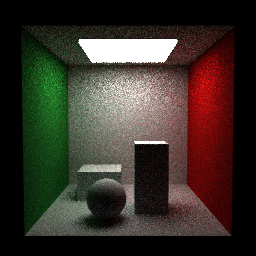
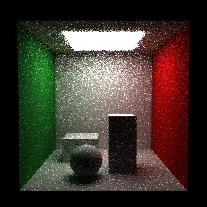
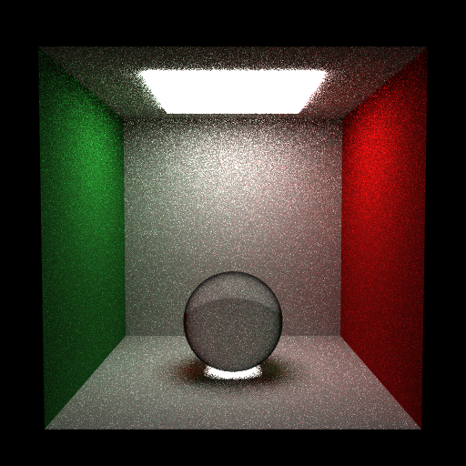
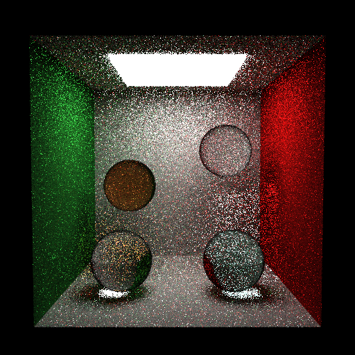
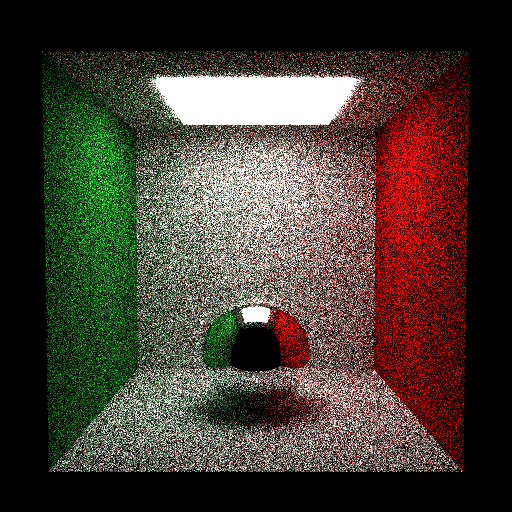
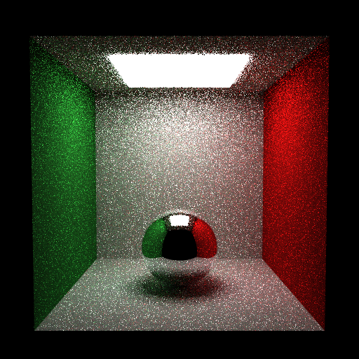
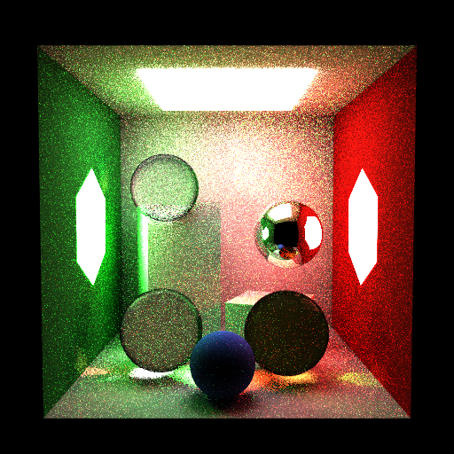
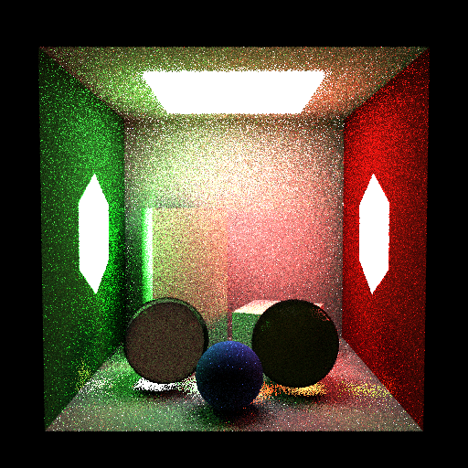

# INF2608 — Fundamentos da Computação Gráfica (2026.1) — PUC-Rio

> **Aluno:** Yang Miranda

## Visão Geral

Este repositório reúne os dois projetos da disciplina:

- **Projeto 1 — Ray Tracing** (`src/ray_tracing_2`): renderer recursivo/analítico com câmera pinhole, interseções geométricas, sombreamento local de Phong, anti-aliasing, instanciação, luz de área, reflexão especular, refração dielétrica, malhas triangulares e uma BVH local para `TriangleMesh`. Relatório completo em [inf2608-proj1.pdf](./inf2608-proj1.pdf).
- **Projeto 2 — Path Tracing** (`src/path_tracing`): renderer estocástico (Monte Carlo) com BSDF Lambertiana, Next Event Estimation (NEE), Multiple Importance Sampling (heurística de potência), Roleta Russa não-viesada, luz de área retangular e como malha de triângulos, BSDF dielétrica (Snell, Fresnel, TIR, Beer-Lambert) e BSDF de espelho puro. Relatório completo em [inf2608-proj2.pdf](./inf2608-proj2.pdf).

Cada execução gera uma pasta timestamped com pelo menos:

- `render.png`
- `properties.json`
- `properties.md`

O Projeto 1 grava em `outputs/`; o Projeto 2 grava em `out/proj2/<script>/` (via `render_snapshot.py`).

## Informações Técnicas

Para detalhes técnicos, decisões de modelagem, referências teóricas e rastreabilidade, consulte:

- [inf2608-proj1.pdf](inf2608-proj1.pdf) — relatório do Projeto 1 (ray tracing)
- [inf2608-proj2.pdf](inf2608-proj2.pdf) — relatório do Projeto 2 (path tracing)
- [latex/inf2608-proj1.v3.pdf](latex/inf2608-proj1.v3.pdf) — fonte LaTeX/versão de build do relatório do Projeto 1
- [latex/inf2608-proj2.pdf](latex/inf2608-proj2.pdf) — fonte LaTeX/versão de build do relatório do Projeto 2
- `materiais/traçado_de_raios/4.tracado_de_raios.pdf`
- `materiais/traçado_de_raios/5.tracado_de_raios2.pdf`
- `materiais/traçado_de_raios/6.estrutura_aceleracao.pdf`

## Setup

### Opção 1: script do projeto

```bash
./scripts/setup_dev.sh
source .venv/bin/activate
```

O script cria `.venv`, instala `requirements.txt` e roda `pip install -e .`.

### Opção 2: setup manual

```bash
python3 -m venv .venv
source .venv/bin/activate
pip install --upgrade pip
pip install -r requirements.txt
pip install -e .
```

## Execução

Depois de ativar o ambiente e instalar o pacote em modo editável, execute como módulo:

```bash
python -m ray_tracing_2
```

## Cenas de Referência

Os exemplos abaixo refletem as cenas usadas no relatório. Cada comando gera uma nova pasta em `outputs/`; ao lado de cada cena há um artefato real já existente no repositório, que pode ser usado como referência visual rápida.

### Núcleo do projeto

`proj1_req1_geometry` mostra geometria básica, instanciação e câmera canônica.

```bash
python -m ray_tracing_2.proj1_req1_geometry --width 800 --height 600 --sampling_mode center --spp 1
```

Exemplo de saída já gerada:

- [render.png](outputs/proj1_req1_geometry_20260502_121509/render.png)
- [properties.md](outputs/proj1_req1_geometry_20260502_121509/properties.md)


`proj1_req2_point_lights` destaca múltiplas luzes pontuais e resposta especular dos materiais.

```bash
python -m ray_tracing_2.proj1_req2_point_lights --width 800 --height 600 --sampling_mode center --spp 1
```

Exemplo de saída já gerada:

- [render.png](outputs/proj1_req2_point_lights_20260502_121731/render.png)
- [properties.md](outputs/proj1_req2_point_lights_20260502_121731/properties.md)


`proj1_req3_phong_shadows` cobre o shading local de Phong com sombras diretas.

```bash
python -m ray_tracing_2.proj1_req3_phong_shadows --width 800 --height 600 --sampling_mode center --spp 1
```

Exemplo de saída já gerada:

- [render.png](outputs/proj1_req3_phong_shadows_20260502_121809/render.png)
- [properties.md](outputs/proj1_req3_phong_shadows_20260502_121809/properties.md)


`proj1_req4_sampling` compara anti-aliasing no mesmo enquadramento.

```bash
python -m ray_tracing_2.proj1_req4_sampling --width 800 --height 600 --sampling_mode center --spp 1
python -m ray_tracing_2.proj1_req4_sampling --width 800 --height 600 --sampling_mode jittered --spp 4 --seed 42
python -m ray_tracing_2.proj1_req4_sampling --width 800 --height 600 --sampling_mode stratified --spp 4 --seed 42
```

Exemplos de saída já gerados:

- [center render.png](outputs/proj1_req4_sampling_20260502_122009/render.png)
- [center properties.md](outputs/proj1_req4_sampling_20260502_122009/properties.md)
- [jittered render.png](outputs/proj1_req4_sampling_20260506_211723/render.png)
- [stratified render.png](outputs/proj1_req4_sampling_20260506_211923/render.png)


### Extensões

`proj1_rext_area_light` mostra penumbra com emissor retangular amostrado.

```bash
python -m ray_tracing_2.proj1_rext_area_light --width 800 --height 600 --sampling_mode center --spp 1 --light_sampling_mode stratified
```

Exemplo de saída já gerada:

- [render.png](outputs/proj1_rext_area_light_20260502_150206/render.png)
- [properties.md](outputs/proj1_rext_area_light_20260502_150206/properties.md)


`proj1_rext_bvh` mostra malha triangular com BVH local.

```bash
python -m ray_tracing_2.proj1_rext_bvh --width 800 --height 600 --sampling_mode center --spp 1
```

Exemplo de saída já gerada:

- [render.png](outputs/proj1_rext_bvh_20260502_131902/render.png)
- [properties.md](outputs/proj1_rext_bvh_20260502_131902/properties.md)


`proj1_rext_refractive` mostra refração com Snell, TIR e Beer-Lambert.

```bash
python -m ray_tracing_2.proj1_rext_refractive --width 800 --height 600 --sampling_mode center --spp 1
```

Exemplo de saída já gerada:

- [render.png](outputs/proj1_rext_refractive_20260502_132340/render.png)
- [properties.md](outputs/proj1_rext_refractive_20260502_132340/properties.md)


### Cenas integradas

`proj1_final` e `proj1_final_v2` combinam materiais recursivos, malhas e iluminação em cenas finais maiores.

```bash
python -m ray_tracing_2.proj1_final --width 800 --height 600 --spp 1
python -m ray_tracing_2.proj1_final_v2 --width 800 --height 600 --spp 1
```

Exemplos de saída já gerados:

- [proj1_final render.png](outputs/proj1_final_20260502_201946/render.png)
- [proj1_final properties.md](outputs/proj1_final_20260502_201946/properties.md)
- [proj1_final_v2 render.png](outputs/proj1_final_v2_20260502_202707/render.png)
- [proj1_final_v2 properties.md](outputs/proj1_final_v2_20260502_202707/properties.md)


`proj1_heart_trianglemesh` destaca a malha cardíaca triangulada com BVH local.

```bash
python -m ray_tracing_2.proj1_heart_trianglemesh --width 800 --height 600 --spp 25 --sampling_mode jittered
```

Exemplo de saída já gerada:

- [render.png](outputs/proj1_heart_trianglemesh_20260502_205136/render.png)
- [properties.md](outputs/proj1_heart_trianglemesh_20260502_205136/properties.md)


Nos entrypoints com `AreaLight`:

- `--sampling_mode` controla apenas o anti-aliasing do filme
- `--light_sampling_mode` controla apenas o padrão 2D usado na integração sobre a fonte de área

Se preferir não instalar o pacote, use `PYTHONPATH=src` na raiz do repositório:

```bash
PYTHONPATH=src python -m ray_tracing_2.main_area_light --width 800 --height 600 --spp 1 --sampling_mode jittered --light_sampling_mode stratified
```

## Cenas de Referência — Path Tracing (Projeto 2)

Os exemplos abaixo refletem as cenas usadas no relatório [inf2608-proj2.pdf](inf2608-proj2.pdf). Cada comando grava um snapshot em `out/proj2/<script>/`; ao lado de cada cena há um artefato real já existente no repositório.

### Núcleo

`proj2_req1_lambert_basic` cobre o path tracer unidirecional com BSDF Lambertiana (método de Malley).

```bash
python -m path_tracing.scripts.proj2_req1_lambert_basic --spp 32 --depth 8 --seed 42 --width 800 --height 600
```

Exemplo de saída já gerada:

- [render.png](out/proj2/req1/proj2_req1_lambert_basic_20260607_120232/render.png)
- [properties.md](out/proj2/req1/proj2_req1_lambert_basic_20260607_120232/properties.md)


`proj2_req2_nee` compara amostragem só por BSDF (`bsdf_only`) com Next Event Estimation (`nee_only`).

```bash
python -m path_tracing.scripts.proj2_req2_nee --mode nee_only --spp 16 --depth 8 --seed 42
```

Exemplo de saída já gerada:

- [render.png](out/proj2/req2/proj2_req2_nee_only_20260606_162251/render.png)
- [properties.md](out/proj2/req2/proj2_req2_nee_only_20260606_162251/properties.md)



`proj2_req3_mis` combina BSDF e NEE via Multiple Importance Sampling (heurística de potência, β=2).

```bash
python -m path_tracing.scripts.proj2_req3_mis --mode mis --spp 16 --depth 8 --seed 42
```

Exemplo de saída já gerada:

- [render.png](out/proj2/req3/proj2_req3_mis_20260606_161743/render.png)
- [properties.md](out/proj2/req3/proj2_req3_mis_20260606_161743/properties.md)



`proj2_req5_rr` liga/desliga a Roleta Russa para encurtar caminhos profundos sem introduzir viés.

```bash
python -m path_tracing.scripts.proj2_req5_rr --mode mis --use-rr true --spp 32 --depth 12 --rr-min-depth 6
```

Exemplos de saída já gerados:

- [sem RR render.png](out/proj2/req5/proj2_req5_mis_no_rr_20260607_153507/render.png)
- [com RR render.png](out/proj2/req5/proj2_req5_mis_rr_20260606_164126/render.png)


### Luzes e materiais

`proj2_req6_mesh_lights` substitui a `RectAreaLight` por uma `TriangleMeshLight` (octaedro) amostrada como NEE.

```bash
python -m path_tracing.scripts.proj2_req6_mesh_lights --mode mis --spp 16 --depth 8
```

Exemplo de saída já gerada:

- [render.png](out/proj2/req6/proj2_req6_mis_no_rr_20260607_122009/render.png)
- [properties.md](out/proj2/req6/proj2_req6_mis_no_rr_20260607_122009/properties.md)


`proj2_req7_dielectric` renderiza esferas dielétricas (Snell, Fresnel, TIR, Beer-Lambert) com material `glass` ou `water`.

```bash
python -m path_tracing.scripts.proj2_req7_dielectric --material glass --spp 64 --depth 8 --mode mis
python -m path_tracing.scripts.proj2_req7_dielectric --material water --absorption 0.30 0.05 0.10 --spp 64 --depth 8 --mode mis
```

Exemplos de saída já gerados:

- [vidro render.png](out/proj2/req7/proj2_req7_glass_mis_no_rr_20260606_200923/render.png)
- [água render.png](out/proj2/req7/proj2_req7_water_mis_no_rr_20260606_212027/render.png)




`proj2_req7_dielectric_showcase` instancia quatro esferas dielétricas (IOR e absorção variados) numa Cornell Box.

```bash
python -m path_tracing.scripts.proj2_req7_dielectric_showcase --spp 64 --depth 8 --mode mis
```

Exemplo de saída já gerada:

- [render.png](out/proj2/req7_dielectric_showcase/proj2_req7_dielectric_showcase_mis_no_rr_20260628_150346/render.png)
- [properties.md](out/proj2/req7_dielectric_showcase/proj2_req7_dielectric_showcase_mis_no_rr_20260628_150346/properties.md)



`proj2_req7_mirror` isola o `MirrorBSDF` (reflexão especular pura, sem Fresnel) sob os três modos de amostragem.

```bash
python -m path_tracing.scripts.proj2_req7_mirror --all --spp 20 --depth 8
```

Exemplos de saída já gerados:

- [bsdf_only render.png](out/proj2/req7_mirror/proj2_req7_mirror_bsdf_only_no_rr.png)
- [mis render.png](out/proj2/req7_mirror/proj2_req7_mirror_mis_no_rr.png)





### Cenas integradas

`proj2_showcase` reúne numa Cornell Box três fontes de luz de área (retangular + duas `TriangleMeshLight` hexagonais), esferas dielétricas, uma esfera espelhada e color bleeding.

```bash
python -m path_tracing.scripts.proj2_showcase --all --spp 64 --depth 12
```

Exemplos de saída já gerados:

- [mis render.png](out/proj2/showcase/proj2_showcase_mis_no_rr.png)
- [nee_only render.png](out/proj2/showcase/proj2_showcase_nee_only_no_rr.png)


`proj2_showcase_combined` funde as cenas anteriores numa única Cornell Box combinada, exercitando todos os recursos do Projeto 2 ao mesmo tempo (NEE, MIS, Roleta Russa, dielétricos, espelho).

```bash
python -m path_tracing.scripts.proj2_showcase_combined --all --spp 32 --depth 10
python -m path_tracing.scripts.proj2_showcase_combined --mode mis --use-rr true --spp 32 --depth 10
```

Exemplos de saída já gerados:

- [mis (sem RR) render.png](out/proj2/showcase_combined/proj2_showcase_combined_mis_no_rr_spp_32.png)
- [mis+RR render.png](out/proj2/showcase_combined/proj2_showcase_combined_mis_rr_spp_32.png)




`proj2_showcase_wall_lights` usa a mesma Cornell Box com `TriangleMeshLight` nas paredes laterais.

```bash
python -m path_tracing.scripts.proj2_showcase_wall_lights --all --spp 64 --depth 12
```

Exemplo de saída já gerada:

- [render.png](out/proj2/showcase_wall_lights/proj2_showcase_wall_lights_mis_no_rr.png)



Nos scripts do Projeto 2:

- `--mode {bsdf_only,nee_only,mis}` controla a estratégia de amostragem do integrador
- `--use-rr {true,false}` e `--rr-min-depth` controlam a Roleta Russa
- `--all` roda os quatro modos (`bsdf_only`, `nee_only`, `mis`, `mis`+RR) de uma vez, gerando um snapshot para cada

## Fluxo

O fluxo atual do renderer pode ser lido assim:

1. o entrypoint monta o parser em `cli.py` e converte os argumentos em `CommonRenderOptions`;
2. a cena e a câmera canônicas são construídas em `proj1_scene_common.py` e nos módulos de cena;
3. `Render` cria a pasta timestamped em `outputs/` e inicializa `Film`;
4. `Film` gera amostras subpixel conforme `sampling_mode` e chama `Camera.generate_ray()`;
5. `Scene.trace_ray()` resolve interseção, visibilidade, materiais, recursão e iluminação;
6. ao final, `Render` salva `render.png`, `properties.json` e `properties.md`.

Os dois modos de amostragem do projeto continuam separados:

- `sampling_mode`: anti-aliasing do filme por pixel
- `light_sampling_mode`: amostragem 2D da `AreaLight`

Para detalhes técnicos mais completos sobre esse fluxo, consulte [inf2608-proj1.pdf](inf2608-proj1.pdf).

O fluxo do path tracer (Projeto 2) é análogo, mas estocástico:

1. o entrypoint monta o parser em `path_tracing/cli.py` e a cena é montada em `path_tracing/scenes/`;
2. o integrador `PathTracer` (`path_tracing/integrators/path_tracer.py`) amostra caminhos câmera → superfícies → luz, acumulando o `throughput` β a cada vértice;
3. a cada vértice, a amostragem direta de luz (NEE) é feita em `lights/area_rect.py`/`lights/area_mesh.py`, combinada com a amostragem da BSDF via MIS (`mis.py`, heurística de potência);
4. a Roleta Russa (dentro do integrador) trunca caminhos de baixo `throughput` sem introduzir viés, quando habilitada;
5. `render_snapshot.py` grava `render.png`, `properties.json` e `properties.md` em `out/proj2/<script>/`.

Diferente do Projeto 1 (determinístico, `spp=1` já converge), o Projeto 2 exige múltiplas amostras por pixel e converge com ruído ∝ 1/√spp. Para detalhes técnicos completos, consulte [inf2608-proj2.pdf](inf2608-proj2.pdf).

## Diagramas

Arquivos-fonte e imagens renderizadas disponíveis no repositório:

- `ray_tracing_render_overview_v1.puml` e `ray_tracing_render_overview_v1.puml.png`
- `ray_tracing_trace_flow_v1.puml` e `ray_tracing_trace_flow_v1.puml.png`
- `ray_tracing_bvh_flow_v1.puml` e `ray_tracing_bvh_flow_v1.puml.png`
- `ray_tracing_classes_v3.puml` e `ray_tracing_classes_v3.png`

### Visão geral do pipeline


### Fluxo de `trace_ray()` e shading recursivo


### Arquitetura principal atual


## Estrutura Principal

- `src/ray_tracing_2/camera.py`: câmera pinhole e geração de raios primários
- `src/ray_tracing_2/film.py`: amostragem por pixel e gravação da imagem
- `src/ray_tracing_2/scene.py`: interseção global, transmitância e recursão
- `src/ray_tracing_2/material.py`: materiais locais, reflexivos e refratários
- `src/ray_tracing_2/light.py`: luzes pontuais, ambiente e luz de área
- `src/ray_tracing_2/shape.py`: primitivas analíticas, triângulos, `TriangleMesh` e `Instance`
- `src/ray_tracing_2/triangle_bvh.py`: BVH local para malhas triangulares

Path tracing (Projeto 2):

- `src/path_tracing/integrators/path_tracer.py`: integrador Monte Carlo unidirecional (NEE, MIS, Roleta Russa)
- `src/path_tracing/bsdf/`: BSDFs Lambertiana, dielétrica (Snell/Fresnel/TIR/Beer-Lambert), espelho e emissiva
- `src/path_tracing/lights/`: luz de área retangular (`area_rect.py`) e como malha de triângulos (`area_mesh.py`)
- `src/path_tracing/mis.py`: heurística de potência para combinar amostragem de BSDF e de luz
- `src/path_tracing/scenes/`: cenas Cornell Box (mirror, glass, water, mesh_light, showcase, combined, wall_lights)
- `src/path_tracing/render_snapshot.py`: persistência do snapshot (`render.png`, `properties.json`/`.md`) em `out/proj2/`
