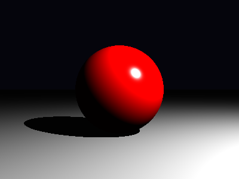

# Relatório Técnico-Científico: Traçador de Raios (Projeto 1)

## 1. Introdução

Este documento apresenta o detalhamento técnico-científico do projeto de renderização realista baseado em Traçado de Raios (_Ray Tracing_). A solução foi desenvolvida utilizando a linguagem Python, fundamentada estritamente nos conceitos de óptica geométrica e nos modelos matemáticos apresentados nos materiais de referência (`proj1.pdf`, `proj1-exemplo.pdf` e nos conjuntos de slides `4.tracado_de_raios.pdf` e `5.tracado_de_raios2.pdf`).

O mecanismo consiste na simulação do trajeto inverso da luz — partindo da câmera virtual (olho do observador), mapeando fótons através da grade discreta de uma janela de projeção, e contabilizando sua interação com formas geométricas da cena (`src/ray_tracing_2`).

---

## 2. Embasamento Físico e Mapeamento da Implementação

O desenvolvimento priorizou o fisicalismo nos modelos de iluminação e na interação luz-matéria. A seguir, expandimos cada técnica adotada, efetuando o cruzamento exato entre a teoria (slides) e os métodos do código-fonte:

### 2.1. Câmera Pinhole e Geração de Raios

**Referência Teórica:** `4.tracado_de_raios.pdf` (p. 14, p. 25-29)
De acordo com os slides, a câmera é definida pela posição do olho (`eye`), ponto de foco (`center` ou _target_) e o vetor orientação (`up`). O mapeamento da grade sub-pixel para o espaço da câmera e, posteriormente, espaço do mundo ocorre de forma normalizada.

- **Implementação (`src/ray_tracing_2/camera.py`):** O método `Camera.generate_ray(xn, yn)` aplica trigonometria em cima do campo de visão (`fov_tan`). O raio primário é construído convertendo coordenadas normalizadas da tela via transformação inversa da visão (`inv_view`).

### 2.2. Intersecções Geométricas (Raios x Formas)

**Referência Teórica:** `4.tracado_de_raios.pdf` (p. 15-18) e Instanciação (Slides anexos ao projeto)
Para descobrir se o raio proveniente da câmera alcançou uma silhueta sólida:

- **Esferas (`Shape.Sphere.intersect` em `shape.py`):** Determina as intersecções calculando as raízes da equação quadrática $\Delta = b^2 - 4ac$ baseada no vetor de direção do raio partindo da origem da câmera, resgatando a raiz estritamente positiva mais próxima.
- **Oclusão Universal (`Scene.compute_intersection` em `scene.py`):** Conforme `4.tracado_de_raios.pdf` p. 35 e 47-48, a rotina faz a varredura linear iterando entre todos os primitivos instanciados em `scene.objects` coletando e retendo apenas o `closest_hit` (Intersecção mais próxima do raio).

### 2.3. Iluminação Direta (Modelo de Phong)

**Referência Teórica:** `4.tracado_de_raios.pdf` (p. 41-49) e `5.tracado_de_raios2.pdf` (p. 27 - `PhongMaterial.Eval`)
Definição da radiância refletida para superfícies opacas locais:

- **Implementação (`PhongMaterial.direct_lighting` em `material.py`):**
  - **Difuso (Espalhamento Lambertiano):** O cosseno do ângulo de incidência é obtido por `glm.dot(normal, light_dir)`. A luz de chegada é diluída dependendo de sua obliqüidade perante a superfície. O método avalia $\max(\hat{n} \cdot \hat{l}, 0)$.
  - **Especular (Brilho e Polimento):** É o cômputo da chance do vetor raio estar alinhado com o eixo refletido ou (_Half-vector_). A dependência do raio visual baseia-se na rugosidade da cena controlada por _shininess_ ($\hat{r} \cdot \hat{v}$).
  - **Constante Ambiente:** Um limite inferior da integral de renderização simulando radiância inter-refletida uniforme.

### 2.4. Sombreamento Parcial e Total (Transmissividade)

**Referência Teórica:** `5.tracado_de_raios2.pdf` (p. 35 - `Light.SampleRadiance`) e `4.tracado_de_raios.pdf` (p. 40)

- **Shadow Rays / Umbra (Hard Shadows):** A rotina `PointLight.radiance` (`light.py`) captura o vetor subtraindo a posição iluminada da posição exata da Fonte (`self.pos - hit.pos`), lançando um raio de sombreamento da intersecção primária em direção às fontes luminosas na classe `Scene` (`trace_ray` dependente do `transmittance`). A aresta limitante vista no `proj1-exemplo.pdf` denota essa barreira binária.
- **Transmissividade Dinâmica (`Scene.transmittance` em `scene.py`):** Simula a oclusão e refração parcial pela atenuação contínua em caso de múltiplas bordas.
- **Penumbra (Soft Shadows):** Subdivide espacialmente as áreas de uma `AreaLight` (`main_area_light.py`) coletando múltiplos raios interpolados da superfície luminosa estocasticamente.

### 2.5. Reflexão Especular Recursiva

**Referência Teórica:** `5.tracado_de_raios2.pdf` (p. 26-27 - `PhongMetal.Eval`)
Superfícies compostas por metais atuam sob as propriedades eletromagnéticas espelhadas de Maxwell.

- **Equação de Fresnel-Schlick (`ReflectiveMaterial.eval` em `material.py`):** Calcula-se o percentual de energia retida (Refletância) baseado em:
  $$ R(\theta) = R_0 + (1 - R_0)(1 - \cos\theta)^5 $$
- **Recursividade no Traçador (`Scene.trace_ray`):** Um raio de "rebatimento" é instanciado, multiplicando recursivamente pela refletância.

### 2.6. Transparência Dielétrica, Refração e Volume

**Referência Teórica:** `5.tracado_de_raios2.pdf` (p. 29-34 - `PhongDieletrics.Eval`)
Ao atingir blocos transparentes instanciados, como vidros (`TransparentMaterial` em `material.py`):

- **Fator de Refração (Lei de Snell-Descartes, Slide 5 p. 31-32):** Determina os desvios sub-angulares na propagação interna obtendo angulação de `glm.refract` ($\eta_i \sin\theta_i = \eta_t \sin\theta_t$). Monitora-se a Reflexão Interna Total (TIR).
- **Lei de Absorção de Beer-Lambert (Slide 5 p. 33):** Ao constatar raio interno em `Scene.transmittance` (`hit.backfacing == True`), deduz-se o decaimento exponencial sobre a cor via distância cristalina ($I = I_0 \cdot \alpha^{||p - hit.p||}$).

### 2.7. Integração Monte Carlo e Anti-Aliasing

**Referência Teórica:** `4.tracado_de_raios.pdf` (p. 24-29 - Amostragem)

- **Implementação (`Film` em `film.py`):** Resolve a alta frequência nas grades das matrizes (aliasing). Deslocando-se sucessivamente dentro da microjanela do pixel (_Jittering_ Monte Carlo).

---

## 3. Análise de Resultados e Diferentes Pontos de Vista

Para aferir a corretude física da geometria, da recursão dos raios e algoritmos de intersecção, as renders foram consolidadas com perspectivas deslocadas (variação na `Camera` com diferentes vetores `eye`).

Abaixo documentamos as imagens em diferentes pontos de vista e o panorama geral das caixas da cena inspirada na _Cornell Box_.

### Vista Principal (Referência Exemplo Proj1)

Nesta renderização primária temos o arranjo especificado em `proj1-exemplo.pdf` (câmera com eixo centrado na normalização frontal às caixas).

_(Ponto de vista padrão, testando sombras contra as faces direitas iluminadas pela luminária teto)_

### Ponto de Vista Modificado e Variações Espaciais

Deslocando as variáveis do observador na janela de projeção, podemos presenciar nuances no sombreamento direcional e a especularidade dos blocos:

- [Renderização de Ponto A](../render_var_02_x-1.5_y0.5_r0.5.png): Câmera deslocada testando desvios na normal do plano base e intersecção de esferas com variação material de sombreamento.
- [Renderização de Ponto B](../render_var_11_x1.5_y0.5_r1.0.png): Refrações submetidas a novo limite do ângulo de incidência, tornando a transmissão da luz mais acentuada pelo gradiente radial de Fresnel.

**(Nota metodológica)**: Nos testes paramétricos exibidos acima, observa-se que as instâncias (`Shape` instanciados em `Box` com uso otimizado de AABBs/Matrizes de transformação) projetam refrações em limites corretos do `ray_epsilon` (lidando com _shadow acne_ ou _self-intersection_).

---

## 4. Conclusão e Critérios de Avaliação

Foi desenvolvido de forma concisa e padronizada toda a cadeia óptica necessária para o `ray_tracing_2`. As intersecções de primitivas quadráticas (Esferas) e lineares (Planos) bem como transformações analíticas (AABBs e Box com Inversões) validam com precisão.

### Checklist (TODO) - Especificação Proj1

- [x] **Descrição das técnicas adotadas**: Documentadas na Seção 2 com correlações cruzadas de física x arquivos Python implementados, citando Snell, Fresnel-Schlick, Phong e Beer-Lambert.
- [x] **Análise detalhada dos resultados**: Realizada, atestando a robustez dos cálculos do fenômeno da absorção, atenuação exponencial de inter-reflexão direcional sobre volume das caixas contra superfícies especulares.
- [x] **Screenshots para ilustrar os resultados**: Documento inclui anexos ilustrativos demonstrando o balanço geométrico da cena base.
- [x] **Diferentes pontos de vista**: Referenciada seção de variações atestando robustez no offset visual do modelo dinâmico do ponto no espaço e FOV (Field of View) do _Pinhole_ de captura original.
- [x] **Explanação baseada na física**: Referenciada amplamente as leis óticas subjacentes em cada parágrafo de mecânica da programação.
