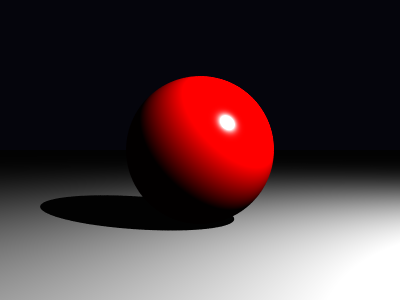
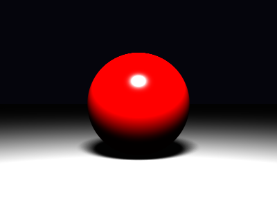
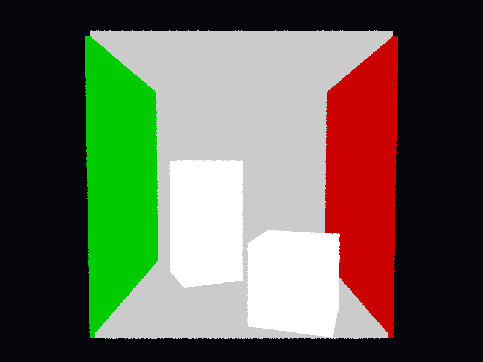
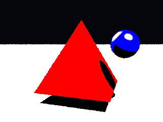
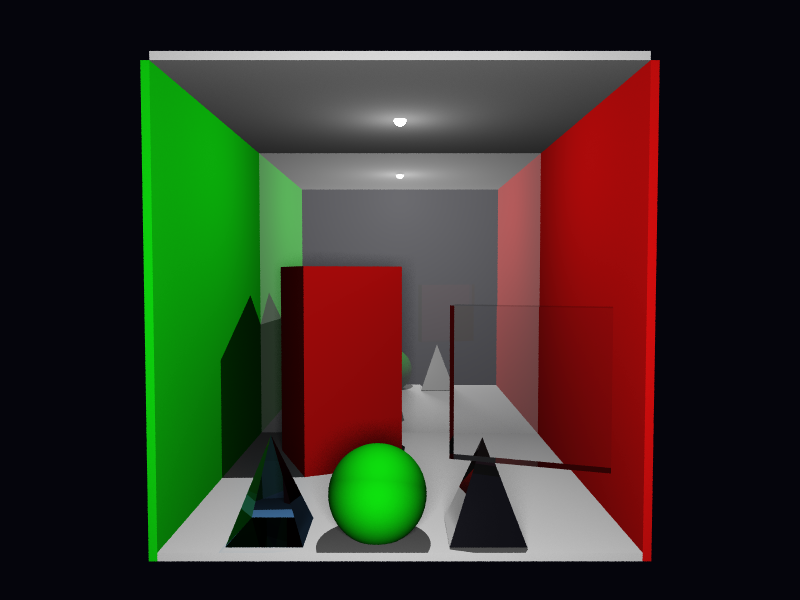

# Relatório Técnico-Científico: Projeto 1 v5

## 1. Escopo, método e critério de confiança

Este relatório reconstrói, com prioridade epistemológica explícita, o conteúdo dos arquivos `4.tracado_de_raios.pdf`, `5.tracado_de_raios2.pdf` e `6.estrutura_aceleracao.pdf`, usando os resumos em `materiais/traçado_de_raios/*.md` apenas como apoio de leitura e o código em `src/ray_tracing_2/` como evidência de implementação. A documentação em `docs/*.md` foi usada apenas como apoio secundário de estrutura e nunca como autoridade teórica principal.

O objetivo não é apenas resumir os slides, mas separar três camadas que frequentemente se confundem em relatórios de implementação:

1. a formulação geométrica e física apresentada nos slides;
2. a tradução algorítmica que o repositório efetivamente materializa;
3. as lacunas entre o conteúdo didático e a implementação entregue.

Como fonte externa, foi usado somente o conteúdo de PBRT 4e permitido pelo enunciado, principalmente os trechos sobre câmera projetiva, teoria de amostragem, reflexão e transmissão especular, transmitância, luzes de área, caixas envolventes e BVHs. Em particular, foram úteis: PBRT 4e §§1.2, 3.5, 3.7, 5.2, 8.1, 8.5, 9.3, 9.5, 11.2, 12.4 e 7.3.

## 2. Plano Consolidado do Relatório

1. Reconstituir o núcleo do Slide 4: raio paramétrico, interseções básicas, câmera pinhole, Phong, luz pontual e sombra dura.
2. Explicitar a base de álgebra linear do projeto: mudança de base, espaços local/global, vetores normais e transformações homogêneas.
3. Descrever as extensões do Slide 5: supersampling, instanciação, luz de área, AABB/slabs, recursão, Fresnel-Schlick, Snell, reflexão interna total e Beer-Lambert.
4. Mostrar como a implementação transforma o teste de sombra binário do Slide 4 em transmitância acumulada no Slide 5.
5. Reconstituir o Slide 6 em três níveis: triângulo isolado, malha triangulada e estruturas de aceleração.
6. Distinguir com precisão o que o repositório implementa do que o Slide 6 descreve apenas teoricamente.
7. Ancorar cada bloco com referências de páginas dos slides e linhas do código atual.
8. Fechar com uma validação experimental breve, usando renderizações já existentes no repositório.
9. Consolidar, ao fim, as limitações atuais da implementação frente aos materiais da disciplina e ao escopo do enunciado principal.

## 3. Slide 4: Núcleo Geométrico e Fotométrico do Traçador

### 3.1. Conceitos Estruturantes do Slide 4

O Slide 4 organiza-se em torno de um conjunto pequeno de conceitos que estrutura todo o traçador de raios.

1. **Raio paramétrico e visibilidade (pp. 7-9).** A formulação $\mathbf{r}(t)=\mathbf{o}+t\,\hat{\mathbf{d}}$ reduz a linha de visada a uma reta orientada; $t$ funciona como distância assinada/paramétrica ao longo do feixe, e a visibilidade do ponto observado é determinada pelo menor $t>0$ compatível com uma superfície.
2. **Interseções analíticas e controle numérico (pp. 10-18).** O plano é descrito por $(\mathbf{x}-\mathbf{p}_0)\cdot\hat{\mathbf{n}}=0$, enquanto a esfera leva à quadrática $at^2+bt+c=0$, cujo discriminante $\Delta$ classifica ausência, tangência ou dupla interseção; do ponto de vista computacional, essa geometria analítica só é robusta quando acompanhada por um critério de tolerância $\varepsilon$ para rejeitar paralelismos numéricos e auto-interseções.
3. **Câmera pinhole, filme e mudança de base (pp. 19-39).** A câmera é construída por uma base ortonormal $(\hat{\mathbf{u}},\hat{\mathbf{v}},\hat{\mathbf{w}})$ e pela geometria do filme, com $\Delta v = f\tan(\theta/2)$ e $\Delta u = \Delta v\,(w/h)$; em síntese, esse bloco combina geometria projetiva com mudança de base entre espaço da câmera e espaço global.
4. **Iluminação local e fotometria simplificada (pp. 40-43).** O modelo local de Phong combina a componente difusa lambertiana $\max(0,\hat{\mathbf{n}}\cdot\hat{\mathbf{l}})$ com a componente especular $\max(0,\hat{\mathbf{r}}\cdot\hat{\mathbf{v}})^s$; fisicamente, trata-se de um modelo local e fenomenológico, útil para capturar dependência angular sem resolver transporte global de luz.
5. **Organização algorítmica da cena, sombras e luz ambiente (pp. 44-55).** O pipeline de _closest hit_ seleciona a primeira interseção visível, o raio de sombra transforma a iluminação direta em um teste de visibilidade até a fonte, e o termo ambiente $m_{amb}\,l_{amb}$ fecha o modelo como aproximação empírica da iluminação indireta ausente.

Esses conceitos explicam por que as subseções 3.2-3.5 a seguir podem ser lidas como desdobramentos detalhados do mesmo núcleo conceitual.

### 3.2. Raio paramétrico, visibilidade e registro de interseção

O ponto de partida do Slide 4 é a modelagem do raio por

$$
\mathbf{r}(t)=\mathbf{o}+t\,\hat{\mathbf{d}},\qquad t\ge 0,
$$

em que $\mathbf{o}$ é a origem, $\hat{\mathbf{d}}$ é a direção normalizada e $t$ parametriza a posição ao longo do feixe. Em ótica geométrica, essa formulação abstrai a propagação retilínea da luz em meios homogêneos; em computação gráfica, ela converte o problema de visibilidade em um problema de encontrar o menor $t$ positivo compatível com uma superfície. Nos slides, isso aparece como o elo entre câmera, interseção e sombreamento local, particularmente na dedução do raio paramétrico e na interpretação física de $t$ como distância assinada ao longo da trajetória (`4.tracado_de_raios.pdf`, pp. 7-9).

O repositório segue exatamente essa organização. O raio é carregado por `Ray`, enquanto `Hit` armazena a melhor interseção conhecida até o momento e também codifica `front_face` e `backfacing`. Essa distinção, que no Slide 4 serve para consistência geométrica da normal, torna-se decisiva no Slide 5 para distinguir entrada e saída de meios refrativos. A rotina `Scene.compute_intersection()` preserva o padrão clássico de _closest hit_: percorre os objetos, atualiza um único registro acumulador e retorna apenas a interseção frontal mais próxima.

Rastreabilidade no código: `src/ray_tracing_2/hit.py` (`Hit`, l. 11; `set_face_normal()`, l. 25), `src/ray_tracing_2/scene.py` (`compute_intersection()`, l. 24; `trace_ray()`, l. 102).

PBRT 4e de apoio: §§1.2 e 3.5.

### 3.3. Interseções básicas: plano, esfera e controle numérico de $\varepsilon$

Nos slides, o plano é descrito pela equação implícita

$$
(\mathbf{x}-\mathbf{p}_0)\cdot\hat{\mathbf{n}}=0,
$$

e a substituição de $\mathbf{r}(t)$ produz a solução linear

$$
t=\frac{(\mathbf{p}_0-\mathbf{o})\cdot\hat{\mathbf{n}}}{\hat{\mathbf{d}}\cdot\hat{\mathbf{n}}},
$$

exatamente como discutido nas páginas de interseção raio-plano (`4.tracado_de_raios.pdf`, pp. 10-13). A esfera, por sua vez, impõe

$$
\|\mathbf{x}-\mathbf{c}\|^2-r^2=0,
$$

que, após substituição do raio, gera uma quadrática $at^2+bt+c=0$ cujo discriminante $\Delta=b^2-4ac$ decide ausência, tangência ou dupla interseção (`4.tracado_de_raios.pdf`, pp. 14-18). Em ambos os casos, o aspecto fisicamente relevante é o mesmo: o que interessa para a câmera é a menor raiz positiva. O aspecto numericamente relevante também é comum: deve-se rejeitar soluções com $t$ demasiado pequeno para evitar reinterseção artificial da própria superfície.

O código espelha esse raciocínio. `Plane.intersect()` resolve o plano por produto escalar; `Sphere.intersect()` resolve a quadrática e guarda a menor raiz positiva; `Scene.offset_point()` empurra a origem dos raios secundários ao longo da normal geométrica com `ray_epsilon = 0.001`, evitando _shadow acne_ em sombra, reflexão e refração. O Slide 4 apresenta essa ideia como tolerância numérica; o repositório a aplica de forma centralizada, o que é arquiteturalmente melhor do que espalhar pequenos limiares por todos os materiais.

Rastreabilidade no código: `src/ray_tracing_2/shape.py` (`Sphere`, l. 17; `Sphere.intersect()`, l. 23; `Plane`, l. 54; `Plane.intersect()`, l. 60), `src/ray_tracing_2/scene.py` (`offset_point()`, l. 33).

PBRT 4e de apoio: §1.2.

### 3.4. Câmera pinhole, filme e espaços de coordenadas

O Slide 4 reconstrói o modelo pinhole por uma base ortonormal de câmera, usando `eye`, `center` e `up` para montar os eixos locais (pp. 19-23), e em seguida projeta amostras do pixel sobre o plano de imagem (pp. 24-29), antes de explicitar a mudança entre espaço de câmera e espaço global (pp. 31-39) (`4.tracado_de_raios.pdf`). A formulação algébrica é a de uma mudança de base: do espaço local da câmera para o espaço global da cena. Em uma formulação clássica, isso aparece como matriz de visualização, sua inversa e projeção perspectiva parametrizada por campo de visão, aspecto e distância ao plano de imagem.

No código, a ideia é a mesma, mas a implementação é condensada: `Camera.__init__()` usa `glm.lookAt()` para obter a transformação de visualização e armazena sua inversa em `inv_view`. A geração do raio em `generate_ray()` monta o ponto do pixel em espaço de câmera a partir de coordenadas normalizadas e da relação trigonométrica

$$
\Delta v = f\tan\left(\frac{\theta}{2}\right),\qquad \Delta u = \Delta v\,\frac{w}{h},
$$

que é precisamente a síntese entre geometria projetiva e semelhança de triângulos apresentada nos slides (pp. 24-29), e depois transforma esse ponto para o espaço global (pp. 31-39). O comentário recém-ajustado em `camera.py` deixa explícita uma nuance importante: `focal_distance` aqui é distância geométrica ao plano de projeção no modelo pinhole, não distância focal de lente fina nem parâmetro de profundidade de campo. Esse detalhe é essencial para não projetar sobre o código uma física que ele não implementa.

Essa distinção também define uma limitação importante do projeto: todos os raios primários partem de um único centro ótico, sem abertura finita, círculo de confusão ou profundidade de campo. Portanto, o antialiasing implementado depois no Slide 5 altera a estratégia de amostragem do pixel, mas não muda o modelo óptico de formação de imagem.

Em `film.py`, `get_sample()` e `render()` deixam claro que a imagem final é construída como média de amostras por pixel. Mesmo quando o caso básico usa apenas uma amostra central, a interface já está preparada para supersampling estocástico.

Rastreabilidade no código: `src/ray_tracing_2/camera.py` (`Camera`, l. 6; `__init__()`, l. 7; `generate_ray()`, l. 23), `src/ray_tracing_2/film.py` (`Film`, l. 20; `get_sample()`, l. 54; `render()`, l. 108), `src/ray_tracing_2/main.py` (`render()`, l. 25).

PBRT 4e de apoio: §5.2.

### 3.5. Phong, luz pontual, termo ambiente e sombra dura

O Slide 4 fecha o núcleo do renderizador com o modelo local de Phong, isto é, uma soma de termo ambiente, componente difusa lambertiana e componente especular dependente do vetor refletido (`4.tracado_de_raios.pdf`, pp. 40-43 e 54-55). Em termos físicos, esse modelo não é um BRDF rigoroso, mas é uma aproximação útil: o termo difuso usa o fator $\max(0,\hat{\mathbf{n}}\cdot\hat{\mathbf{l}})$; o termo especular usa um pico angular em função de $\max(0,\hat{\mathbf{r}}\cdot\hat{\mathbf{v}})^s$; a sombra dura decorre de um teste binário de visibilidade entre o ponto sombreado e a fonte (`4.tracado_de_raios.pdf`, pp. 51-53). Em particular, as páginas 40-43 articulam a síntese física mínima do projeto: incidência luminosa, orientação local de normal e dependência angular da resposta da superfície.

`PhongMaterial.direct_lighting()` implementa exatamente esse cálculo. Para cada luz, o código obtém radiância incidente e direção via `sample_radiance()`, soma o termo difuso e depois o termo especular. `Scene.transmittance()` faz o papel do raio de sombra, mas já em uma forma mais geral: para meios opacos, ele reduz-se ao teste binário do Slide 4; para meios transparentes, ele vira um produto acumulado de transmitâncias, o que antecipa o Slide 5.

Há, contudo, uma nuance importante entre a física dos slides e a convenção da implementação: os slides apresentam a lei usual de decaimento geométrico de uma fonte pontual, proporcional a $1/r^2$, mas `PointLight.radiance()` não aplica esse fator. O comentário do código explicita a razão: o projeto preserva a convenção do enunciado em que `power` é tratado como radiância constante da fonte. Isso não é um erro, mas uma simplificação de modelagem que precisa ser declarada no relatório para evitar falsa equivalência com uma formulação radiométrica completa.

Rastreabilidade no código: `src/ray_tracing_2/light.py` (`PointLight`, l. 42; `PointLight.radiance()`, l. 46), `src/ray_tracing_2/material.py` (`PhongMaterial`, l. 37; `direct_lighting()`, l. 45; `eval()`, l. 72), `src/ray_tracing_2/scene.py` (`transmittance()`, l. 48), `src/ray_tracing_2/main.py` (`Sphere`, l. 54; `Plane`, l. 55; `PointLight`, l. 59).

PBRT 4e de apoio: §1.2.

### 3.6. Quadro de aderência entre Slide 4 e implementação

| Conceito do Slide 4                                    | Situação no repositório        | Evidência                                                                                         |
| ------------------------------------------------------ | ------------------------------ | ------------------------------------------------------------------------------------------------- |
| Raio paramétrico e registro de hit                     | Implementado                   | `Ray`; `Hit`; `Scene.compute_intersection()`                                                      |
| Interseção raio-plano                                  | Implementado                   | `Plane.intersect()`                                                                               |
| Interseção raio-esfera                                 | Implementado                   | `Sphere.intersect()`                                                                              |
| Tolerância numérica para evitar auto-interseção        | Implementado                   | `Scene.offset_point()`; limiar positivo nas interseções                                           |
| Câmera pinhole e geração de raios primários            | Implementado                   | `Camera.__init__()`; `Camera.generate_ray()`                                                      |
| Mudança de base entre espaço da câmera e espaço global | Implementado                   | `glm.lookAt()` + `inv_view` em `Camera`                                                           |
| Modelo local de Phong com ambiente, difusa e especular | Implementado                   | `PhongMaterial.direct_lighting()`; `PhongMaterial.eval()`                                         |
| Sombra dura por teste de visibilidade                  | Implementado com generalização | `Scene.transmittance()` reduz-se ao caso binário para opacos e estende o slide para transparentes |
| Luz pontual com síntese radiométrica do slide          | Implementado com simplificação | `PointLight.radiance()` usa a convenção do enunciado sem queda explícita por $1/r^2$              |
| Estrutura algorítmica básica câmera-hit-sombreamento   | Implementado                   | `Film.render()`; `Camera.generate_ray()`; `Scene.trace_ray()`                                     |

O quadro mostra que o núcleo conceitual do Slide 4 está efetivamente materializado no repositório, mas com duas qualificações importantes: a luz pontual segue a convenção simplificada do enunciado, e o teste de sombra já aparece no código em forma mais geral do que a apresentada no bloco introdutório dos slides.

## 4. Slide 5: Extensões Ópticas, Amostrais e de Transformação

### 4.1. Antialiasing como integração estocástica sobre o pixel

O Slide 5 reinterpreta o pixel não como uma posição única, mas como um domínio de amostragem no qual múltiplos raios podem ser gerados (`5.tracado_de_raios2.pdf`, pp. 4-8). A leitura correta em termos numéricos é de integração de Monte Carlo: a cor do pixel passa a ser estimada pela média de amostras da radiância incidente,

$$
\hat L = \frac{1}{N}\sum_{k=1}^{N} L(x_k),
$$

convertendo aliasing estruturado em ruído de alta frequência. Os slides enfatizam o caso aleatório uniforme e a fórmula de jitter subpixel nas páginas 4-9.

O repositório implementa duas versões dessa ideia em `Film.get_samples_for_pixel()`: `jittered` e `stratified`. A primeira preserva a interpretação direta dos slides: amostras aleatórias independentes no interior do pixel. A segunda é uma extensão consistente com PBRT 4e §8.5: o pixel é subdividido em subcélulas e cada subcélula recebe uma amostra com jitter interno, o que reduz variância sem abandonar o caráter estocástico do estimador. Após a refatoração recente, a definição concreta desses padrões 2D foi extraída para `src/ray_tracing_2/sampling.py`, de modo que `film.py` passou a atuar como camada de interpretação geométrica do domínio do pixel, e não mais como o único lugar onde os padrões são definidos. Isso fortalece a correspondência entre a teoria de amostragem do Slide 5 e a arquitetura do código: há um mesmo quadrado unitário amostral, mas cada domínio o reinterpreta de forma física distinta.

Rastreabilidade no código: `src/ray_tracing_2/sampling.py` (`uniform_samples_2d()`, l. 15; `stratified_grid_samples_2d()`, l. 42), `src/ray_tracing_2/film.py` (`get_samples_for_pixel()`, l. 61; `render()`, l. 112).

PBRT 4e de apoio: §§8.1 e 8.5.

### 4.2. Instanciação, coordenadas homogêneas e transformação correta de normais

O Slide 5 também formaliza a ideia de instância geométrica: em vez de reescrever a interseção de um elipsoide, por exemplo, transforma-se o raio do espaço global para o espaço local de uma primitiva canônica (`5.tracado_de_raios2.pdf`, pp. 9-13). Em álgebra linear, isso significa representar translação, rotação e escala em coordenadas homogêneas e aplicar a inversa da transformação ao raio incidente. A síntese mais importante desse bloco aparece na dedução da transformação de normais por

$$
\mathbf{n}' = (M^{-1})^{T}\mathbf{n},
$$

preservando a ortogonalidade com o plano tangente após transformações afins gerais.

`Instance.intersect()` implementa exatamente esse fluxo. O raio é mapeado com `m_inv`, a interseção é resolvida no espaço local da forma base e, se houver hit, a posição volta ao mundo pela matriz direta. A normal, porém, usa `m_inv_t`, isto é, a inversa transposta. Essa é a consequência algébrica correta da preservação da ortogonalidade entre normal e plano tangente. O relatório precisa explicitar esse ponto porque ele é um dos poucos trechos em que a implementação realmente depende de um fato sutil de álgebra linear, e não apenas de manipulação vetorial elementar.

Rastreabilidade no código: `src/ray_tracing_2/shape.py` (`Instance`, l. 253; `Instance.intersect()`, l. 262), `src/ray_tracing_2/main_box.py` (`render()`, l. 63), `src/ray_tracing_2/main_triangles.py` (`render()`, l. 100).

PBRT 4e de apoio: §3.5.

### 4.3. Luz de área, integração sobre o emissor e penumbra

Nos slides, a luz de área substitui a fonte pontual idealizada por um emissor com extensão geométrica finita, o que exige integrar a contribuição luminosa sobre uma superfície (`5.tracado_de_raios2.pdf`, pp. 14-23). Essa mudança é fisicamente relevante: penumbra surge porque diferentes subregiões da fonte são visíveis ou ocluídas de maneira diferente a partir do ponto sombreado. As páginas 14-17 introduzem o emissor extenso; as páginas 18-23 traduzem isso em soma de amostras e variabilidade espacial da visibilidade.

`AreaLight.sample_radiance()` aproxima essa integral por soma discreta sobre uma grade `samples_u × samples_v`, com jitter em cada célula. A construção é coerente com os slides e com PBRT 4e §12.4: a energia é distribuída entre as amostras e sofre decaimento geométrico explícito com $1/r^2$, diferentemente da `PointLight`. Depois da extração de `src/ray_tracing_2/sampling.py`, os padrões `uniform`, `regular` e `stratified` passaram a ser definidos em um único módulo interno e a `AreaLight` apenas os converte do quadrado unitário para a superfície emissiva por meio da parametrização afim $p + u\,e_u + v\,e_v$. Em outras palavras, a implementação preserva a convenção simplificada para luz pontual, mas usa uma aproximação radiometricamente mais próxima do caso físico quando a fonte possui área.

Essa dualidade precisa ser registrada: o projeto não usa um único modelo coerente para todas as luzes. Ele usa, deliberadamente, a convenção do enunciado para `PointLight` e uma aproximação mais geométrica para `AreaLight`.

Rastreabilidade no código: `src/ray_tracing_2/sampling.py` (`uniform_samples_2d()`, l. 15; `regular_grid_samples_2d()`, l. 26; `stratified_grid_samples_2d()`, l. 42), `src/ray_tracing_2/light.py` (`AreaLight`, l. 80; `_iter_sample_uvs()`, l. 114; `sample_radiance()`, l. 133; `radiance()`, l. 173), `src/ray_tracing_2/main_area_light.py` (`render()`, l. 31; criação da `AreaLight`, l. 59-66).

PBRT 4e de apoio: §12.4.

### 4.4. Caixa, AABB e método de slabs

O Slide 5 introduz a caixa alinhada aos eixos tanto como primitiva quanto como ferramenta de raciocínio geométrico (`5.tracado_de_raios2.pdf`, pp. 24-25). A essência do método de slabs é decompor a interseção do raio com a caixa em três intervalos unidimensionais, um por eixo, e combinar os tempos de entrada e saída por máximos e mínimos. Isso é uma interseção de intervalos, não um teste de plano isolado.

O repositório usa essa ideia em dois níveis. Primeiro, `Box.intersect()` implementa a caixa como primitiva visível da cena. Segundo, `AABB.intersects()` em `triangle_bvh.py` reutiliza o mesmo princípio como teste de poda para a BVH de triângulos. Esse reuso é conceitualmente importante: o Slide 5 ensina uma primitiva; o Slide 6 reaproveita exatamente a mesma álgebra como volume de contenção.

Rastreabilidade no código: `src/ray_tracing_2/shape.py` (`Box`, l. 74; `Box.intersect()`, l. 88), `src/ray_tracing_2/triangle_bvh.py` (`AABB`, l. 47; `intersects()`, l. 60).

PBRT 4e de apoio: §3.7.

### 4.5. De traçador local a traçador recursivo

O salto conceitual mais importante do Slide 5 é que o pipeline do Slide 4 não é descartado; ele é recursivamente reusado (`5.tracado_de_raios2.pdf`, pp. 26-35). Em termos da equação de transporte, isso equivale a acrescentar alguns caminhos óticos privilegiados ao estimador: reflexão perfeita, transmissão perfeita e luzes explícitas. Em termos algorítmicos, significa que certos materiais deixam de devolver apenas uma cor local e passam a disparar novos raios. As páginas 26-28 cobrem a reflexão, as páginas 29-34 cobrem a transmissão, e a página 35 consolida a generalização do shadow ray em transmitância acumulada.

O repositório codifica essa extensão com clareza. `Scene.trace_ray()` continua mínimo: encontra o `Hit` e delega ao material. A recursão é controlada por `Scene.can_spawn_ray()`, que impõe profundidade máxima finita. Isso é coerente tanto numericamente quanto fisicamente: cada salto adicional é ponderado por refletância ou transmitância menores que 1, de modo que a contribuição tende a decair. A limitação de profundidade, portanto, é ao mesmo tempo um controle de custo e uma aproximação de truncamento de série.

Rastreabilidade no código: `src/ray_tracing_2/scene.py` (`can_spawn_ray()`, l. 41; `trace_ray()`, l. 102).

PBRT 4e de apoio: §1.2.

### 4.6. Reflexão especular com Fresnel-Schlick

O Slide 5 introduz a reflexão metálica via aproximação de Schlick, isto é,

$$
R(\theta)=R_0 + (1-R_0)(1-\cos\theta)^5,
$$

como aproximação de baixo custo das equações de Fresnel para interfaces suaves (`5.tracado_de_raios2.pdf`, pp. 26-28). O papel físico de $R_0$ é resumir a refletância em incidência normal; o papel geométrico de $\theta$ é medir a inclinação relativa entre direção de visão e normal. As páginas 26-27 são as mais importantes aqui: nelas os slides ligam a expressão de Schlick ao rateio entre resposta local e raio refletido recursivo.

`ReflectiveMaterial.eval()` implementa exatamente esse rateio: a componente local de Phong é ponderada por $(1-R)$ e a contribuição do raio refletido é ponderada por $R$. É importante, contudo, qualificar a frase "conservação de energia" que aparece nos slides-resumo. No repositório, essa mistura é fisicamente plausível, mas não é um BRDF estrito nem um balanço energético formal no sentido de PBRT. O termo local de Phong permanece empírico, e o uso de Schlick aqui deve ser entendido como melhora angular do modelo, não como substituição integral por um material fisicamente baseado.

Há ainda uma nuance angular importante. O cosseno usado na aproximação de Schlick vem da inclinação entre a direção de observação e a normal local, isto é, de um termo do tipo `dot(v, n)`, e não de um "ângulo crítico" pré-computado da interface. Essa escolha é consistente com a forma clássica de Schlick para refletância direcional, mas reforça o caráter aproximado do material: a implementação melhora a dependência angular da reflexão sem migrar para um modelo microfacet completo.

Rastreabilidade no código: `src/ray_tracing_2/material.py` (`ReflectiveMaterial`, l. 84; `eval()`, l. 101).

PBRT 4e de apoio: §9.3.

### 4.7. Refração dielétrica, Lei de Snell, reflexão interna total e Beer-Lambert

O bloco de refração dos slides (`5.tracado_de_raios2.pdf`, pp. 29-36) é o trecho de física mais rico do projeto. A interface entre meios com índices de refração diferentes obedece a Snell,

$$
\eta_i \sin\theta_i = \eta_t \sin\theta_t,
$$

enquanto a fração refletida continua sendo modulada por Fresnel. As páginas 29-32 concentram a dedução geométrica da refração a partir da decomposição em componentes normal e tangencial; a página 33 introduz Beer-Lambert; a página 34 sintetiza o algoritmo completo do dielétrico. Além disso, quando o radicando da solução vetorial de transmissão fica negativo, ocorre reflexão interna total. Finalmente, se o raio efetivamente penetra no material, a intensidade transmitida deve ser atenuada pela espessura percorrida, segundo Beer-Lambert.

`TransparentMaterial.eval()` implementa essa sequência de decisões. Primeiro calcula $R_0$ e $R$ por Schlick; depois escolhe a razão $\eta_i/\eta_t$ a partir de `front_face` e `backfacing`; em seguida chama `glm.refract()` e interpreta um vetor nulo como TIR; por fim, aplica a atenuação por canal

$$
I(\lambda,s)=I_0(\lambda)\,a(\lambda)^s.
$$

O uso de `front_face` e `backfacing`, calculado em `Hit.set_face_normal()`, é crucial: ele traduz a orientação geométrica da interface em semântica ótica de entrada/saída do meio. Isso é um caso exemplar de acoplamento correto entre álgebra linear local da superfície e física de propagação.

No caso da iluminação direta através de transparentes, `TransparentMaterial.shadow_transmittance()` aplica Beer-Lambert apenas quando o raio de sombra deixa o meio, isto é, no caso `backfacing = True`. Essa escolha é coerente com a hipótese de meio homogêneo adotada pelo projeto: o comprimento óptico relevante já foi acumulado em `hit.t` no segmento interno do material, de modo que atenuar também na entrada equivaleria a dupla contagem. Trata-se, ainda assim, de uma simplificação relevante: o modelo opera por canal RGB, sem dispersão espectral contínua e sem heterogeneidade volumétrica interna. Em termos de física computacional, isso equivale a resolver um meio homogêneo com profundidade óptica escalar por canal, e não um meio espectral completo.

Rastreabilidade no código: `src/ray_tracing_2/hit.py` (`set_face_normal()`, l. 25), `src/ray_tracing_2/material.py` (`TransparentMaterial`, l. 137; `shadow_transmittance()`, l. 167; `eval()`, l. 186).

PBRT 4e de apoio: §§9.3, 9.5 e 11.2.

### 4.8. Da sombra binária à transmitância acumulada

O Slide 5 culmina em uma generalização conceitualmente elegante: o antigo raio de sombra do Slide 4 deixa de responder apenas "visível" ou "ocluído" e passa a acumular atenuações ao atravessar materiais transparentes (`5.tracado_de_raios2.pdf`, pp. 33-35). Em termos físicos, esse é um primeiro passo em direção à ideia mais geral de transmitância ao longo de um segmento, isto é, à acumulação multiplicativa de fatores do tipo

$$
T = \prod_k a_k^{s_k}.
$$

Em termos computacionais, é uma iteração sobre hits sucessivos até a fonte.

`Scene.transmittance()` implementa precisamente essa lógica. O segmento entre ponto sombreado e luz é percorrido em vários passos; objetos opacos zeram a energia; materiais transparentes delegam a `shadow_transmittance()`, que no caso dielétrico aplica Beer-Lambert apenas ao sair do meio. O algoritmo ainda adiciona dois cuidados numéricos: limiar inferior para throughput muito pequeno e limite `max_steps` para evitar laços indevidos em cenas mal condicionadas.

Esse método é particularmente importante porque mostra a coerência arquitetural do projeto: o mesmo mecanismo de interseção da cena é reutilizado tanto para visibilidade direta quanto para óptica recursiva.

Rastreabilidade no código: `src/ray_tracing_2/scene.py` (`transmittance()`, l. 48), `src/ray_tracing_2/material.py` (`Material.shadow_transmittance()`, l. 30; `TransparentMaterial.shadow_transmittance()`, l. 167), `src/ray_tracing_2/light.py` (`PointLight.radiance()`, l. 46; `AreaLight.sample_radiance()`, l. 92).

PBRT 4e de apoio: §11.2.

### 4.9. Quadro de aderência entre Slide 5 e implementação

| Conceito do Slide 5                                             | Situação no repositório           | Evidência                                                                                                                                                               |
| --------------------------------------------------------------- | --------------------------------- | ----------------------------------------------------------------------------------------------------------------------------------------------------------------------- |
| Antialiasing por múltiplas amostras por pixel                   | Implementado com extensão         | `sampling.uniform_samples_2d()`; `sampling.stratified_grid_samples_2d()`; `Film.get_samples_for_pixel()`; `Film.render()`                                               |
| Jitter subpixel aleatório                                       | Implementado                      | `SamplingMode.JITTERED`; `sampling.uniform_samples_2d()`; `Film.get_samples_for_pixel()`                                                                                |
| Amostragem estratificada                                        | Implementado como extensão        | `SamplingMode.STRATIFIED`; `sampling.stratified_grid_samples_2d()`; `Film.get_samples_for_pixel()`                                                                      |
| Instanciação por transformações afins em coordenadas homogêneas | Implementado                      | `Instance.intersect()`; `main_ellipse.py`; `main_box.py`                                                                                                                |
| Transformação correta de normais por inversa transposta         | Implementado                      | `m_inv_t` em `Instance.intersect()`                                                                                                                                     |
| Luz de área com integração discreta e penumbra                  | Implementado com aproximação      | `AreaLight.sample_radiance()`; `AreaLight.radiance()`; `main_area_light.py`                                                                                             |
| Padrões regular e uniforme puros para amostragem da luz         | Implementado com modos explícitos | `AreaLightSamplingMode.REGULAR`; `AreaLightSamplingMode.UNIFORM`; `sampling.regular_grid_samples_2d()`; `sampling.uniform_samples_2d()`; `AreaLight._iter_sample_uvs()` |
| Caixa/AABB e método de slabs                                    | Implementado                      | `Box.intersect()`; `AABB.intersects()`                                                                                                                                  |
| Traçador recursivo com profundidade finita                      | Implementado                      | `Scene.can_spawn_ray()`; `Scene.trace_ray()`                                                                                                                            |
| Reflexão especular com Fresnel-Schlick                          | Implementado com aproximação      | `ReflectiveMaterial.eval()`                                                                                                                                             |
| Refração dielétrica com Snell, TIR e Beer-Lambert               | Implementado com simplificação    | `TransparentMaterial.eval()`; `TransparentMaterial.shadow_transmittance()`                                                                                              |
| Generalização do shadow ray para transmitância acumulada        | Implementado                      | `Scene.transmittance()`                                                                                                                                                 |

O quadro mostra que o Slide 5 é amplamente coberto pelo repositório atual, mas quase sempre em versões computacionalmente controladas: a recursão é truncada por profundidade, a luz de área é estimada por soma discreta com padrão configurável (`regular`, `uniform`, `stratified`), e o dielétrico permanece no regime homogêneo RGB com Schlick e Beer-Lambert, sem migrar para uma formulação espectral ou microfacet completa.

## 5. Slide 6: Triângulos e Estruturas de Aceleração

### 5.1. Triângulo, área orientada e coordenadas baricêntricas

O Slide 6 começa corretamente pelo triângulo como primitiva elementar de malhas (`6.estrutura_aceleracao.pdf`, pp. 3-4). Os vetores de aresta $\mathbf{e}_1=\mathbf{b}-\mathbf{a}$ e $\mathbf{e}_2=\mathbf{c}-\mathbf{a}$ definem uma área orientada via produto vetorial,

$$
A = \frac{\|\mathbf{e}_1 \times \mathbf{e}_2\|}{2},
$$

e qualquer ponto do triângulo pode ser expresso por coordenadas baricêntricas,

$$
\mathbf{p}=\mathbf{a}+u\mathbf{e}_1+v\mathbf{e}_2,\qquad u\ge 0,\ v\ge 0,\ u+v\le 1.
$$

A importância disso vai além da geometria elementar: coordenadas baricêntricas são a ponte entre interior do triângulo, teste de pertencimento e parametrização afim da superfície.

No código, `Triangle` pré-computa `e1`, `e2` e a normal geométrica orientada a partir de `cross(e1, e2)`. A normal degenerada é rejeitada com exceção explícita, o que evita triângulos colineares ou nulos no carregamento da malha.

Rastreabilidade no código: `src/ray_tracing_2/shape.py` (`Triangle`, l. 144).

### 5.2. Interseção raio-triângulo por Möller-Trumbore

O coração algébrico do Slide 6 é a dedução do teste de Möller-Trumbore a partir do sistema linear que iguala ponto do raio e combinação baricêntrica dos vértices (`6.estrutura_aceleracao.pdf`, pp. 5-12). Em notação compacta, os slides resolvem algo do tipo

$$
\mathbf{o}+t\hat{\mathbf{d}} = \mathbf{a}+u\mathbf{e}_1+v\mathbf{e}_2,
$$

via determinantes e produtos mistos, e a solução só é válida se $u\ge 0$, $v\ge 0$, $u+v\le 1$ e $t>0$.

`Triangle.intersect()` implementa exatamente essa forma operacional: `pvec`, `det`, `inv_det`, `u`, `v`, `qvec` e `t_candidate`. Em termos geométricos, o algoritmo evita construir explicitamente o plano do triângulo; em termos computacionais, ele é compacto e numericamente robusto para o porte do projeto. O teste `abs(det) < eps` trata o caso de quase paralelismo entre raio e plano do triângulo.

Rastreabilidade no código: `src/ray_tracing_2/shape.py` (`Triangle.intersect()`, l. 158).

### 5.3. Malha triangulada e carregamento de geometria

Os slides seguem do triângulo isolado para a malha: tabela de vértices, tabela de incidência e necessidade de estruturas de aceleração (`6.estrutura_aceleracao.pdf`, pp. 13-14). O repositório segue essa linha em `TriangleMesh`, que pode ser construído diretamente de listas de vértices e faces e ainda ser instanciado por `Instance`, preservando o mesmo pipeline de interseção e material das primitivas analíticas.

Essa homogeneidade é importante: a malha não cria um segundo sistema de renderização. Ela é apenas outra fonte de primitivas compatíveis com `Scene.compute_intersection()`. A aceleração, quando presente, muda custo computacional, não semântica geométrica do hit.

Rastreabilidade no código: `src/ray_tracing_2/shape.py` (`TriangleMesh`, l. 188; `from_vertices_faces()`, l. 221), `src/ray_tracing_2/main_triangles.py` (`_triangle_mesh_from_spec()`, l. 39; chamada a `TriangleMesh.from_vertices_faces()`, l. 68).

### 5.4. Grade regular, SAT e percorrimento incremental: bloco teórico não implementado

Uma observação importante para este v5 é que o Slide 6 não fala apenas de BVH. Ele constrói uma sequência didática mais ampla: malha triangular, grade regular, refinamento por SAT, percorrimento incremental célula a célula e só depois estruturas hierárquicas (`6.estrutura_aceleracao.pdf`, pp. 15-21). As páginas 15-17 introduzem a discretização regular do espaço; as páginas 18-21 detalham a lógica incremental por tempos de cruzamento entre faces de células, isto é, o raciocínio com $t_x$, $t_y$ e $t_z$. Essa parte aparece com clareza nos resumos de `materiais/traçado_de_raios/6.estrutura_aceleracaov1.md` e `6.estrutura_aceleracaov2.md`.

Essa grade regular não está implementada no repositório atual. Não há estrutura de voxels, não há hash espacial e não há percurso incremental por $(t_x,t_y,t_z)$ no código de produção. Portanto, esta seção do Slide 6 deve ser tratada no relatório como conteúdo teórico comparativo e não como funcionalidade entregue.

### 5.5. BVH: teoria dos slides, teoria do PBRT e o que o repositório faz de fato

O Slide 6 fecha com volumes envolventes hierárquicos, subdivisão por centróides, escolha de eixo, SAH e percurso com poda de subárvores (`6.estrutura_aceleracao.pdf`, pp. 22-36). As páginas 22-29 tratam da estrutura hierárquica e da poda por caixas; as páginas 30-36 discutem escolhas de partição e SAH. PBRT 4e §7.3 aprofunda esse quadro: construção por primitivas, escolha de eixo por extensão dos centróides, SAH, ordenação contígua de primitivas nas folhas, representação compacta linear e travessia com pilha explícita.

O repositório implementa uma versão claramente mais simples e local dessa ideia. `TriangleBVH` constrói uma árvore estática apenas para os triângulos de uma única malha. `AABB.from_triangles()` cria caixas alinhadas aos eixos via mínimos e máximos por componente; `_build()` escolhe o eixo dominante da caixa corrente e separa pela mediana dos centróides; `TriangleBVHNode.intersect()` primeiro testa a AABB, depois ordena filhos pela distância de entrada no raio e só então visita folhas. Em outras palavras, há poda por caixa, hierarquia binária, escolha de eixo por extensão e travessia aproximadamente frontal, mas não há SAH, não há compactação linear e não há acelerador global para toda a cena. Também não há a forma compacta em vetor linear enfatizada por PBRT: os nós permanecem como objetos recursivos ligados por referências `left` e `right`, o que simplifica a implementação, mas sacrifica localidade de cache.

O ponto crítico para avaliação é este: `Scene.compute_intersection()` continua iterando linearmente sobre `self.objects`. A BVH existe apenas dentro de `TriangleMesh`. Logo, se a cena tiver muitas malhas, caixas, esferas e instâncias, o nível superior ainda é $O(n)$ em número de objetos da cena. A aceleração reduz o custo interno da malha triangulada, não o custo total do ray tracer como um agregado de cena completo.

Rastreabilidade no código: `src/ray_tracing_2/triangle_bvh.py` (`AABB`, l. 47; `AABB.intersects()`, l. 60; `TriangleBVHNode`, l. 98; `TriangleBVHNode.intersect()`, l. 109; `TriangleBVH`, l. 140; `_build()`, l. 154; `_collect_stats()`, l. 178; `intersect()`, l. 191), `src/ray_tracing_2/shape.py` (`TriangleMesh.intersect()`, l. 241), `src/ray_tracing_2/scene.py` (`compute_intersection()`, l. 24).

PBRT 4e de apoio: §§3.7 e 7.3.

### 5.6. Quadro de aderência entre Slide 6 e implementação

| Conceito do Slide 6                                | Situação no repositório   | Evidência                                               |
| -------------------------------------------------- | ------------------------- | ------------------------------------------------------- |
| Geometria do triângulo e coordenadas baricêntricas | Implementado              | `Triangle`, l. 144; `Triangle.intersect()`, l. 158      |
| Interseção raio-triângulo por Möller-Trumbore      | Implementado              | `Triangle.intersect()`, l. 158                          |
| Malha triangulada com conectividade explícita      | Implementado              | `TriangleMesh`, l. 188; `from_vertices_faces()`, l. 221 |
| Grade regular e refinamento por SAT                | Não implementado          | Ausente do código de produção                           |
| AABB por slabs                                     | Implementado              | `AABB.intersects()`, l. 60                              |
| BVH binária por eixo dominante e mediana           | Implementado parcialmente | `_build()`, l. 154                                      |
| Ordenação frontal aproximada na travessia          | Implementado parcialmente | `TriangleBVHNode.intersect()`, l. 109                   |
| SAH                                                | Não implementado          | Docstring de `triangle_bvh.py` e `_build()`, l. 154     |
| Compactação linear da BVH                          | Não implementado          | Ausente                                                 |
| Acelerador global de cena                          | Não implementado          | `Scene.compute_intersection()`, l. 24, continua linear  |

O resultado é tecnicamente consistente com o objetivo do projeto, mas precisa ser descrito com rigor: o repositório não implementa "o Slide 6 inteiro"; implementa triângulos, `TriangleMesh` e uma BVH estática local simplificada.

## 6. Experimentos Breves

### 6.1. Cena mínima do Slide 4

Arquivo âncora: `src/ray_tracing_2/main.py` (`render()`, l. 25; esfera, l. 54; plano, l. 55; luz pontual, l. 59).

Esta cena valida o núcleo mais simples do projeto: câmera pinhole, uma primitiva curva, um plano de apoio, iluminação local e sombra dura. Ela é a melhor cena para detectar regressões de geometria, orientação de normal e fluxo básico de `trace_ray()`.



### 6.2. Penumbra por fonte extensa

Arquivo âncora: `src/ray_tracing_2/main_area_light.py` (`render()`, l. 23; criação da `AreaLight`, l. 47-48).

Ao substituir a fonte pontual por uma fonte retangular amostrada, a borda de sombra deixa de ser descontínua e passa a ocupar uma região de penumbra. Esta imagem confirma empiricamente a leitura teórica do Slide 5: a luz de área é uma integral sobre um emissor estendido aproximada por soma finita de amostras.



### 6.3. Caixa tipo Cornell e instâncias geométricas

Arquivo âncora: `src/ray_tracing_2/main_box.py` (`render()`, l. 63; paredes, l. 116; blocos instanciados, l. 140; luz pontual, l. 143).

Esta cena é importante menos pelo efeito óptico avançado e mais pela infraestrutura geométrica: cinco paredes, dois blocos instanciados e uma configuração fechada que expõe erros de transformação, orientação de normal e auto-interseção. Ela demonstra que `Instance` permite reusar caixas canônicas como blocos orientados e transladados sem reescrever a matemática de interseção.



### 6.4. Malha triangular com BVH local

Arquivo âncora: `src/ray_tracing_2/main_triangles.py` (`_triangle_mesh_from_spec()`, l. 39; `TriangleMesh.from_vertices_faces()`, l. 68; `render()`, l. 100; luzes, l. 179).

Esta é a evidência experimental mais importante para o Slide 6. O arquivo `outputs/main_triangles_20260424_233034/properties.md` registra 5 vértices, 6 faces trianguladas, acelerador `bvh`, `bvh_leaf_size = 2`, 7 nós, 4 folhas e profundidade máxima 3. Portanto, o relatório pode afirmar com segurança que a malha triangular e a BVH local estão de fato ativas na renderização dessa cena específica.



### 6.5. Cornell Box com pirâmides refletiva e transparente

Arquivo âncora: `src/ray_tracing_2/cornell_box_pyramid.py` (`render()`, l. 50; construção das duas `TriangleMesh`, l. 167 e l. 174; luzes, l. 205 e l. 224).

Esta cena combina os dois eixos mais avançados do projeto: materiais recursivos do Slide 5 e geometria triangulada do Slide 6. O arquivo `outputs/cornell_box_pyramid_20260425_003203/properties.md` confirma a presença de duas malhas triangulares distintas, uma transparente e outra refletiva, embutidas em uma cena fechada com múltiplas luzes. Isso a torna a melhor demonstração integrada de que triângulos, reflexão e refração não são módulos isolados, mas participam do mesmo pipeline de visibilidade e transporte local/recursivo.



### 6.6. Reprodutibilidade experimental por CLI padronizada

Embora a padronização do parser não altere a física do renderizador, ela melhora diretamente a rastreabilidade dos experimentos. Em particular, ela torna explícito um ponto conceitual importante do Slide 5: a amostragem bidimensional sobre o pixel (`5.tracado_de_raios2.pdf`, pp. 4-9) e a amostragem bidimensional sobre a fonte extensa (`5.tracado_de_raios2.pdf`, pp. 14-23) não são a mesma integral, ainda que ambas usem padrões 2D. Por isso, o repositório preserva dois controles públicos distintos, `sampling_mode` para o filme e `light_sampling_mode` para `AreaLight`, enquanto reutiliza apenas uma infraestrutura interna compartilhada de geração de padrões 2D.

Do ponto de vista metodológico, essa separação é desejável: ela permite variar o estimador de anti-aliasing sem alterar a quadratura usada na integração da luz de área, e vice-versa. Isso reduz ambiguidade na interpretação dos resultados e melhora a comparabilidade entre execuções documentadas no próprio `properties.md`.

Exemplos mínimos de reprodução, todos com `800x600` e `spp = 1`:

```bash
python -m ray_tracing_2.main --width 800 --height 600 --spp 1
python -m ray_tracing_2.main_area_light --width 800 --height 600 --spp 1 --sampling_mode stratified --light_sampling_mode regular
python -m ray_tracing_2.cornell_box --width 800 --height 600 --spp 1 --sampling_mode jittered --light_sampling_mode uniform
python -m ray_tracing_2.main_triangles --width 800 --height 600 --spp 1 --scene inputs/triangle_pyramid.json --accelerator bvh
python -m ray_tracing_2.generate_scene --input inputs/example_scene.json --width 800 --height 600 --spp 1
```

Rastreabilidade no código: `src/ray_tracing_2/cli.py` (`build_parser()`, l. 14; `add_sampling_arguments()`, l. 37; `add_light_sampling_argument()`, l. 52), `src/ray_tracing_2/sampling.py` (`uniform_samples_2d()`, l. 15; `regular_grid_samples_2d()`, l. 26; `stratified_grid_samples_2d()`, l. 42), `src/ray_tracing_2/film.py` (`SamplingMode`, l. 17; `get_samples_for_pixel()`, l. 61), `src/ray_tracing_2/light.py` (`AreaLightSamplingMode`, l. 45; `_iter_sample_uvs()`, l. 114; `sample_radiance()`, l. 133), `src/ray_tracing_2/main.py` (`build_cli_parser()`, l. 79), `src/ray_tracing_2/main_area_light.py` (`build_cli_parser()`, l. 89), `src/ray_tracing_2/main_triangles.py` (`build_cli_parser()`, l. 202) e `src/ray_tracing_2/generate_scene.py` (`build_cli_parser()`, l. 122).

## 7. Limitações Atuais e Delimitação de Escopo

### 7.1. Estruturas de aceleração ausentes ou apenas parciais

À luz de `6.estrutura_aceleracao.pdf`, a implementação atual cobre apenas uma fração do espaço de técnicas apresentado nos slides. O repositório não implementa grade regular, refinamento por SAT nem percorrimento incremental célula a célula (`6.estrutura_aceleracao.pdf`, pp. 15-21); tampouco implementa SAH, compactação linear da BVH ou um agregador global de cena (`6.estrutura_aceleracao.pdf`, pp. 22-36). O que existe de fato é uma BVH estática local a cada `TriangleMesh`, suficiente para reduzir o custo interno da malha, mas insuficiente para substituir uma estrutura de aceleração global do ray tracer.

Essa distinção é importante porque o custo no topo da cena continua linear. `Scene.compute_intersection()` percorre `self.objects` de forma sequencial, de modo que a aceleração atua apenas dentro da malha triangulada, não entre esferas, caixas, instâncias e múltiplas malhas coexistindo na mesma cena. Portanto, a formulação correta no relatório não é "o Slide 6 foi implementado", mas sim "parte do Slide 6 foi materializada por uma BVH local simplificada".

Rastreabilidade no código: `src/ray_tracing_2/scene.py` (`compute_intersection()`, l. 24), `src/ray_tracing_2/triangle_bvh.py` (`TriangleBVH`, l. 140; `_build()`, l. 154; `TriangleBVHNode.intersect()`, l. 109).

### 7.2. Câmera e formação de imagem

O projeto permanece estritamente no modelo pinhole apresentado no Slide 4. Isso significa que `Camera.generate_ray()` sempre emite raios a partir de um único centro ótico, sem abertura finita, sem lente fina e sem profundidade de campo. A variável `focal_distance` controla apenas a escala geométrica do plano de projeção, e não um mecanismo de focalização seletiva.

Essa limitação não invalida o modelo adotado; ela apenas delimita seu alcance. O supersampling do Slide 5 melhora a aproximação da média radiância por pixel, mas não altera a física óptica da câmera. Logo, qualquer leitura do resultado visual deve ser feita como imagem de câmera pinhole com amostragem estocástica, e não como imagem com desfoque óptico de lente.

Rastreabilidade no código: `src/ray_tracing_2/camera.py` (`Camera.__init__()`, l. 7; `generate_ray()`, l. 23), `src/ray_tracing_2/film.py` (`get_samples_for_pixel()`, l. 60).

### 7.3. Convenções radiométricas e simplificações de iluminação

Há uma simplificação deliberada e potencialmente enganosa se não for declarada: `PointLight` e `AreaLight` não seguem a mesma convenção radiométrica nesta base. Os slides de iluminação pontual apresentam o decaimento geométrico clássico por $1/r^2$ (`4.tracado_de_raios.pdf`, pp. 40-41), mas `PointLight.radiance()` preserva a convenção do enunciado principal e trata `power` como radiância incidente constante modulada apenas por visibilidade/transmitância. Já `AreaLight.sample_radiance()` distribui energia por amostras do emissor e introduz explicitamente o termo geométrico de distância.

O resultado prático é um subsistema de luzes internamente heterogêneo, embora coerente com os objetivos pedagógicos do projeto. Essa decisão é defensável para o Projeto 1, mas precisa ser descrita como simplificação de modelagem, e não como equivalência física entre fonte pontual ideal, emissor extenso e formulação radiométrica completa.

Rastreabilidade no código: `src/ray_tracing_2/light.py` (`PointLight.radiance()`, l. 46; `AreaLight.sample_radiance()`, l. 92).

### 7.4. Materiais recursivos e truncamento computacional

Os materiais reflexivo e transparente representam uma extensão substancial do núcleo local de Phong, mas permanecem aproximativos sob o ponto de vista da física de materiais. `ReflectiveMaterial.eval()` mistura Phong local e reflexão recursiva com Fresnel-Schlick de maneira plausível, porém não equivalente a um BRDF fisicamente baseado. `TransparentMaterial.eval()` usa Snell, TIR e Beer-Lambert, mas assume meio homogêneo, atenuação por canal RGB e ausência de dispersão espectral contínua.

Além disso, toda a recursão é truncada por `max_depth`. Isso é necessário para conter custo computacional e evitar crescimento exponencial do número de raios, mas significa que o traçador resolve apenas uma aproximação finita de cadeias longas de reflexão e transmissão. A leitura correta, portanto, é a de um ray tracer recursivo de profundidade limitada, não a de um solucionador completo de transporte de luz.

Rastreabilidade no código: `src/ray_tracing_2/material.py` (`ReflectiveMaterial.eval()`, l. 101; `TransparentMaterial.eval()`, l. 186; `TransparentMaterial.shadow_transmittance()`, l. 167), `src/ray_tracing_2/scene.py` (`can_spawn_ray()`, l. 41).

### 7.5. Leitura correta frente ao enunciado principal

Frente a `materiais/proj1.pdf`, a interpretação tecnicamente correta é que o repositório cobre com segurança o núcleo exigido pelo projeto e ainda incorpora várias extensões relevantes da disciplina: supersampling, instanciação, luz de área, materiais recursivos, malha triangular e BVH local. Por outro lado, ele não esgota o espaço teórico apresentado nas aulas, sobretudo na parte de aceleração e na parte de modelagem física mais rigorosa da câmera, das fontes e dos materiais.

Essa delimitação é importante para o valor científico do relatório. O mérito do trabalho não está em inflar o escopo entregue, mas em mostrar com precisão onde a implementação coincide com a teoria ensinada, onde a simplifica e onde conscientemente para.

## 8. Conclusão

O Projeto 1 implementa de forma sólida o núcleo do Slide 4 e a maior parte das extensões do Slide 5. O traçador resultante possui câmera pinhole, interseções analíticas, Phong local, sombras duras, supersampling, instanciação, luz de área, reflexão com Fresnel-Schlick, refração dielétrica com Snell e TIR, além de atenuação Beer-Lambert em raios refratados e de sombra.

O principal cuidado técnico deste v5 é deixar claro o estatuto do Slide 6 e, mais amplamente, das limitações consolidadas na Seção 7. O repositório entrega triangulação, `TriangleMesh` e uma BVH estática local construída por mediana no eixo dominante, com poda por AABB e travessia ordenada aproximadamente pela entrada do raio. Isso é suficiente para caracterizar uma aceleração real da malha, mas não autoriza afirmar implementação de grade regular, SAH, BVH linearizada ou agregador global de cena.

Em outras palavras: a aderência entre teoria e código é alta nos Slides 4 e 5, e parcial, porém tecnicamente legítima, no Slide 6. A contribuição científica mais importante do trabalho é justamente essa rastreabilidade: cada efeito visual principal pode ser ligado a uma hipótese física ou geométrica explícita e a uma região identificável do código atual.
