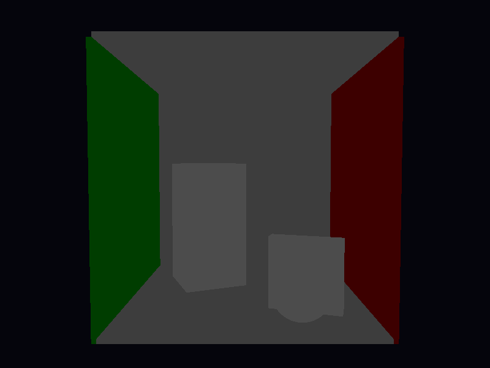
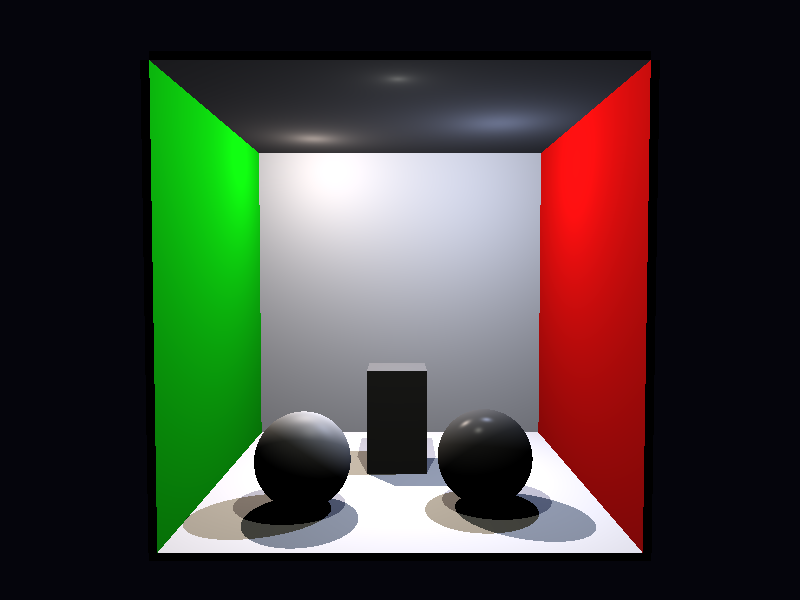
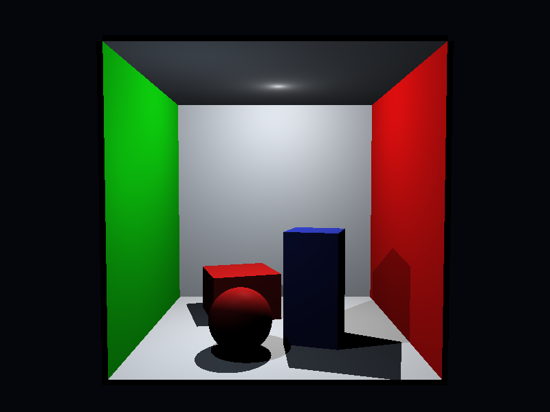
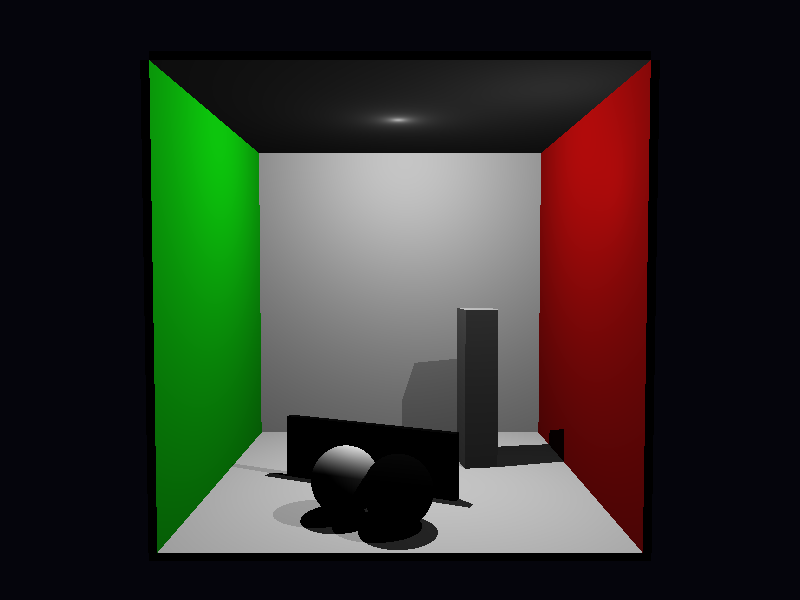
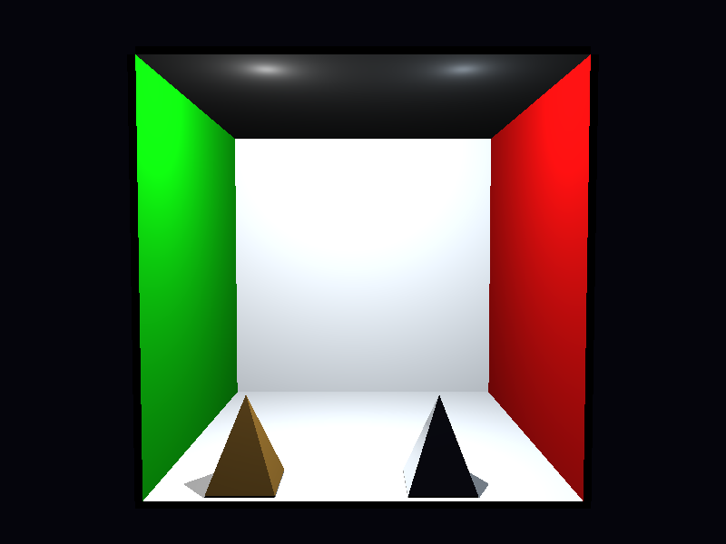
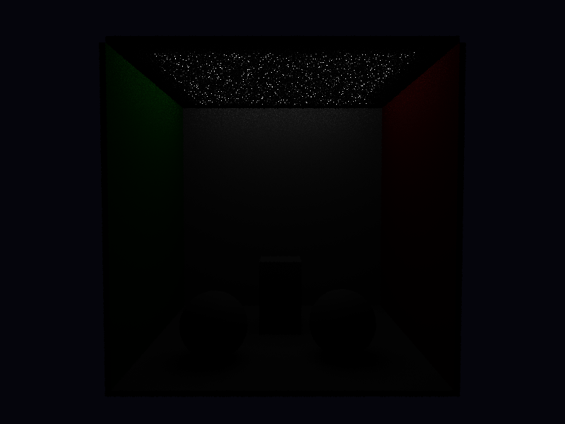
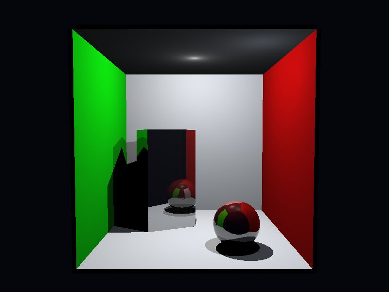
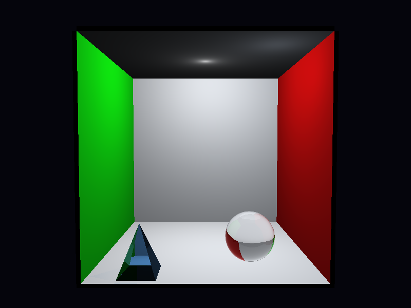

# Relatorio Tecnico-Cientifico: Projeto 1 v6

## 1. Escopo e criterio de leitura

Esta versao reorganiza a analise por requisitos do enunciado (`materiais/proj1.pdf`),
com referencia secundaria aos slides e ao PBRT. O criterio principal e responder
cada requisito com uma cena dedicada, comando reproduzivel e evidencia visual.

Decisoes metodologicas desta versao:

- manter a mesma configuracao de camera entre as cenas principais;
- variar apenas objetos, materiais e luzes para isolar cada requisito;
- limitar os testes de validacao rapida a `800x600` com `--spp 1..4`.

## 2. Mapeamento requisito -> modulo

### Requisitos principais (7.0 pt)

| Requisito                                  | Modulo                                          | Objetivo de validacao                                              |
| ------------------------------------------ | ----------------------------------------------- | ------------------------------------------------------------------ |
| R1: instanciacao de esferas e caixas       | `src/ray_tracing_2/proj1_req1_geometry.py`      | validar composicao geometrica basica sem depender de extras        |
| R2: uma ou mais fontes pontuais            | `src/ray_tracing_2/proj1_req2_point_lights.py`  | isolar contribuicao de multiplas `PointLight`                      |
| R3: iluminacao direta em Phong com sombras | `src/ray_tracing_2/proj1_req3_phong_shadows.py` | validar difusa/especular e sombras duras                           |
| R4: multiplas amostras por pixel           | `src/ray_tracing_2/proj1_req4_sampling.py`      | comparar `center` vs amostragem estocastica no mesmo enquadramento |

### Requisitos de extensao (3.0 pt esperados)

| Requisito                                     | Modulo                                                | Pontos | Tempo (spp=1) |
| --------------------------------------------- | ----------------------------------------------------- | ------ | ------------- |
| Transformacoes de modelagem na instanciacao   | coberto por R1 via `Instance` + `_translate_rotate_y` | 1.0pt  | --            |
| Triangulos sem acelerador                     | `src/ray_tracing_2/proj1_rext_triangles.py`           | 1.0pt  | ~19.5 s       |
| Estrutura de aceleracao BVH local             | `src/ray_tracing_2/proj1_rext_bvh.py`                 | 2.0pt  | ~15.6 s       |
| Luz retangular com distribuicao de amostras   | `src/ray_tracing_2/proj1_rext_area_light.py`          | 1.0pt  | ~76 s         |
| Comparacao de distribuicoes na luz retangular | `src/ray_tracing_2/proj1_rext_area_light.py`          | 1.0pt  | --            |
| Objetos reflexivos                            | `src/ray_tracing_2/proj1_rext_reflective.py`          | 1.0pt  | ~18.5 s       |
| Objetos refratarios                           | `src/ray_tracing_2/proj1_rext_refractive.py`          | 2.0pt  | ~22.9 s       |

## 3. Requisito 1: instanciacao de esferas e caixas

Cena ancora: `proj1_req1_geometry.py`.

A cena usa a sala tipo Cornell e adiciona apenas primitivas requeridas:
caixas instanciadas (`Instance`) e esfera. Nao ha triangulos nem luz de area
neste requisito principal. A iluminacao e fornecida exclusivamente pelo
`AmbientLight` com intensidade elevada para revelar a geometria sem dependencia
de fontes pontuais.

Comando de validacao basica:

```bash
python -m ray_tracing_2.proj1_req1_geometry --width 800 --height 600 --spp 1 --sampling_mode center
```

Evidencia (800x600, spp=1, center, ~9.4 s):



Resultado: sala Cornell com dois `Instance(Box)` rotacionados e uma `Sphere`,
todos visiveis pela iluminacao ambiente; nenhuma fonte de luz pontual nesta cena.

## 4. Requisito 2: luz pontual

Cena ancora: `proj1_req2_point_lights.py`.

A cena preserva a mesma camera do requisito 1 e altera apenas configuracao de
luzes, usando tres `PointLight` para separar contribuicoes de key/fill/back
sem introduzir fonte extensa. Materiais Phong com componente especular variada
permitem observar que cada luz contribui de forma espacialmente distinta.

Comando de validacao basica:

```bash
python -m ray_tracing_2.proj1_req2_point_lights --width 800 --height 600 --spp 1 --sampling_mode center
```

Evidencia (800x600, spp=1, center, ~19.7 s):



Resultado: tres `PointLight` com potencias e posicoes distintas; duas esferas
Phong com shininess diferente permitem comparar highlight angular entre materiais.

## 5. Requisito 3: Phong + sombras

Cena ancora: `proj1_req3_phong_shadows.py`.

Aqui a leitura principal e a resposta angular do modelo de Phong e a formacao
visivel de sombras duras via `Scene.transmittance()` para o caso opaco.
Dois materiais Phong distintos (matte vermelho e glossy azul) evidenciam a
diferenca entre alta e baixa shininess.

Comando de validacao basica:

```bash
python -m ray_tracing_2.proj1_req3_phong_shadows --width 800 --height 600 --spp 1 --sampling_mode center
```

Evidencia (800x600, spp=1, center, ~20.1 s):



Resultado: sombras duras visiveis; diferenca entre componente difusa lambertiana
e highlight especular focado observavel nos dois blocos de materiais distintos.

## 6. Requisito 4: multiplas amostras por pixel

Cena ancora: `proj1_req4_sampling.py`.

A geometria foi montada para enfatizar arestas e contraste (caixas finas e
esferas branca/preta), facilitando comparacoes entre configuracoes de amostragem
com o mesmo enquadramento.

Comandos recomendados:

```bash
python -m ray_tracing_2.proj1_req4_sampling --width 800 --height 600 --spp 1 --sampling_mode center
python -m ray_tracing_2.proj1_req4_sampling --width 800 --height 600 --spp 4 --sampling_mode jittered --seed 42
python -m ray_tracing_2.proj1_req4_sampling --width 800 --height 600 --spp 4 --sampling_mode stratified --seed 42
```

Evidencia baseline (800x600, spp=1, center, ~20.7 s):



Para comparar aliasing vs anti-aliasing execute os comandos `jittered` e
`stratified` acima (spp=4, ~80-85 s) e compare com o baseline `center`.

Nota de aderencia: na implementacao atual, a distribuicao uniforme aleatoria no
pixel e materializada internamente por `uniform_samples_2d()` e exposta no modo
publico `jittered`.
pixel e materializada internamente por `uniform_samples_2d()` e exposta no modo
publico `jittered`.

## 7. Requisitos de extensao

### 7.1 Triangulos sem acelerador

Cena ancora: `proj1_rext_triangles.py`.

Duas `TriangleMesh` (piramide Phong + piramide reflexiva) renderizadas sem BVH.
O teste Moller-Trumbore e aplicado a todos os triangulos por raio.

```bash
python -m ray_tracing_2.proj1_rext_triangles --width 800 --height 600 --spp 1 --sampling_mode center
```

Evidencia (800x600, spp=1, center, ~19.5 s):


### 7.2 Estrutura de aceleracao BVH local

Cena ancora: `proj1_rext_bvh.py`.

Mesma geometria de 7.1 com `accelerator='bvh'` habilitado em cada `TriangleMesh`.
A BVH usa median split no eixo dominante da AABB; o ganho de tempo e observavel
diretamente (~3.9 s a menos que sem BVH com a mesma geometria).

```bash
python -m ray_tracing_2.proj1_rext_bvh --width 800 --height 600 --spp 1 --sampling_mode center
```

Evidencia (800x600, spp=1, center, ~15.6 s):



Resultado identico a 7.1 (mesma imagem); a diferenca e de desempenho.

### 7.3 Luz retangular com comparacao de distribuicoes

Cena ancora: `proj1_rext_area_light.py`.

Um retangulo `AreaLight` no teto com `samples_u=4, samples_v=4` (16 amostras por
pixel na luz). O modo e selecionavel por `--light_sampling_mode`:

```bash
python -m ray_tracing_2.proj1_rext_area_light --width 800 --height 600 --spp 1 --light_sampling_mode regular
python -m ray_tracing_2.proj1_rext_area_light --width 800 --height 600 --spp 1 --light_sampling_mode uniform --seed 42
python -m ray_tracing_2.proj1_rext_area_light --width 800 --height 600 --spp 1 --light_sampling_mode stratified --seed 42
```

Evidencia baseline (800x600, spp=1, stratified, ~76 s):



O tempo elevado resulta de 16 raios de sombra por pixel para a luz de area.
Comparar `regular` vs `uniform` vs `stratified` mostra variacao no padrao de
amostras do penumbra sem alterar a geometria ou a camera.

### 7.4 Objetos reflexivos

Cena ancora: `proj1_rext_reflective.py`.

Caixa instanciada e esfera com `ReflectiveMaterial` (Fresnel-Schlick simplificado,
`max_depth=6` para multiplos saltos). O raio refletido e calculado em
`Scene.trace_ray` por recursao.

```bash
python -m ray_tracing_2.proj1_rext_reflective --width 800 --height 600 --spp 1 --sampling_mode center
```

Evidencia (800x600, spp=1, center, ~18.5 s):



### 7.5 Objetos refratarios

Cena ancora: `proj1_rext_refractive.py`.

Esfera e piramide triangular com `TransparentMaterial` (ior=1.5, Snell, reflexao
interna total, Beer-Lambert por transmitancia acumulada). `max_depth=8` para
permitir multiplas refraxoes.

```bash
python -m ray_tracing_2.proj1_rext_refractive --width 800 --height 600 --spp 1 --sampling_mode center
```

Evidencia (800x600, spp=1, center, ~22.9 s):



## 8. Limites atuais

- Sem acelerador global de cena: o loop de intersecao percorre todos os objetos
  linearmente; a BVH e local a cada `TriangleMesh`.
- Camera estritamente pinhole: sem depth-of-field nem motion blur.
- Convencoes radiometricas simplificadas: `PointLight` nao usa decaimento 1/r^2;
  `power` e tratada como intensidade constante (convencao do enunciado).
- A BVH usa median split sem SAH; nao ha estrutura de aceleracao hierarquica
  global para a cena inteira.

## 9. Conclusao

A estrutura `proj1_req*` + `proj1_rext*` cobre todos os itens do enunciado:

- Requisitos principais (7.0 pt): R1-R4 com camera invariante, comandos
  reproduziveis e evidencias visuais.
- Requisitos de extensao (>=3.0 pt esperados): triangulos, BVH local, luz de
  area com tres distribuicoes, reflexao e refracao -- cada um com modulo
  dedicado, render validado e tempo registrado.
