# <span id="page-0-0"></span>Integra¸c˜ao de Monte Carlo INF2604 – Fundamentos de Computa¸c˜ao Gr´afica

Waldemar Celes celes@inf.puc-rio.br

Departamento de Inform´atica, PUC-Rio


# T´opicos

[Gera¸c˜ao de N´umeros Aleat´orios](#page-2-0)

[Integra¸c˜ao Num´erica](#page-27-0)

[Monte Carlo em renderiza¸c˜ao](#page-53-0)


## <span id="page-2-0"></span>Geração de Números Aleatórios


### Dom´ınio discreto

I Exemplo: lan¸camento de um dado

$$X_i \in \{1, 2, 3, 4, 5, 6\}$$

I Probabilidade de sair um determinado n´umero

$$p_i = \frac{1}{6}, \qquad \sum_i p_i = 1$$


### Dom´ınio discreto

I Exemplo: lan¸camento de um dado

$$X_i \in \{1, 2, 3, 4, 5, 6\}$$

I Probabilidade de sair um determinado n´umero

$$p_i = \frac{1}{6}, \qquad \sum_i p_i = 1$$

I Distribui¸c˜ao de probabilidade


### Dom´ınio discreto

I Exemplo: lan¸camento de um dado

$$X_i \in \{1, 2, 3, 4, 5, 6\}$$

I Probabilidade de sair um determinado n´umero

$$p_i = \frac{1}{6}, \qquad \sum_i p_i = 1$$

I Distribui¸c˜ao de probabilidade

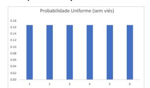

I Escolhendo X<sup>i</sup> a partir de uma vari´avel randˆomica cont´ınua ξ ∈ [0, 1)


### Dom´ınio discreto

I Exemplo: lan¸camento de um dado

$$X_i \in \{1, 2, 3, 4, 5, 6\}$$

I Probabilidade de sair um determinado n´umero

$$p_i = \frac{1}{6}, \qquad \sum_i p_i = 1$$

I Distribui¸c˜ao de probabilidade

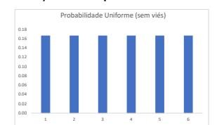

I Escolhendo X<sup>i</sup> a partir de uma vari´avel randˆomica cont´ınua ξ ∈ [0, 1)

$$X_i = 1 + \lfloor 6\,\xi \rfloor$$


### Dom´ınio discreto

I Dado "viciado": n´umero 5 com 10% a mais de probabilidade de sair

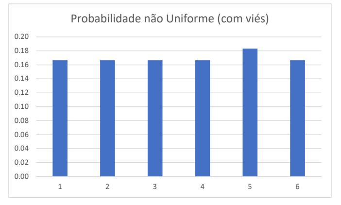


I Como gerar X<sup>i</sup> a partir de ξ?


Dado "viciado"

$$p = \left\{ \frac{1}{6}, \frac{1}{6}, \frac{1}{6}, \frac{1}{6}, \frac{1.1}{6}, \frac{1}{6} \right\}$$


Dado "viciado"

$$p = \left\{ \frac{1}{6}, \frac{1}{6}, \frac{1}{6}, \frac{1}{6}, \frac{1.1}{6}, \frac{1}{6} \right\}$$

Normalizando

$$p = \left\{ \frac{1}{6.1}, \frac{1}{6.1}, \frac{1}{6.1}, \frac{1}{6.1}, \frac{1}{6.1}, \frac{1}{6.1} \right\}, \qquad \sum_{i} p_i = 1$$


### Dado "viciado"

I Fun¸c˜ao de distribui¸c˜ao acumulada (cumulative distribution function (CDF))

$$P(x) = P_r\{X \le x\}$$

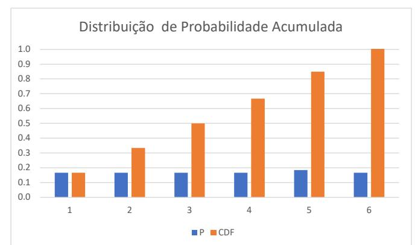


### Dado "viciado"

I Gera¸c˜ao de X<sup>i</sup> a partir de ξ?

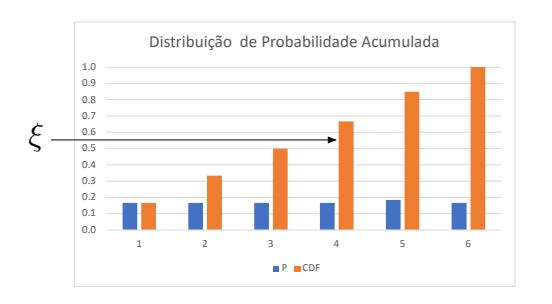

$$\sum_{j=1}^{i-1} p_j \le \xi < \sum_{j=1}^{i} p_j$$


# Gera¸c˜ao de n´umeros aleat´orios seguindo p<sup>i</sup>

Distribui¸c˜ao de probabilidade discreta: M´etodo da invers˜ao

- I Determinar X<sup>i</sup> com base em ξ
  - I Dado a distribui¸c˜ao discreta p<sup>i</sup> normalizada

$$\sum_{i=0}^{n-1} p_i = 1$$

I Calcula CDF

$$P(i) = \sum_{j=0}^{i} p_j$$

I Usa gerador padr˜ao

$$\xi \in [0,1)$$

I Calcula amostra como valor inverso

$$X_i / P(i-1) \le \xi < P(i)$$


# Dom´ınio cont´ınuo

### Probability Density Function (PDF)

- I Fun¸c˜ao de densidade de probabilidade : p(x)
  - I Necessariamente n˜ao negativo

$$p(x) = \frac{dP(x)}{dx}$$

I Integral no dom´ınio necessariamente igual a 1

$$\int_{D} p(x)dx = 1$$

I Avalia¸c˜ao da probabilidade de um valor estar num intervalo

$$P(x \in [a, b]) = \int_{a}^{b} p(x)dx$$


# Geração de números aleatórios seguindo p(x)

Distribuição de probabilidade qualquer contínua: Método da inversão

- ▶ Determinar  $X_i$  de um PDF arbitrário p(x)
  - Normalizado

$$\int_{D} p(x)dx = 1$$

Calcula CDF

$$P(x) = \int_0^x p(x')dx'$$

► Calcula a inversa

$$P^{-1}(x)$$

Usa gerador padrão

$$\xi \in [0,1)$$

► Calcula amostra como valor inverso

$$X_i = P^{-1}(\xi)$$


Exemplo com distribuição exponencial:  $p(x) \propto e^{-ax}$ 

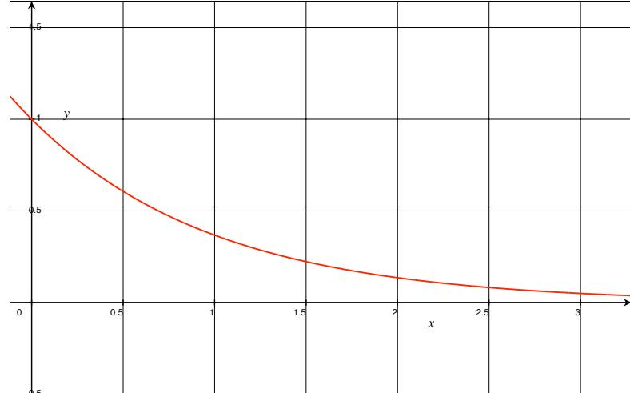


Exemplo com distribuição exponencial:  $p(x) \propto e^{-ax}$   $\therefore$   $p(x) = c e^{-ax}$ 


Exemplo com distribuição exponencial:  $p(x) \propto e^{-ax}$  :  $p(x) = c e^{-ax}$ 

Normalizando a distribuição (considerando o intervalor 
$$[0,\infty]$$
): 
$$\int_0^\infty c\,e^{-ax}dx = -\frac{c}{x}e^{-ax}\Big|_0^\infty = \frac{c}{a} = 1$$


Exemplo com distribuição exponencial:  $p(x) \propto e^{-ax}$   $\therefore$   $p(x) = c e^{-ax}$ 

Normalizando a distribuição (considerando o intervalor  $[0,\infty]$ ):

$$\int_0^\infty c \, e^{-ax} dx = -\frac{c}{x} e^{-ax} \Big|_0^\infty = \frac{c}{a} = 1$$

▶ Então c=a e nosso PDF deve ser  $p(x)=ae^{-ax}$ . Achando P(x):  $P(x)=\int_0^x a\,e^{-ax'}dx'=1-e^{-ax}$ 

$$P(x) = \int_0^x a e^{-ax'} dx' = 1 - e^{-ax}$$


Exemplo com distribuição exponencial:  $p(x) \propto e^{-ax}$   $\therefore$   $p(x) = c e^{-ax}$ 

Normalizando a distribuição (considerando o intervalor  $[0,\infty]$ ):

$$\int_{0}^{\infty} c \, e^{-ax} dx = -\frac{c}{x} e^{-ax} \Big|_{0}^{\infty} = \frac{c}{a} = 1$$

▶ Então c=a e nosso PDF deve ser  $p(x)=ae^{-ax}$ . Achando P(x):  $P(x)=\int_0^x a\,e^{-ax'}dx'=1-e^{-ax}$ 

$$P(x) = \int_0^x a e^{-ax'} dx' = 1 - e^{-ax}$$

Invertendo:

$$P^{-1} = -\frac{\ln(1-x)}{a}$$


13

Exemplo com distribuição exponencial:  $p(x) \propto e^{-ax}$  :  $p(x) = c e^{-ax}$ 

Normalizando a distribuição (considerando o intervalor  $[0, \infty]$ ):

$$\int_0^\infty c \, e^{-ax} dx = -\frac{c}{x} e^{-ax} \Big|_0^\infty = \frac{c}{a} = 1$$

▶ Então c=a e nosso PDF deve ser  $p(x)=ae^{-ax}$ . Achando P(x):  $P(x)=\int_0^x a\,e^{-ax'}dx'=1-e^{-ax}$ 

$$P(x) = \int_0^x a e^{-ax'} dx' = 1 - e^{-ax}$$

Invertendo:

$$P^{-1} = -\frac{\ln(1-x)}{a}$$

Amostra:

$$X = -\frac{\ln(1-\xi)}{a}$$


# Gera¸c˜ao no caso cont´ınuo

Exemplo com distribui¸c˜ao exponencial: p(x) ∝ e <sup>−</sup>ax, para a = 1

```
f o r i = 1 , 1 0 0 0 do
   l o c a l xi = - m a t h . l o g (1 - m a t h . r a n d o m ( ) )
   p r i n t ( xi )
e n d
```

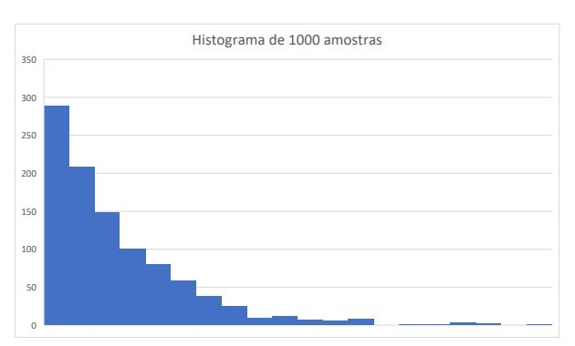


# Valor esperado e variˆancia

Valor esperado (valor m´edio)

I Valor m´edio de uma fun¸c˜ao considerando a distribui¸c˜ao p(x) no dom´ınio

$$E_p[f(x)] = \int_D f(x)p(x)dx$$


# Valor esperado e variˆancia

Valor esperado (valor m´edio)

- I Exemplo: valor esperado de cos x no dom´ınio [0, π]
  - I Assumindo distrui¸c˜ao constante: p(x) = k
  - I Como o PDF p(x) tem que integrar para o valor 1 no dom´ınio

Z <sup>π</sup> 0

nter 
$$p(x) = k$$
ntegrar para o valor  $1$  no domínio
 $k\,dx = 1$   $\therefore$   $p(x) = k = \frac{1}{\pi}$ 

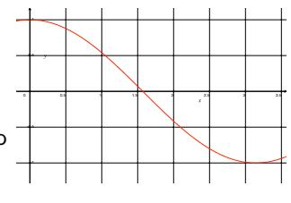

I Ent˜ao:

$$E[\cos x] = \int_0^{\pi} \frac{\cos x}{\pi} dx = \frac{1}{\pi} (\sin \pi - \sin 0) = 0$$


## Valor esperado e variância

#### Variância

- ► Mede a dispersão estatística dos valores
  - O quão longe, em geral, eles se encontram do valor esperado

$$V[f(x)] = E\left[ (f(x) - E[f(x)])^2 \right]$$


## Valor esperado e variância

#### Variância

- ► Mede a dispersão estatística dos valores
  - ▶ O quão longe, em geral, eles se encontram do valor esperado

$$V[f(x)] = E[(f(x) - E[f(x)])^{2}]$$

Observe:

$$\begin{split} \mu &= E[f(x)] \\ \sigma^2 &= E[(f(x) - \mu)^2] \\ \sigma^2 &= E[f(x)^2 - 2\mu f(x) + \mu^2] = E[f(x)^2] - 2\mu E[f(x)] + \mu^2 \\ \sigma^2 &= E[f(x)^2] - 2\mu^2 + \mu^2 = E[f(x)^2] - \mu^2 \end{split}$$

Logo:

$$V[f(x)] = E[f(x)^2] - E[f(x)]^2$$


# Valor esperado e variˆancia

I Exemplo: variˆancia de cos x no dom´ınio [0, π]

$$V[f(x)] = E[\cos^2 x] - E[\cos x]^2$$
$$= \int_0^{\pi} \frac{\cos^2 x}{\pi} dx - 0$$
$$= \frac{1}{2}$$


<span id="page-27-0"></span>


# Integra¸c˜ao num´erica

Exemplo: integra¸c˜ao da fun¸c˜ao f(x) = 2.4 − (x − π 2 ) 2

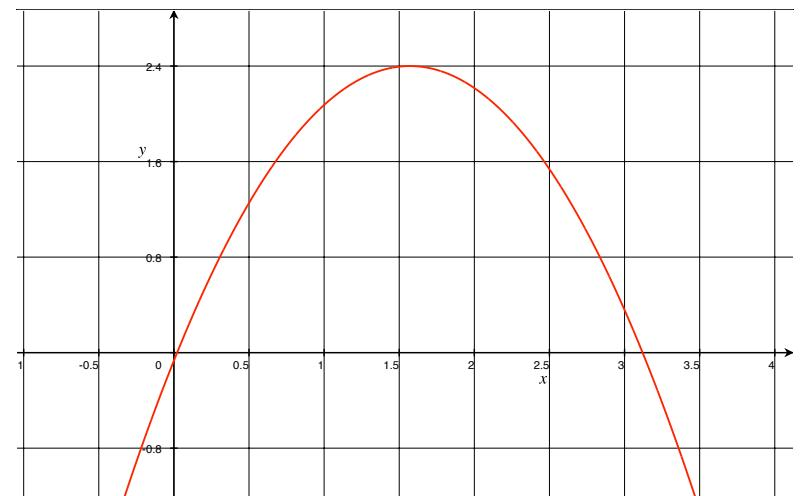


# Integra¸c˜ao num´erica

Integra¸c˜ao da fun¸c˜ao f(x) = 2.4 − (x − π 2 ) 2

I M´etodo do ponto m´edio

$$\int_a^b f(x)dx = h\sum_{i=0}^{n-1} f(\frac{x_i+x_{i+1}}{2})$$
 onde: 
$$h = \frac{b-a}{n}$$

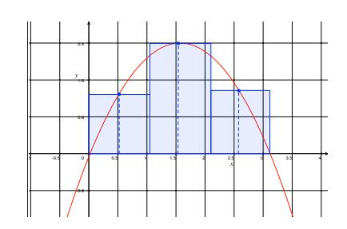


# Integra¸c˜ao num´erica

Integra¸c˜ao da fun¸c˜ao f(x) = 2.4 − (x − π 2 ) 2

I M´etodo do ponto m´edio

$$\int_a^b f(x)dx = h\sum_{i=0}^{n-1} f(\frac{x_i+x_{i+1}}{2})$$
 onde: 
$$h = \frac{b-a}{n}$$


$$\int_a^b f(x)dx = \frac{1}{n} \left(b-a\right) \sum_{i=0}^{n-1} f(x_i)$$
 onde:  $x_i = a + \xi(b-a)$ 

n

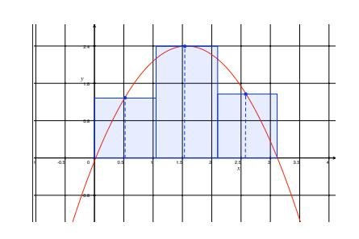

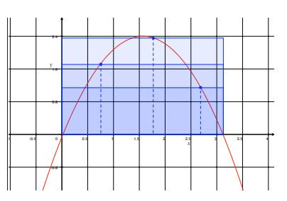


$$\int_0^{\pi} 2.4 - \left(x - \frac{\pi}{2}\right)^2 dx$$

- ► Solução analítica: 4.956
- ▶ Ponto médio com 10 intervalos: 4.982 (e=0.026)


$$\int_0^{\pi} 2.4 - \left(x - \frac{\pi}{2}\right)^2 dx$$

- ► Solução analítica: 4.956
- ▶ Ponto médio com 10 intervalos: 4.982 (e=0.026)
- Monte Carlo com 10 amostras
  - ▶ 4.841 (e=0.115)


$$\int_0^{\pi} 2.4 - \left(x - \frac{\pi}{2}\right)^2 dx$$

- ► Solução analítica: 4.956
- ▶ Ponto médio com 10 intervalos: 4.982 (e=0.026)
- ► Monte Carlo com 10 amostras
  - ▶ 4.841 (e=0.115)
  - ▶ 5.037 (e=0.081)
  - ▶ 4.513 (e=0.443)


$$\int_0^{\pi} 2.4 - \left(x - \frac{\pi}{2}\right)^2 dx$$

- ► Solução analítica: 4.956
- ▶ Ponto médio com 10 intervalos: 4.982 (e=0.026)
- ► Monte Carlo com 10 amostras
  - ► 4.841 (e=0.115)
  - ▶ 5.037 (e=0.081)
  - ▶ 4.513 (e=0.443)
- ▶ Converge?


$$\int_0^{\pi} 2.4 - \left(x - \frac{\pi}{2}\right)^2 dx$$

- ► Solução analítica: 4.956
- ▶ Ponto médio com 10 intervalos: 4.982 (e=0.026)
- ► Monte Carlo com 10 amostras
  - ▶ 4.841 (e=0.115)
  - ▶ 5.037 (e=0.081)
  - ▶ 4.513 (e=0.443)
- ► Converge?
  - ► Monte Carlo com 1000 amostras
    - ▶ 4.951 (e=0.005)
    - ▶ 4.906 (e=0.050)
    - ▶ 4.981 (e=0.025)


$$\int_0^{\pi} 2.4 - \left(x - \frac{\pi}{2}\right)^2 dx$$

- ► Solução analítica: 4.956
- ▶ Ponto médio com 10 intervalos: 4.982 (e=0.026)
- ► Monte Carlo com 10 amostras
  - ▶ 4.841 (e=0.115)
  - ► 5.037 (e=0.081)
  - ▶ 4.513 (e=0.443)
- ► Converge?
  - ► Monte Carlo com 1000 amostras
    - ▶ 4.951 (e=0.005)
    - ▶ 4.906 (e=0.050)
    - ▶ 4.981 (e=0.025)
- ► É efetivo?


$$\int_0^{\pi} 2.4 - (x - \frac{\pi}{2})^2 dx$$

- ► Desempenho com baixa amostragem
  - ► Solução analítica: 4.956
  - ▶ Ponto médio com 2 intervalos: 5.602 (e=0.646)
  - ► Monte Carlo com 2 amostras
    - ▶ 6.630 (e=1.674)
    - ▶ 5.432 (e=0.476)
    - ▶ 4.942 (e=0.014)
    - ▶ 5.850 (e=0.894)


#### Exemplo

$$\int_0^{\pi} 2.4 - (x - \frac{\pi}{2})^2 dx$$

- ▶ Desempenho com baixa amostragem
  - ► Solução analítica: 4.956
  - ▶ Ponto médio com 2 intervalos: 5.602 (e=0.646)
  - ► Monte Carlo com 2 amostras
    - ▶ 6.630 (e=1.674)
    - ▶ 5.432 (e=0.476)
    - ▶ 4.942 (e=0.014)
    - ▶ 5.850 (e=0.894)

#### Observação

Determinadas amostragem resultam em resultados muito bons


#### Exemplo

$$\int_0^{\pi} 2.4 - (x - \frac{\pi}{2})^2 dx$$

- ▶ Desempenho com baixa amostragem
  - ► Solução analítica: 4.956
  - ▶ Ponto médio com 2 intervalos: 5.602 (e=0.646)
  - ► Monte Carlo com 2 amostras
    - ▶ 6.630 (e=1.674)
    - ► 5.432 (e=0.476)
    - ► 4.942 (e=0.014)
    - ▶ 5.850 (e=0.894)

#### Observação

- ▶ Determinadas amostragem resultam em resultados muito bons
- ► Como fazer uma amostragem adequada?


# Monte Carlo

### Estimador de Monte Carlo

I Fun¸c˜ao 1D com distribui¸c˜ao de amostras uniforme

$$\int_{a}^{b} f(x)dx \approx F_{N} = \frac{b-a}{N} \sum_{i=1}^{N} f(X_{i})$$

I onde X<sup>i</sup> ∈ [a, b] ´e um n´umero aleat´orio com p(x) = <sup>1</sup> b−a


#### Converge?

▶ De fato:  $E[F_N] = \int_a^b f(x) dx$ 

$$E[F_N] = E\left[\frac{b-a}{N} \sum_{i=1}^N f(X_i)\right]$$
$$= \frac{b-a}{N} \sum_{i=1}^N E[f(X_i)]$$
$$= \frac{b-a}{N} \sum_{i=1}^N \int_a^b f(x) p(x) dx$$

 $\rightharpoonup$  como  $p(x) = \frac{1}{b-a}$ , tem-se:

$$E[F_N] = \frac{1}{N} \sum_{i=1}^{N} \int_a^b f(x) = \int_a^b f(x) dx$$


Generalizando para amostragens que seguem uma distribuição de p(x):

$$F_N = \frac{1}{N} \sum_{i=1}^{N} \frac{f(X_i)}{p(X_i)}$$


Generalizando para amostragens que seguem uma distribui¸c˜ao de p(x):

$$F_N = \frac{1}{N} \sum_{i=1}^{N} \frac{f(X_i)}{p(X_i)}$$

I Intuitivamente: amostras menos prov´aveis, quando utilizadas, tˆem peso maior para compensar baixa ocorrˆencia


Generalizando para amostragens que seguem uma distribui¸c˜ao de p(x):

$$F_N = \frac{1}{N} \sum_{i=1}^{N} \frac{f(X_i)}{p(X_i)}$$

- I Intuitivamente: amostras menos prov´aveis, quando utilizadas, tˆem peso maior para compensar baixa ocorrˆencia
- I De novo, demonstra-se que:

$$E[F_N] = \int_a^b f(x)dx$$


Retomando

$$F_N = \frac{1}{N} \sum_{i=1}^{N} \frac{f(X_i)}{p(X_i)}$$

▶ Qual PDF usar?


### Retomando

$$F_N = \frac{1}{N} \sum_{i=1}^{N} \frac{f(X_i)}{p(X_i)}$$

- I Qual PDF usar?
  - I Se usarmos p(x) = k f(x):

$$E[F_N] = E\left[\frac{1}{N} \sum_{i=1}^{N} \frac{f(X_i)}{p(X_i)}\right]$$

$$E[F_N] = \frac{1}{N} \sum_{i=1}^{N} E\left[\frac{1}{k}\right] = \frac{1}{k}$$

I Como o valor independe de X<sup>i</sup> , uma amostra qualquer resulta no valor correto


### Retomando

$$F_N = \frac{1}{N} \sum_{i=1}^{N} \frac{f(X_i)}{p(X_i)}$$

- I Qual PDF usar?
  - I Se usarmos p(x) = k f(x):

$$E[F_N] = E\left[\frac{1}{N} \sum_{i=1}^{N} \frac{f(X_i)}{p(X_i)}\right]$$

$$E[F_N] = \frac{1}{N} \sum_{i=1}^{N} E\left[\frac{1}{k}\right] = \frac{1}{k}$$

- I Como o valor independe de X<sup>i</sup> , uma amostra qualquer resulta no valor correto
  - I Mas:

$$k = \frac{1}{\int_D f(x)dx}$$


Qual PDF usar?

 $\rightharpoonup$  Uma função conhecida que se aproxima de f(x)


#### Qual PDF usar?

- $\blacktriangle$  Uma função conhecida que se aproxima de f(x)
  - ▶ No nosso exemplo:  $f(x) = 2.4 (x \frac{\pi}{2})^2$ 
    - $label{eq:poisson} \blacktriangleright \ \, \mathsf{Uso} \,\, \mathsf{de} \,\, p(x) = k \, \sin(x)$

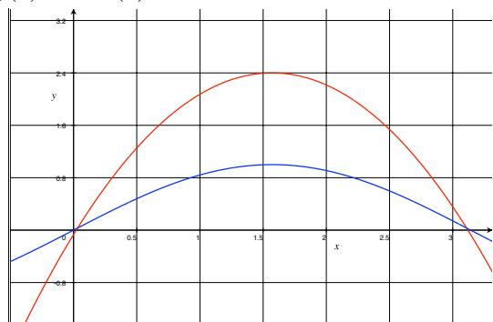


Exemplo:  $f(x) = 2.4 - (x - \frac{\pi}{2})^2$ 

- ▶ Usando  $p(x) = k \sin x$ 
  - Normaliza

$$\int_0^{\pi} k \sin(x) dx = k[-\cos x]_0^{\pi}] = k[-(-2)] = 2k = 1 :: k = 1/2$$

Calcula CDF

$$P(x) = \int_0^x \frac{\sin x'}{2} dx' = -\frac{1}{2} \cos x \Big|_0^x = -\frac{1}{2} (\cos x - 1) = \frac{1}{2} (1 - \cos x)$$

Calcula inversa

$$y = \frac{1}{2}(1 - \cos x)$$
 :  $x = \cos^{-1}(1 - 2y)$ 

► Calcula amostra

$$X = \cos^{-1}(1 - 2\xi)$$


Exemplo: 
$$f(x) = 2.4 - (x - \frac{\pi}{2})^2$$

- ► Solução analítica: 4.956
- ► Solução ponto médio (2 amostras)
  - ► 5.602 (e=0.646)
- ► Solução Monte Carlo (2 amostras): p(x) = k
  - ▶ 7.302 (e=2.346)
  - ► 5.850 (e=0.894)
  - ▶ 4.942 (e=0.014)
  - ► 6.744 (e=1.788)


Exemplo: 
$$f(x) = 2.4 - (x - \frac{\pi}{2})^2$$

- ► Solução analítica: 4.956
- ► Solução ponto médio (2 amostras)
  - ► 5.602 (e=0.646)
- Solução Monte Carlo (2 amostras): p(x) = k
  - ▶ 7.302 (e=2.346)
  - ► 5.850 (e=0.894)
  - ▶ 4.942 (e=0.014)
  - ▶ 6.744 (e=1.788)
- ▶ Solução Monte Carlo (2 amostras):  $p(x) = \frac{\sin x}{2}$ 
  - ► 5.261 (e=0.305)
  - ▶ 5.130 (e=0.174)
  - ► 5.010 (e=0.054)
  - ► 4.826 (e=0.130)


## <span id="page-53-0"></span>Monte Carlo em renderização


## Geração multidimensional

Gerar (X,Y) com base no pdf p(x,y)

► Distribuição separável

$$p(x,y) = p_x(x)p_y(y)$$

 $\blacktriangle$  Basta gerar X e Y independentemente de acordo com  $p_x$  e  $p_y$ 


# Gera¸c˜ao multidimensional

Gerar (X, Y ) com base no pdf p(x, y)

- I Distribui¸c˜ao n˜ao separ´avel
  - I Calcula uma fun¸c˜ao densidade marginal
    - I Densidade m´edia de um x para todos os poss´ıveis y

$$p(x) = \int p(x, y) dy$$

- I Calcula a fun¸c˜ao densidade condicional
  - I Fun¸c˜ao densidade de y para um dado x

$$p(y|x) = \frac{p(x,y)}{p(x)}$$

- I Procedimento
  - I Usa p(x) para gerar X
  - I Usa p(y|x) para gerar Y , dado o x j´a escolhido


### Transformação entre distribuições

- $\blacktriangle$  Suponha uma amostra aleatória X que segue a distribuição  $p_x(x)$
- ▶ Suponha a transformação bijetora Y = T(X)

Tem-se:

$$p_y(y) = p_y(T(x)) = \frac{p_x(x)}{|J_T(x)|}$$

 $\rightharpoonup$  onde  $J_T$  é a matrix Jacobiana:

$$\begin{bmatrix} \partial T_1/\partial x_i & \cdots & \partial T_1/\partial x_n \\ \vdots & \ddots & \vdots \\ \partial T_n/\partial x_i & \cdot & \partial T_n/\partial x_n \end{bmatrix}$$


# Transforma¸c˜ao entre distribui¸c˜oes

#### Exemplo: Coordenadas polares

$$x = r\cos\theta$$
$$y = r\sin\theta$$

- I Dado p(r, θ), queremos determinar p(x, y)
  - I Matrix Jacobiana

$$J_T = \begin{bmatrix} \partial x/\partial r & \partial x/\partial \theta \\ \partial y/\partial r & \partial y/\partial \theta \end{bmatrix} = \begin{bmatrix} \cos\theta & -r\sin\theta \\ \sin\theta & r\cos\theta \end{bmatrix}$$

I Determinante

$$|J_T| = r\cos^2\theta + r\sin^2\theta = r$$

I Logo

$$p(x,y) = \frac{p(r,\theta)}{r}$$
 :  $p(r,\theta) = r p(x,y)$ 


# Amostragem uniforme em um hemisf´erio unit´ario

Amostragem de ω no hemisf´erio Ω considerando p(w) = c

I Normalizando p(x)

$$\int_{\Omega} p(w)dw = 1 \Rightarrow c \int_{\Omega} dw = 1 \Rightarrow c = \frac{1}{2\pi}$$

I Transforma¸c˜ao para coordenadas esf´ericas: p(θ, φ)

$$dw = \sin\theta \, d\theta d\phi$$
 :  $p(\theta, \phi) = \frac{\sin\theta}{2\pi}$ 

I Densidade marginal p(θ)

$$p(\theta) = \int_0^{2\pi} p(\theta, \phi) d\phi = \int_0^{2\pi} \frac{\sin \theta}{2\pi} d\phi = \sin \theta$$

I Densidade condicional p(φ|θ)


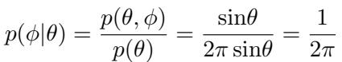


# Amostragem uniforme em um hemisf´erio unit´ario

Usando o m´etodo de invers˜ao para cada dimens˜ao

I Calcula CDFs

$$P(\theta) = \int_0^{\theta} \sin\theta' \, d\theta' = 1 - \cos\theta$$
$$P(\phi|\theta) = \int_0^{\phi} \frac{1}{2\pi} d\phi' = \frac{\phi}{2\pi}$$

I Calcula inversas (substituindo 1 − ξ por ξ)

$$\theta = \cos^{-1} \xi_1$$
$$\phi = 2\pi \xi_2$$


# Amostragem uniforme em um hemisf´erio unit´ario

I Obtendo (x, y, z)

$$x = \sin\theta \cos\phi = \sqrt{1 - \xi_1^2} \cos(2\pi \xi_2)$$
$$y = \sin\theta \sin\phi = \sqrt{1 - \xi_1^2} \sin(2\pi \xi_2)$$
$$z = \cos\theta = \xi_1$$


# Amostragem uniforme em uma esfera unit´aria

De forma equivalente, chega-se a:

$$x = \sqrt{1 - z^2} \cos(2\pi \xi_2)$$
$$y = \sqrt{1 - z^2} \sin(2\pi \xi_2)$$
$$z = 1 - 2\xi_1$$


### Amostragem ruim

$$r = \xi_1$$

$$\theta = 2\pi \xi_2$$


Amostragem ruim

$$r = \xi_1$$

$$\theta = 2\pi \xi_2$$

Resultado alcan¸cado


Amostragem ruim

$$r = \xi_1$$

$$\theta = 2\pi \xi_2$$

Resultado alcan¸cado Resultado desejado


Amostragem uniforme correta

I PDF de amostragem uniforme

$$p(x,y) = k :: p(x,y) = \frac{1}{\pi}$$

I Em coordenadas polares

$$p(r,\theta) = r p(x,y) = \frac{r}{\pi}$$

I PDFs separadas

$$p(r) = \int_0^{2\pi} p(r,\theta) d\theta = \int_0^{2\pi} \frac{r}{\pi} d\theta = 2r$$
$$p(\theta|r) = \frac{p(r,\theta)}{p(r)} = \frac{1}{2\pi}$$


### Amostragem uniforme correta

I CDFs

$$P(r) = \int_0^{r'} p(r)dr = \int_0^{r'} 2rdr = r^2$$

$$P(\theta) = \int_0^{2\pi} p(\theta|r)d\theta = \int_0^{\theta} \frac{1}{2\pi}d\theta' = \frac{\theta}{2\pi}$$

I Inversas

$$r = \sqrt{\xi_1}$$
$$\theta = 2\pi \xi_2$$


## Amonstragem do hemisfério ponderada pelo cosseno

PDF:  $p(w) \propto \cos\theta$ 

Normalizando

$$\int_{\Omega} p(w) dw = 1$$

$$\int_{\Omega} c \cos\theta dw = 1$$

$$\int_{0}^{2\pi} \int_{0}^{\frac{\pi}{2}} c \cos\theta \sin\theta d\theta d\phi = 1$$

$$c2\pi \int_{0}^{\frac{\pi}{2}} \cos\theta \sin\theta d\theta = 1$$

$$c2\pi \frac{\sin^{2}\theta}{2} \Big|_{0}^{\frac{\pi}{2}} = 1$$

$$c2\pi \frac{1}{2} = 1 \quad \therefore \quad c = \frac{1}{\pi}$$


# Amonstragem do hemisf´erio ponderada pelo cosseno

Logo:

$$p(\theta, \phi) = \frac{1}{\pi} \cos\theta \sin\theta$$

Seguindo os passos:

I Densidade marginal p(θ)

$$p(\theta) = \int_0^{2\pi} p(\theta, \phi) d\phi = \int_0^{2\pi} \frac{1}{\pi} \cos\theta \sin\theta d\phi = 2 \cos\theta \sin\theta$$

I Densidade condicional p(φ|θ)

$$p(\phi|\theta) = (p(\theta,\phi)/p(\theta)) = \frac{1}{\pi} \frac{\cos\theta \sin\theta}{2 \cos\theta \sin\theta} = \frac{1}{2\pi}$$


# Amonstragem do hemisf´erio ponderada pelo cosseno

Usando o m´etodo de invers˜ao para cada dimens˜ao

I Calcula CDFs

$$P(\theta) = \int_0^{\theta} 2\cos\theta' \sin\theta' d\theta' = \sin^2\theta$$
$$P(\phi|\theta) = \int_0^{\phi} \frac{1}{2\pi} d\phi' = \frac{\phi}{2\pi}$$

I Calcula inversas

$$\xi_1 = \sin^2 \theta$$
  $\therefore$   $\theta = \sin^{-1} \sqrt{\xi_1}$   
 $\xi_2 = \frac{\phi}{2\pi}$   $\therefore$   $\phi = 2\pi \xi_2$ 


# <span id="page-70-0"></span>Amonstragem do hemisf´erio ponderada pelo cosseno

### M´etodo de Malleys

I Amostragem uniforme no disco projetada no hemisf´erio

I Amostragem uniforme no disco (r, φ)

$$r = \sqrt{\xi_1}$$
$$\phi = 2\pi \xi_2$$

I Na proje¸c˜ao para o hemisf´erio unit´ario

$$\sin\theta = r$$

I Logo, amostras projetadas no hemisf´erio

$$\theta = \sin^{-1} \sqrt{\xi_1}$$
$$\phi = 2\pi \xi_2$$


