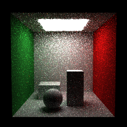

# Propriedades da Simulação

## Render

- **name**: proj2_req5_mis_rr
- **width**: 256
- **height**: 256
- **samples_per_pixel**: 16
- **sampling_mode**: jittered
- **seed**: 42
- **gamma_fix**: False
- **render_time_seconds**: 110.15022650000174
- **render_time_minutes**: 1.8358371083333622

## Estimativa de Raios

- **Raios Primários**: 1,048,576
- **Raios Secundários**: 5,242,880
- **Shadow Rays**: 4,404,019
- **Total de Raios**: 1,048,576
- **Throughput**: 5,000 raios/segundo
- **Tempo Estimado**: 209.715s (3.495 min)
- **Tempo Estimado (minutos)**: 3.495
- **Primary Hit Ratio**: 0.700
- **Recursive Surface Ratio**: 0.889
- **Shadow Samples/Hit**: 1

## Qualidade da Estimativa

- **Rays Model (estimado)**: 209.715s
- **Rays Model (real)**: 110.150s
- **Rays Model (erro abs)**: 99.565s
- **Rays Model (erro rel)**: 90.390%
- **Rays Model (fator real/estimado)**: 0.53x
- **Rays Model (acurácia)**: 9.61%

## Scene

- **ambient_light**: [0.0, 0.0, 0.0]
- **background_color**: [0.0, 0.0, 0.0]
- **max_depth**: 8
- **ray_epsilon**: 0.001

## Camera

- **eye**: [2.7750000953674316, 3.200000047683716, 12.774999618530273]
- **center**: [2.7750000953674316, 2.7750000953674316, 2.7750000953674316]
- **up**: [0.0, 1.0, 0.0]
- **fov**: 50.0
- **focal_distance**: 1.0
- **aspect**: 1.0

## Objetos (detalhado)

### Objeto 1: Box
- **shape_chain**: ['Box']
- **p_min**: [-0.10000000149011612, -0.10000000149011612, -0.10000000149011612]
- **p_max**: [5.650000095367432, 5.650000095367432, 0.0]
- **material**:
  - **type**: LambertianBSDF

### Objeto 2: Box
- **shape_chain**: ['Box']
- **p_min**: [-0.10000000149011612, -0.10000000149011612, 0.0]
- **p_max**: [0.0, 5.550000190734863, 5.550000190734863]
- **material**:
  - **type**: LambertianBSDF

### Objeto 3: Box
- **shape_chain**: ['Box']
- **p_min**: [5.550000190734863, -0.10000000149011612, 0.0]
- **p_max**: [5.650000095367432, 5.550000190734863, 5.550000190734863]
- **material**:
  - **type**: LambertianBSDF

### Objeto 4: Box
- **shape_chain**: ['Box']
- **p_min**: [0.0, 5.550000190734863, 0.0]
- **p_max**: [5.550000190734863, 5.650000095367432, 5.550000190734863]
- **material**:
  - **type**: LambertianBSDF

### Objeto 5: Box
- **shape_chain**: ['Box']
- **p_min**: [-0.10000000149011612, -0.10000000149011612, 0.0]
- **p_max**: [5.650000095367432, 0.0, 5.550000190734863]
- **material**:
  - **type**: LambertianBSDF

### Objeto 6: Box
- **shape_chain**: ['Box']
- **p_min**: [1.274999976158142, 5.449999809265137, 1.274999976158142]
- **p_max**: [4.275000095367432, 5.550000190734863, 4.275000095367432]
- **material**:
  - **type**: EmissiveBSDF

### Objeto 7: Box
- **shape_chain**: ['Box']
- **p_min**: [0.8500000238418579, 0.0, 0.8500000238418579]
- **p_max**: [2.5, 1.100000023841858, 2.5]
- **material**:
  - **type**: LambertianBSDF

### Objeto 8: Box
- **shape_chain**: ['Box']
- **p_min**: [3.0, 0.0, 2.799999952316284]
- **p_max**: [4.099999904632568, 2.299999952316284, 3.9000000953674316]
- **material**:
  - **type**: LambertianBSDF

### Objeto 9: Sphere
- **shape_chain**: ['Sphere']
- **center**: [2.0999999046325684, 0.6200000047683716, 4.25]
- **radius**: 0.62
- **material**:
  - **type**: LambertianBSDF

## Luzes (detalhado)

- **Light 1 (RectAreaLight)**:

## Artefatos

- [Snapshot JSON](properties.json): payload serializado do render, da câmera, da cena, dos objetos e das luzes.

> Nota: abra este `properties.md` dentro da pasta de saída para visualizar a imagem incorporada e navegar até o snapshot JSON.