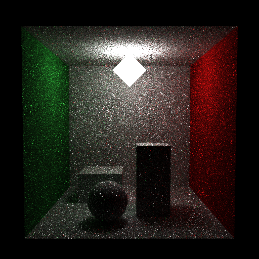

# Propriedades da Simulação

## Render

- **name**: proj2_req6_mis_no_rr
- **width**: 512
- **height**: 512
- **samples_per_pixel**: 12
- **sampling_mode**: jittered
- **seed**: None
- **gamma_fix**: False
- **render_time_seconds**: 460.98832075000973
- **render_time_minutes**: 7.683138679166829

## Estimativa de Raios

- **Raios Primários**: 3,145,728
- **Raios Secundários**: 15,728,640
- **Shadow Rays**: 13,212,057
- **Total de Raios**: 3,145,728
- **Throughput**: 8,495 raios/segundo
- **Tempo Estimado**: 370.260s (6.171 min)
- **Tempo Estimado (minutos)**: 6.171
- **Tempo Estimado (interseções)**: 87.448s
- **Primary Hit Ratio**: 0.700
- **Recursive Surface Ratio**: 0.889
- **Shadow Samples/Hit**: 1

### Calibração (rápida)
- **elapsed_seconds**: 0.362
- **samples_tested**: 3,072
- **rays_traced**: 0
- **intersection_tests**: 117,063
- **shadow_rays**: 0
- **measured_throughput**: 8496 raios/segundo

## Qualidade da Estimativa

- **Rays Model (estimado)**: 370.260s
- **Rays Model (real)**: 460.988s
- **Rays Model (erro abs)**: 90.728s
- **Rays Model (erro rel)**: 19.681%
- **Rays Model (fator real/estimado)**: 1.25x
- **Rays Model (acurácia)**: 80.32%
- **Intersection Model (estimado)**: 87.448s
- **Intersection Model (real)**: 460.988s
- **Intersection Model (erro abs)**: 373.540s
- **Intersection Model (erro rel)**: 81.030%
- **Intersection Model (fator real/estimado)**: 5.27x
- **Intersection Model (acurácia)**: 18.97%

## Scene

- **ambient_light**: [0.0, 0.0, 0.0]
- **background_color**: [0.0, 0.0, 0.0]
- **max_depth**: 8
- **ray_epsilon**: 0.001

## Camera

- **eye**: [2.7750000953674316, 3.200000047683716, 12.774999618530273]
- **center**: [2.7750000953674316, 2.7750000953674316, 2.7750000953674316]
- **up**: [0.0, 1.0, 0.0]
- **fov**: 50.0
- **focal_distance**: 1.0
- **aspect**: 1.0

## Objetos (detalhado)

### Objeto 1: Box
- **shape_chain**: ['Box']
- **p_min**: [-0.10000000149011612, -0.10000000149011612, -0.10000000149011612]
- **p_max**: [5.650000095367432, 5.650000095367432, 0.0]
- **material**:
  - **type**: LambertianBSDF

### Objeto 2: Box
- **shape_chain**: ['Box']
- **p_min**: [-0.10000000149011612, -0.10000000149011612, 0.0]
- **p_max**: [0.0, 5.550000190734863, 5.550000190734863]
- **material**:
  - **type**: LambertianBSDF

### Objeto 3: Box
- **shape_chain**: ['Box']
- **p_min**: [5.550000190734863, -0.10000000149011612, 0.0]
- **p_max**: [5.650000095367432, 5.550000190734863, 5.550000190734863]
- **material**:
  - **type**: LambertianBSDF

### Objeto 4: Box
- **shape_chain**: ['Box']
- **p_min**: [0.0, 5.550000190734863, 0.0]
- **p_max**: [5.550000190734863, 5.650000095367432, 5.550000190734863]
- **material**:
  - **type**: LambertianBSDF

### Objeto 5: Box
- **shape_chain**: ['Box']
- **p_min**: [-0.10000000149011612, -0.10000000149011612, 0.0]
- **p_max**: [5.650000095367432, 0.0, 5.550000190734863]
- **material**:
  - **type**: LambertianBSDF

### Objeto 6: TriangleMesh
- **shape_chain**: ['TriangleMesh']
- **material**:
  - **type**: EmissiveBSDF

### Objeto 7: Box
- **shape_chain**: ['Box']
- **p_min**: [0.8500000238418579, 0.0, 0.8500000238418579]
- **p_max**: [2.5, 1.100000023841858, 2.5]
- **material**:
  - **type**: LambertianBSDF

### Objeto 8: Box
- **shape_chain**: ['Box']
- **p_min**: [3.0, 0.0, 2.799999952316284]
- **p_max**: [4.099999904632568, 2.299999952316284, 3.9000000953674316]
- **material**:
  - **type**: LambertianBSDF

### Objeto 9: Sphere
- **shape_chain**: ['Sphere']
- **center**: [2.0999999046325684, 0.6200000047683716, 4.25]
- **radius**: 0.62
- **material**:
  - **type**: LambertianBSDF

## Luzes (detalhado)

- **Light 1 (TriangleMeshLight)**:

## Artefatos

- [Snapshot JSON](properties.json): payload serializado do render, da câmera, da cena, dos objetos e das luzes.

> Nota: abra este `properties.md` dentro da pasta de saída para visualizar a imagem incorporada e navegar até o snapshot JSON.