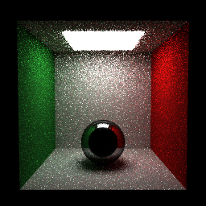

# Propriedades da Simulação

## Render

- **name**: proj2_req7_glass_mis_no_rr
- **width**: 256
- **height**: 256
- **samples_per_pixel**: 16
- **sampling_mode**: jittered
- **seed**: 42
- **gamma_fix**: False
- **render_time_seconds**: 101.84076012496371
- **render_time_minutes**: 1.6973460020827285

## Estimativa de Raios

- **Raios Primários**: 1,048,576
- **Raios Secundários**: 5,242,880
- **Shadow Rays**: 4,404,019
- **Total de Raios**: 1,048,576
- **Throughput**: 13,261 raios/segundo
- **Tempo Estimado**: 79.070s (1.318 min)
- **Tempo Estimado (minutos)**: 1.318
- **Tempo Estimado (interseções)**: 19.674s
- **Primary Hit Ratio**: 0.700
- **Recursive Surface Ratio**: 0.857
- **Shadow Samples/Hit**: 1

### Calibração (rápida)
- **elapsed_seconds**: 0.309
- **samples_tested**: 4,096
- **rays_traced**: 0
- **intersection_tests**: 115,234
- **shadow_rays**: 0
- **measured_throughput**: 13261 raios/segundo

## Qualidade da Estimativa

- **Rays Model (estimado)**: 79.070s
- **Rays Model (real)**: 101.841s
- **Rays Model (erro abs)**: 22.771s
- **Rays Model (erro rel)**: 22.359%
- **Rays Model (fator real/estimado)**: 1.29x
- **Rays Model (acurácia)**: 77.64%
- **Intersection Model (estimado)**: 19.674s
- **Intersection Model (real)**: 101.841s
- **Intersection Model (erro abs)**: 82.167s
- **Intersection Model (erro rel)**: 80.682%
- **Intersection Model (fator real/estimado)**: 5.18x
- **Intersection Model (acurácia)**: 19.32%

## Scene

- **ambient_light**: [0.0, 0.0, 0.0]
- **background_color**: [0.0, 0.0, 0.0]
- **max_depth**: 8
- **ray_epsilon**: 0.001

## Camera

- **eye**: [2.7750000953674316, 3.200000047683716, 12.774999618530273]
- **center**: [2.7750000953674316, 2.7750000953674316, 2.7750000953674316]
- **up**: [0.0, 1.0, 0.0]
- **fov**: 50.0
- **focal_distance**: 1.0
- **aspect**: 1.0

## Objetos (detalhado)

### Objeto 1: Box
- **shape_chain**: ['Box']
- **p_min**: [-0.10000000149011612, -0.10000000149011612, -0.10000000149011612]
- **p_max**: [5.650000095367432, 5.650000095367432, 0.0]
- **material**:
  - **type**: LambertianBSDF

### Objeto 2: Box
- **shape_chain**: ['Box']
- **p_min**: [-0.10000000149011612, -0.10000000149011612, 0.0]
- **p_max**: [0.0, 5.550000190734863, 5.550000190734863]
- **material**:
  - **type**: LambertianBSDF

### Objeto 3: Box
- **shape_chain**: ['Box']
- **p_min**: [5.550000190734863, -0.10000000149011612, 0.0]
- **p_max**: [5.650000095367432, 5.550000190734863, 5.550000190734863]
- **material**:
  - **type**: LambertianBSDF

### Objeto 4: Box
- **shape_chain**: ['Box']
- **p_min**: [0.0, 5.550000190734863, 0.0]
- **p_max**: [5.550000190734863, 5.650000095367432, 5.550000190734863]
- **material**:
  - **type**: LambertianBSDF

### Objeto 5: Box
- **shape_chain**: ['Box']
- **p_min**: [-0.10000000149011612, -0.10000000149011612, 0.0]
- **p_max**: [5.650000095367432, 0.0, 5.550000190734863]
- **material**:
  - **type**: LambertianBSDF

### Objeto 6: Box
- **shape_chain**: ['Box']
- **p_min**: [1.274999976158142, 5.449999809265137, 1.274999976158142]
- **p_max**: [4.275000095367432, 5.550000190734863, 4.275000095367432]
- **material**:
  - **type**: EmissiveBSDF

### Objeto 7: Sphere
- **shape_chain**: ['Sphere']
- **center**: [2.7750000953674316, 1.0, 2.7750000953674316]
- **radius**: 1.0
- **material**:
  - **type**: DielectricBSDF
  - **ior**: 1.5

## Luzes (detalhado)

- **Light 1 (RectAreaLight)**:

## Artefatos

- [Snapshot JSON](properties.json): payload serializado do render, da câmera, da cena, dos objetos e das luzes.

> Nota: abra este `properties.md` dentro da pasta de saída para visualizar a imagem incorporada e navegar até o snapshot JSON.