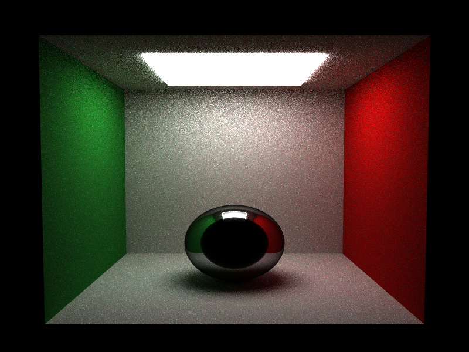

# Propriedades da Simulação

## Render

- **name**: proj2_req7_glass_mis_no_rr
- **width**: 800
- **height**: 600
- **samples_per_pixel**: 64
- **sampling_mode**: jittered
- **seed**: 42
- **gamma_fix**: False
- **render_time_seconds**: 3483.8786870419863
- **render_time_minutes**: 58.064644784033106

## Estimativa de Raios

- **Raios Primários**: 30,720,000
- **Raios Secundários**: 153,600,000
- **Shadow Rays**: 129,023,999
- **Total de Raios**: 30,720,000
- **Throughput**: 11,385 raios/segundo
- **Tempo Estimado**: 2698.054s (44.968 min)
- **Tempo Estimado (minutos)**: 44.968
- **Tempo Estimado (interseções)**: 573.777s
- **Primary Hit Ratio**: 0.700
- **Recursive Surface Ratio**: 0.857
- **Shadow Samples/Hit**: 1

### Calibração (rápida)
- **elapsed_seconds**: 1.439
- **samples_tested**: 16,384
- **rays_traced**: 0
- **intersection_tests**: 539,294
- **shadow_rays**: 0
- **measured_throughput**: 11386 raios/segundo

## Qualidade da Estimativa

- **Rays Model (estimado)**: 2698.054s
- **Rays Model (real)**: 3483.879s
- **Rays Model (erro abs)**: 785.824s
- **Rays Model (erro rel)**: 22.556%
- **Rays Model (fator real/estimado)**: 1.29x
- **Rays Model (acurácia)**: 77.44%
- **Intersection Model (estimado)**: 573.777s
- **Intersection Model (real)**: 3483.879s
- **Intersection Model (erro abs)**: 2910.102s
- **Intersection Model (erro rel)**: 83.531%
- **Intersection Model (fator real/estimado)**: 6.07x
- **Intersection Model (acurácia)**: 16.47%

## Scene

- **ambient_light**: [0.0, 0.0, 0.0]
- **background_color**: [0.0, 0.0, 0.0]
- **max_depth**: 8
- **ray_epsilon**: 0.001

## Camera

- **eye**: [2.7750000953674316, 3.200000047683716, 12.774999618530273]
- **center**: [2.7750000953674316, 2.7750000953674316, 2.7750000953674316]
- **up**: [0.0, 1.0, 0.0]
- **fov**: 50.0
- **focal_distance**: 1.0
- **aspect**: 1.0

## Objetos (detalhado)

### Objeto 1: Box
- **shape_chain**: ['Box']
- **p_min**: [-0.10000000149011612, -0.10000000149011612, -0.10000000149011612]
- **p_max**: [5.650000095367432, 5.650000095367432, 0.0]
- **material**:
  - **type**: LambertianBSDF

### Objeto 2: Box
- **shape_chain**: ['Box']
- **p_min**: [-0.10000000149011612, -0.10000000149011612, 0.0]
- **p_max**: [0.0, 5.550000190734863, 5.550000190734863]
- **material**:
  - **type**: LambertianBSDF

### Objeto 3: Box
- **shape_chain**: ['Box']
- **p_min**: [5.550000190734863, -0.10000000149011612, 0.0]
- **p_max**: [5.650000095367432, 5.550000190734863, 5.550000190734863]
- **material**:
  - **type**: LambertianBSDF

### Objeto 4: Box
- **shape_chain**: ['Box']
- **p_min**: [0.0, 5.550000190734863, 0.0]
- **p_max**: [5.550000190734863, 5.650000095367432, 5.550000190734863]
- **material**:
  - **type**: LambertianBSDF

### Objeto 5: Box
- **shape_chain**: ['Box']
- **p_min**: [-0.10000000149011612, -0.10000000149011612, 0.0]
- **p_max**: [5.650000095367432, 0.0, 5.550000190734863]
- **material**:
  - **type**: LambertianBSDF

### Objeto 6: Box
- **shape_chain**: ['Box']
- **p_min**: [1.274999976158142, 5.449999809265137, 1.274999976158142]
- **p_max**: [4.275000095367432, 5.550000190734863, 4.275000095367432]
- **material**:
  - **type**: EmissiveBSDF

### Objeto 7: Sphere
- **shape_chain**: ['Sphere']
- **center**: [2.7750000953674316, 1.0, 2.7750000953674316]
- **radius**: 1.0
- **material**:
  - **type**: DielectricBSDF
  - **ior**: 1.5

## Luzes (detalhado)

- **Light 1 (RectAreaLight)**:

## Artefatos

- [Snapshot JSON](properties.json): payload serializado do render, da câmera, da cena, dos objetos e das luzes.

> Nota: abra este `properties.md` dentro da pasta de saída para visualizar a imagem incorporada e navegar até o snapshot JSON.