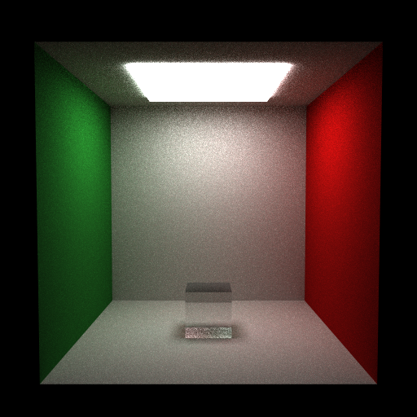

# Propriedades da Simulação

## Render

- **name**: proj2_req7_water_mis_no_rr
- **width**: 512
- **height**: 512
- **samples_per_pixel**: 256
- **sampling_mode**: jittered
- **seed**: None
- **gamma_fix**: False
- **render_time_seconds**: 8506.197226000018
- **render_time_minutes**: 141.769953766667

## Estimativa de Raios

- **Raios Primários**: 67,108,864
- **Raios Secundários**: 335,544,320
- **Shadow Rays**: 281,857,228
- **Total de Raios**: 67,108,864
- **Throughput**: 9,623 raios/segundo
- **Tempo Estimado**: 6973.330s (116.222 min)
- **Tempo Estimado (minutos)**: 116.222
- **Tempo Estimado (interseções)**: 1274.960s
- **Primary Hit Ratio**: 0.700
- **Recursive Surface Ratio**: 0.857
- **Shadow Samples/Hit**: 1

### Calibração (rápida)
- **elapsed_seconds**: 5.000
- **samples_tested**: 48,120
- **rays_traced**: 0
- **intersection_tests**: 1,842,330
- **shadow_rays**: 0
- **measured_throughput**: 9624 raios/segundo

## Qualidade da Estimativa

- **Rays Model (estimado)**: 6973.330s
- **Rays Model (real)**: 8506.197s
- **Rays Model (erro abs)**: 1532.867s
- **Rays Model (erro rel)**: 18.021%
- **Rays Model (fator real/estimado)**: 1.22x
- **Rays Model (acurácia)**: 81.98%
- **Intersection Model (estimado)**: 1274.960s
- **Intersection Model (real)**: 8506.197s
- **Intersection Model (erro abs)**: 7231.238s
- **Intersection Model (erro rel)**: 85.011%
- **Intersection Model (fator real/estimado)**: 6.67x
- **Intersection Model (acurácia)**: 14.99%

## Scene

- **ambient_light**: [0.0, 0.0, 0.0]
- **background_color**: [0.0, 0.0, 0.0]
- **max_depth**: 8
- **ray_epsilon**: 0.001

## Camera

- **eye**: [2.7750000953674316, 3.200000047683716, 12.774999618530273]
- **center**: [2.7750000953674316, 2.7750000953674316, 2.7750000953674316]
- **up**: [0.0, 1.0, 0.0]
- **fov**: 50.0
- **focal_distance**: 1.0
- **aspect**: 1.0

## Objetos (detalhado)

### Objeto 1: Box
- **shape_chain**: ['Box']
- **p_min**: [-0.10000000149011612, -0.10000000149011612, -0.10000000149011612]
- **p_max**: [5.650000095367432, 5.650000095367432, 0.0]
- **material**:
  - **type**: LambertianBSDF

### Objeto 2: Box
- **shape_chain**: ['Box']
- **p_min**: [-0.10000000149011612, -0.10000000149011612, 0.0]
- **p_max**: [0.0, 5.550000190734863, 5.550000190734863]
- **material**:
  - **type**: LambertianBSDF

### Objeto 3: Box
- **shape_chain**: ['Box']
- **p_min**: [5.550000190734863, -0.10000000149011612, 0.0]
- **p_max**: [5.650000095367432, 5.550000190734863, 5.550000190734863]
- **material**:
  - **type**: LambertianBSDF

### Objeto 4: Box
- **shape_chain**: ['Box']
- **p_min**: [0.0, 5.550000190734863, 0.0]
- **p_max**: [5.550000190734863, 5.650000095367432, 5.550000190734863]
- **material**:
  - **type**: LambertianBSDF

### Objeto 5: Box
- **shape_chain**: ['Box']
- **p_min**: [-0.10000000149011612, -0.10000000149011612, 0.0]
- **p_max**: [5.650000095367432, 0.0, 5.550000190734863]
- **material**:
  - **type**: LambertianBSDF

### Objeto 6: Box
- **shape_chain**: ['Box']
- **p_min**: [1.274999976158142, 5.449999809265137, 1.274999976158142]
- **p_max**: [4.275000095367432, 5.550000190734863, 4.275000095367432]
- **material**:
  - **type**: EmissiveBSDF

### Objeto 7: Box
- **shape_chain**: ['Box']
- **p_min**: [2.2750000953674316, 0.0, 2.2750000953674316]
- **p_max**: [3.2750000953674316, 1.0, 3.2750000953674316]
- **material**:
  - **type**: DielectricBSDF
  - **ior**: 1.33

## Luzes (detalhado)

- **Light 1 (RectAreaLight)**:

## Artefatos

- [Snapshot JSON](properties.json): payload serializado do render, da câmera, da cena, dos objetos e das luzes.

> Nota: abra este `properties.md` dentro da pasta de saída para visualizar a imagem incorporada e navegar até o snapshot JSON.