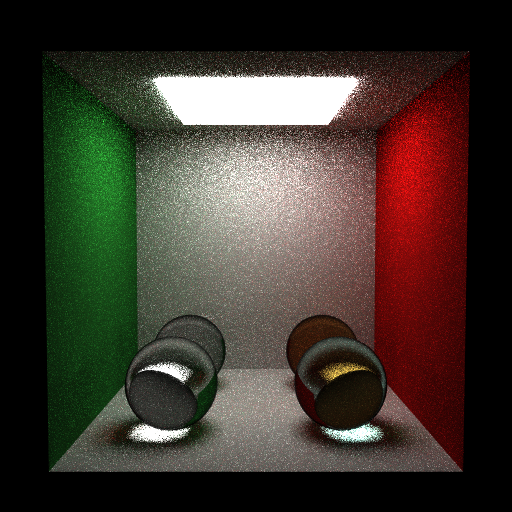

# Propriedades da Simulação

## Comando

```bash
/Users/yang/projects/INF2608-comp-grafica/src/path_tracing/scripts/proj2_req7_dielectric_showcase.py --spp 32 --depth 8 --use-rr 8
```



## Render

- **name**: proj2_req7_dielectric_showcase_mis_no_rr
- **width**: 512
- **height**: 512
- **samples_per_pixel**: 32
- **sampling_mode**: jittered
- **seed**: None
- **gamma_fix**: False
- **integrator_mode**: mis
- **command_line**: /Users/yang/projects/INF2608-comp-grafica/src/path_tracing/scripts/proj2_req7_dielectric_showcase.py --spp 32 --depth 8 --use-rr 8
- **render_time_seconds**: 1013.4420723750009
- **render_time_minutes**: 16.890701206250014

## Estimativa de Caminhos

- **Caminhos Totais**: 8,388,608
- **Bounces Estimados**: 41,943,040 (informativo)
- **Shadow Rays**: 35,232,153
- **Total**: 8,388,608
- **Throughput**: 9,956 caminhos/segundo
- **Tempo Estimado**: 842.549s (14.042 min)
- **Tempo Estimado (minutos)**: 14.042

### Calibração (rápida)
- **elapsed_seconds**: 0.823
- **samples_tested**: 8,192
- **rays_traced**: 0
- **intersection_tests**: 386,850
- **shadow_rays**: 0
- **measured_throughput**: 9956 caminhos/segundo

## Qualidade da Estimativa

- **Rays Model (estimado)**: 842.549s
- **Rays Model (real)**: 1013.442s
- **Rays Model (erro abs)**: 170.893s
- **Rays Model (erro rel)**: 16.863%
- **Rays Model (fator real/estimado)**: 1.20x
- **Rays Model (acurácia)**: 83.14%
- **Intersection Model (estimado)**: 178.420s
- **Intersection Model (real)**: 1013.442s
- **Intersection Model (erro abs)**: 835.022s
- **Intersection Model (erro rel)**: 82.395%
- **Intersection Model (fator real/estimado)**: 5.68x
- **Intersection Model (acurácia)**: 17.61%

## Scene

- **ambient_light**: [0.0, 0.0, 0.0]
- **background_color**: [0.0, 0.0, 0.0]
- **max_depth**: 8
- **ray_epsilon**: 0.001

## Camera

- **eye**: [2.7750000953674316, 3.200000047683716, 12.774999618530273]
- **center**: [2.7750000953674316, 2.7750000953674316, 2.7750000953674316]
- **up**: [0.0, 1.0, 0.0]
- **fov**: 50.0
- **focal_distance**: 1.0
- **aspect**: 1.0

## Objetos (detalhado)

### Objeto 1: Box
- **shape_chain**: ['Box']
- **p_min**: [-0.10000000149011612, -0.10000000149011612, -0.10000000149011612]
- **p_max**: [5.650000095367432, 5.650000095367432, 0.0]
- **material**:
  - **type**: LambertianBSDF
  - **albedo**: [0.7300000190734863, 0.7300000190734863, 0.7300000190734863]

### Objeto 2: Box
- **shape_chain**: ['Box']
- **p_min**: [-0.10000000149011612, -0.10000000149011612, 0.0]
- **p_max**: [0.0, 5.550000190734863, 5.550000190734863]
- **material**:
  - **type**: LambertianBSDF
  - **albedo**: [0.11999999731779099, 0.44999998807907104, 0.15000000596046448]

### Objeto 3: Box
- **shape_chain**: ['Box']
- **p_min**: [5.550000190734863, -0.10000000149011612, 0.0]
- **p_max**: [5.650000095367432, 5.550000190734863, 5.550000190734863]
- **material**:
  - **type**: LambertianBSDF
  - **albedo**: [0.6499999761581421, 0.05000000074505806, 0.05000000074505806]

### Objeto 4: Box
- **shape_chain**: ['Box']
- **p_min**: [0.0, 5.550000190734863, 0.0]
- **p_max**: [5.550000190734863, 5.650000095367432, 5.550000190734863]
- **material**:
  - **type**: LambertianBSDF
  - **albedo**: [0.7300000190734863, 0.7300000190734863, 0.7300000190734863]

### Objeto 5: Box
- **shape_chain**: ['Box']
- **p_min**: [-0.10000000149011612, -0.10000000149011612, 0.0]
- **p_max**: [5.650000095367432, 0.0, 5.550000190734863]
- **material**:
  - **type**: LambertianBSDF
  - **albedo**: [0.7300000190734863, 0.7300000190734863, 0.7300000190734863]

### Objeto 6: Box
- **shape_chain**: ['Box']
- **p_min**: [1.274999976158142, 5.448999881744385, 1.274999976158142]
- **p_max**: [4.275000095367432, 5.550000190734863, 4.275000095367432]
- **material**:
  - **type**: EmissiveBSDF
  - **emission**: [7.0, 7.0, 7.0]

### Objeto 7: Sphere
- **shape_chain**: ['Sphere']
- **center**: [1.399999976158142, 0.75, 1.5]
- **radius**: 0.75
- **material**:
  - **type**: DielectricBSDF
  - **attenuation**: [0.0, 0.0, 0.0]
  - **ior**: 1.5

### Objeto 8: Sphere
- **shape_chain**: ['Sphere']
- **center**: [4.150000095367432, 0.75, 1.5]
- **radius**: 0.75
- **material**:
  - **type**: DielectricBSDF
  - **attenuation**: [0.20000000298023224, 0.6000000238418579, 1.2000000476837158]
  - **ior**: 1.5

### Objeto 9: Sphere
- **shape_chain**: ['Sphere']
- **center**: [1.399999976158142, 0.75, 3.9000000953674316]
- **radius**: 0.75
- **material**:
  - **type**: DielectricBSDF
  - **attenuation**: [0.0, 0.0, 0.0]
  - **ior**: 1.33

### Objeto 10: Sphere
- **shape_chain**: ['Sphere']
- **center**: [4.150000095367432, 0.75, 3.9000000953674316]
- **radius**: 0.75
- **material**:
  - **type**: DielectricBSDF
  - **attenuation**: [0.30000001192092896, 0.05000000074505806, 0.10000000149011612]
  - **ior**: 1.33

## Luzes (detalhado)

- **Light 1 (RectAreaLight)**:
  - Le: [7.0, 7.0, 7.0]
  - corner: [1.274999976158142, 5.449999809265137, 1.274999976158142]
  - edge_u: [3.0, 0.0, 0.0]
  - edge_v: [0.0, 0.0, 3.0]

## Artefatos

- [Snapshot JSON](properties.json): payload serializado do render, da câmera, da cena, dos objetos e das luzes.

> Nota: abra este `properties.md` dentro da pasta de saída para visualizar a imagem incorporada e navegar até o snapshot JSON.