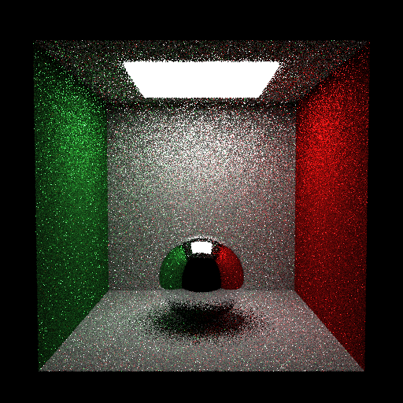

# Propriedades da Simulação

## Comando

```bash
/Users/yang/projects/INF2608-comp-grafica/src/path_tracing/scripts/proj2_req7_mirror.py --spp 2 --depth 4 --mode mis
```



## Render

- **name**: proj2_req7_mirror_mis_no_rr
- **width**: 512
- **height**: 512
- **samples_per_pixel**: 2
- **sampling_mode**: jittered
- **seed**: None
- **gamma_fix**: False
- **integrator_mode**: mis
- **command_line**: /Users/yang/projects/INF2608-comp-grafica/src/path_tracing/scripts/proj2_req7_mirror.py --spp 2 --depth 4 --mode mis
- **render_time_seconds**: 41.75248775
- **render_time_minutes**: 0.6958747958333333

## Estimativa de Caminhos

- **Caminhos Totais**: 524,288
- **Bounces Estimados**: 2,621,440 (informativo)
- **Shadow Rays**: 2,202,009
- **Total**: 524,288
- **Throughput**: 13,319 caminhos/segundo
- **Tempo Estimado**: 39.364s (0.656 min)
- **Tempo Estimado (minutos)**: 0.656

### Calibração (rápida)
- **elapsed_seconds**: 0.038
- **samples_tested**: 512
- **rays_traced**: 0
- **intersection_tests**: 11,844
- **shadow_rays**: 0
- **measured_throughput**: 13319 caminhos/segundo

## Qualidade da Estimativa

- **Rays Model (estimado)**: 39.364s
- **Rays Model (real)**: 41.752s
- **Rays Model (erro abs)**: 2.389s
- **Rays Model (erro rel)**: 5.722%
- **Rays Model (fator real/estimado)**: 1.06x
- **Rays Model (acurácia)**: 94.28%
- **Intersection Model (estimado)**: 11.911s
- **Intersection Model (real)**: 41.752s
- **Intersection Model (erro abs)**: 29.841s
- **Intersection Model (erro rel)**: 71.471%
- **Intersection Model (fator real/estimado)**: 3.51x
- **Intersection Model (acurácia)**: 28.53%

## Scene

- **ambient_light**: [0.0, 0.0, 0.0]
- **background_color**: [0.0, 0.0, 0.0]
- **max_depth**: 8
- **ray_epsilon**: 0.001

## Camera

- **eye**: [2.7750000953674316, 3.200000047683716, 12.774999618530273]
- **center**: [2.7750000953674316, 2.7750000953674316, 2.7750000953674316]
- **up**: [0.0, 1.0, 0.0]
- **fov**: 50.0
- **focal_distance**: 1.0
- **aspect**: 1.0

## Objetos (detalhado)

### Objeto 1: Box
- **shape_chain**: ['Box']
- **p_min**: [-0.10000000149011612, -0.10000000149011612, -0.10000000149011612]
- **p_max**: [5.650000095367432, 5.650000095367432, 0.0]
- **material**:
  - **type**: LambertianBSDF
  - **albedo**: [0.7300000190734863, 0.7300000190734863, 0.7300000190734863]

### Objeto 2: Box
- **shape_chain**: ['Box']
- **p_min**: [-0.10000000149011612, -0.10000000149011612, 0.0]
- **p_max**: [0.0, 5.550000190734863, 5.550000190734863]
- **material**:
  - **type**: LambertianBSDF
  - **albedo**: [0.11999999731779099, 0.44999998807907104, 0.15000000596046448]

### Objeto 3: Box
- **shape_chain**: ['Box']
- **p_min**: [5.550000190734863, -0.10000000149011612, 0.0]
- **p_max**: [5.650000095367432, 5.550000190734863, 5.550000190734863]
- **material**:
  - **type**: LambertianBSDF
  - **albedo**: [0.6499999761581421, 0.05000000074505806, 0.05000000074505806]

### Objeto 4: Box
- **shape_chain**: ['Box']
- **p_min**: [0.0, 5.550000190734863, 0.0]
- **p_max**: [5.550000190734863, 5.650000095367432, 5.550000190734863]
- **material**:
  - **type**: LambertianBSDF
  - **albedo**: [0.7300000190734863, 0.7300000190734863, 0.7300000190734863]

### Objeto 5: Box
- **shape_chain**: ['Box']
- **p_min**: [-0.10000000149011612, -0.10000000149011612, 0.0]
- **p_max**: [5.650000095367432, 0.0, 5.550000190734863]
- **material**:
  - **type**: LambertianBSDF
  - **albedo**: [0.7300000190734863, 0.7300000190734863, 0.7300000190734863]

### Objeto 6: Box
- **shape_chain**: ['Box']
- **p_min**: [1.274999976158142, 5.448999881744385, 1.274999976158142]
- **p_max**: [4.275000095367432, 5.550000190734863, 4.275000095367432]
- **material**:
  - **type**: EmissiveBSDF
  - **emission**: [7.0, 7.0, 7.0]

### Objeto 7: Sphere
- **shape_chain**: ['Sphere']
- **center**: [2.7750000953674316, 1.0099999904632568, 2.7750000953674316]
- **radius**: 1.0
- **material**:
  - **type**: MirrorBSDF

## Luzes (detalhado)

- **Light 1 (RectAreaLight)**:
  - Le: [7.0, 7.0, 7.0]
  - corner: [1.274999976158142, 5.449999809265137, 1.274999976158142]
  - edge_u: [3.0, 0.0, 0.0]
  - edge_v: [0.0, 0.0, 3.0]

## Artefatos

- [Snapshot JSON](properties.json): payload serializado do render, da câmera, da cena, dos objetos e das luzes.

> Nota: abra este `properties.md` dentro da pasta de saída para visualizar a imagem incorporada e navegar até o snapshot JSON.