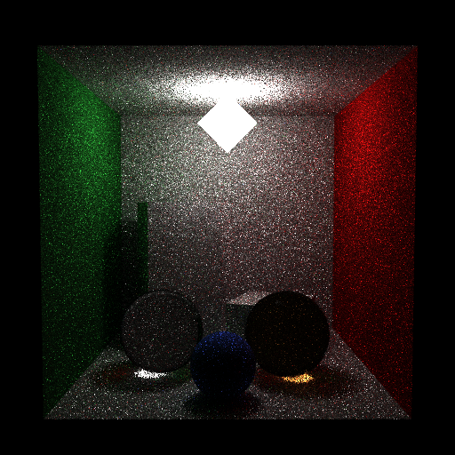

# Propriedades da Simulação

## Render

- **name**: proj2_showcase_mis_no_rr
- **width**: 512
- **height**: 512
- **samples_per_pixel**: 16
- **sampling_mode**: jittered
- **seed**: None
- **gamma_fix**: False
- **render_time_seconds**: 753.7066503749811
- **render_time_minutes**: 12.561777506249685

## Estimativa de Raios

- **Raios Primários**: 4,194,304
- **Raios Secundários**: 20,971,520
- **Shadow Rays**: 17,616,076
- **Total de Raios**: 4,194,304
- **Throughput**: 6,281 raios/segundo
- **Tempo Estimado**: 667.688s (11.128 min)
- **Tempo Estimado (minutos)**: 11.128
- **Tempo Estimado (interseções)**: 152.589s
- **Primary Hit Ratio**: 0.700
- **Recursive Surface Ratio**: 0.909
- **Shadow Samples/Hit**: 1

### Calibração (rápida)
- **elapsed_seconds**: 0.652
- **samples_tested**: 4,096
- **rays_traced**: 0
- **intersection_tests**: 197,153
- **shadow_rays**: 0
- **measured_throughput**: 6282 raios/segundo

## Qualidade da Estimativa

- **Rays Model (estimado)**: 667.688s
- **Rays Model (real)**: 753.707s
- **Rays Model (erro abs)**: 86.019s
- **Rays Model (erro rel)**: 11.413%
- **Rays Model (fator real/estimado)**: 1.13x
- **Rays Model (acurácia)**: 88.59%
- **Intersection Model (estimado)**: 152.589s
- **Intersection Model (real)**: 753.707s
- **Intersection Model (erro abs)**: 601.118s
- **Intersection Model (erro rel)**: 79.755%
- **Intersection Model (fator real/estimado)**: 4.94x
- **Intersection Model (acurácia)**: 20.25%

## Scene

- **ambient_light**: [0.0, 0.0, 0.0]
- **background_color**: [0.0, 0.0, 0.0]
- **max_depth**: 8
- **ray_epsilon**: 0.001

## Camera

- **eye**: [2.7750000953674316, 3.200000047683716, 12.774999618530273]
- **center**: [2.7750000953674316, 2.7750000953674316, 2.7750000953674316]
- **up**: [0.0, 1.0, 0.0]
- **fov**: 50.0
- **focal_distance**: 1.0
- **aspect**: 1.0

## Objetos (detalhado)

### Objeto 1: Box
- **shape_chain**: ['Box']
- **p_min**: [-0.10000000149011612, -0.10000000149011612, -0.10000000149011612]
- **p_max**: [5.650000095367432, 5.650000095367432, 0.0]
- **material**:
  - **type**: LambertianBSDF

### Objeto 2: Box
- **shape_chain**: ['Box']
- **p_min**: [-0.10000000149011612, -0.10000000149011612, 0.0]
- **p_max**: [0.0, 5.550000190734863, 5.550000190734863]
- **material**:
  - **type**: LambertianBSDF

### Objeto 3: Box
- **shape_chain**: ['Box']
- **p_min**: [5.550000190734863, -0.10000000149011612, 0.0]
- **p_max**: [5.650000095367432, 5.550000190734863, 5.550000190734863]
- **material**:
  - **type**: LambertianBSDF

### Objeto 4: Box
- **shape_chain**: ['Box']
- **p_min**: [0.0, 5.550000190734863, 0.0]
- **p_max**: [5.550000190734863, 5.650000095367432, 5.550000190734863]
- **material**:
  - **type**: LambertianBSDF

### Objeto 5: Box
- **shape_chain**: ['Box']
- **p_min**: [-0.10000000149011612, -0.10000000149011612, 0.0]
- **p_max**: [5.650000095367432, 0.0, 5.550000190734863]
- **material**:
  - **type**: LambertianBSDF

### Objeto 6: TriangleMesh
- **shape_chain**: ['TriangleMesh']
- **material**:
  - **type**: EmissiveBSDF

### Objeto 7: Instance
- **shape_chain**: ['Instance', 'Box']
- **material**:
  - **type**: LambertianBSDF

### Objeto 8: Instance
- **shape_chain**: ['Instance', 'Box']
- **material**:
  - **type**: LambertianBSDF

### Objeto 9: Sphere
- **shape_chain**: ['Sphere']
- **center**: [1.5, 0.800000011920929, 3.4000000953674316]
- **radius**: 0.8
- **material**:
  - **type**: DielectricBSDF
  - **ior**: 1.5

### Objeto 10: Sphere
- **shape_chain**: ['Sphere']
- **center**: [3.9000000953674316, 0.800000011920929, 3.5999999046325684]
- **radius**: 0.8
- **material**:
  - **type**: DielectricBSDF
  - **ior**: 1.5

### Objeto 11: Sphere
- **shape_chain**: ['Sphere']
- **center**: [2.700000047683716, 0.550000011920929, 4.699999809265137]
- **radius**: 0.55
- **material**:
  - **type**: LambertianBSDF

## Luzes (detalhado)

- **Light 1 (TriangleMeshLight)**:

## Artefatos

- [Snapshot JSON](properties.json): payload serializado do render, da câmera, da cena, dos objetos e das luzes.

> Nota: abra este `properties.md` dentro da pasta de saída para visualizar a imagem incorporada e navegar até o snapshot JSON.