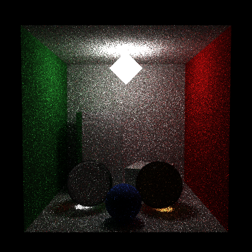

# Propriedades da Simulação

## Comando

```bash
/Users/yang/projects/INF2608-comp-grafica/src/path_tracing/scripts/proj2_showcase.py --spp 12 --depth 8 --mode mis --use-rr 4
```



## Render

- **name**: proj2_showcase_mis_no_rr
- **width**: 512
- **height**: 512
- **samples_per_pixel**: 12
- **sampling_mode**: jittered
- **seed**: None
- **gamma_fix**: False
- **integrator_mode**: mis
- **command_line**: /Users/yang/projects/INF2608-comp-grafica/src/path_tracing/scripts/proj2_showcase.py --spp 12 --depth 8 --mode mis --use-rr 4
- **render_time_seconds**: 555.4813500830205
- **render_time_minutes**: 9.258022501383675

## Estimativa de Caminhos

- **Caminhos Totais**: 3,145,728
- **Bounces Estimados**: 15,728,640 (informativo)
- **Shadow Rays**: 13,212,057
- **Total**: 3,145,728
- **Throughput**: 7,016 caminhos/segundo
- **Tempo Estimado**: 448.364s (7.473 min)
- **Tempo Estimado (minutos)**: 7.473

### Calibração (rápida)
- **elapsed_seconds**: 0.438
- **samples_tested**: 3,072
- **rays_traced**: 0
- **intersection_tests**: 145,332
- **shadow_rays**: 0
- **measured_throughput**: 7016 caminhos/segundo

## Qualidade da Estimativa

- **Rays Model (estimado)**: 448.364s
- **Rays Model (real)**: 555.481s
- **Rays Model (erro abs)**: 107.118s
- **Rays Model (erro rel)**: 19.284%
- **Rays Model (fator real/estimado)**: 1.24x
- **Rays Model (acurácia)**: 80.72%
- **Intersection Model (estimado)**: 104.252s
- **Intersection Model (real)**: 555.481s
- **Intersection Model (erro abs)**: 451.230s
- **Intersection Model (erro rel)**: 81.232%
- **Intersection Model (fator real/estimado)**: 5.33x
- **Intersection Model (acurácia)**: 18.77%

## Scene

- **ambient_light**: [0.0, 0.0, 0.0]
- **background_color**: [0.0, 0.0, 0.0]
- **max_depth**: 8
- **ray_epsilon**: 0.001

## Camera

- **eye**: [2.7750000953674316, 3.200000047683716, 12.774999618530273]
- **center**: [2.7750000953674316, 2.7750000953674316, 2.7750000953674316]
- **up**: [0.0, 1.0, 0.0]
- **fov**: 50.0
- **focal_distance**: 1.0
- **aspect**: 1.0

## Objetos (detalhado)

### Objeto 1: Box
- **shape_chain**: ['Box']
- **p_min**: [-0.10000000149011612, -0.10000000149011612, -0.10000000149011612]
- **p_max**: [5.650000095367432, 5.650000095367432, 0.0]
- **material**:
  - **type**: LambertianBSDF
  - **albedo**: [0.7300000190734863, 0.7300000190734863, 0.7300000190734863]

### Objeto 2: Box
- **shape_chain**: ['Box']
- **p_min**: [-0.10000000149011612, -0.10000000149011612, 0.0]
- **p_max**: [0.0, 5.550000190734863, 5.550000190734863]
- **material**:
  - **type**: LambertianBSDF
  - **albedo**: [0.11999999731779099, 0.44999998807907104, 0.15000000596046448]

### Objeto 3: Box
- **shape_chain**: ['Box']
- **p_min**: [5.550000190734863, -0.10000000149011612, 0.0]
- **p_max**: [5.650000095367432, 5.550000190734863, 5.550000190734863]
- **material**:
  - **type**: LambertianBSDF
  - **albedo**: [0.6499999761581421, 0.05000000074505806, 0.05000000074505806]

### Objeto 4: Box
- **shape_chain**: ['Box']
- **p_min**: [0.0, 5.550000190734863, 0.0]
- **p_max**: [5.550000190734863, 5.650000095367432, 5.550000190734863]
- **material**:
  - **type**: LambertianBSDF
  - **albedo**: [0.7300000190734863, 0.7300000190734863, 0.7300000190734863]

### Objeto 5: Box
- **shape_chain**: ['Box']
- **p_min**: [-0.10000000149011612, -0.10000000149011612, 0.0]
- **p_max**: [5.650000095367432, 0.0, 5.550000190734863]
- **material**:
  - **type**: LambertianBSDF
  - **albedo**: [0.7300000190734863, 0.7300000190734863, 0.7300000190734863]

### Objeto 6: TriangleMesh
- **shape_chain**: ['TriangleMesh']
- **material**:
  - **type**: EmissiveBSDF
  - **emission**: [18.0, 18.0, 18.0]

### Objeto 7: Instance
- **shape_chain**: ['Instance', 'Box']
- **material**:
  - **type**: LambertianBSDF
  - **albedo**: [0.7300000190734863, 0.7300000190734863, 0.7300000190734863]

### Objeto 8: Instance
- **shape_chain**: ['Instance', 'Box']
- **material**:
  - **type**: LambertianBSDF
  - **albedo**: [0.7300000190734863, 0.7300000190734863, 0.7300000190734863]

### Objeto 9: Sphere
- **shape_chain**: ['Sphere']
- **center**: [1.5, 0.800000011920929, 3.4000000953674316]
- **radius**: 0.8
- **material**:
  - **type**: DielectricBSDF
  - **attenuation**: [0.0, 0.0, 0.0]
  - **ior**: 1.5

### Objeto 10: Sphere
- **shape_chain**: ['Sphere']
- **center**: [3.9000000953674316, 0.800000011920929, 3.5999999046325684]
- **radius**: 0.8
- **material**:
  - **type**: DielectricBSDF
  - **attenuation**: [0.20000000298023224, 0.6000000238418579, 1.2000000476837158]
  - **ior**: 1.5

### Objeto 11: Sphere
- **shape_chain**: ['Sphere']
- **center**: [2.700000047683716, 0.550000011920929, 4.699999809265137]
- **radius**: 0.55
- **material**:
  - **type**: LambertianBSDF
  - **albedo**: [0.20000000298023224, 0.30000001192092896, 0.800000011920929]

## Luzes (detalhado)

- **Light 1 (TriangleMeshLight)**:
  - Le: [18.0, 18.0, 18.0]
  - vertex_count: 6
  - face_count: 8

## Artefatos

- [Snapshot JSON](properties.json): payload serializado do render, da câmera, da cena, dos objetos e das luzes.

> Nota: abra este `properties.md` dentro da pasta de saída para visualizar a imagem incorporada e navegar até o snapshot JSON.