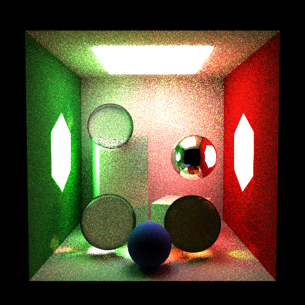

# Propriedades da Simulação

## Comando

```bash
/Users/yang/projects/INF2608-comp-grafica/src/path_tracing/scripts/proj2_showcase_combined.py --all --spp 32 --depth 10 --use-rr 12
```



## Render

- **name**: proj2_showcase_combined_mis_no_rr
- **width**: 512
- **height**: 512
- **samples_per_pixel**: 32
- **sampling_mode**: stratified
- **seed**: None
- **gamma_fix**: False
- **integrator_mode**: mis
- **command_line**: /Users/yang/projects/INF2608-comp-grafica/src/path_tracing/scripts/proj2_showcase_combined.py --all --spp 32 --depth 10 --use-rr 12
- **render_time_seconds**: 3044.4628234580014
- **render_time_minutes**: 50.74104705763336

## Estimativa de Caminhos

- **Caminhos Totais**: 8,388,608
- **Bounces Estimados**: 58,720,256 (informativo)
- **Shadow Rays**: 140,928,614
- **Total**: 8,388,608
- **Throughput**: 2,916 caminhos/segundo
- **Tempo Estimado**: 2876.716s (47.945 min)
- **Tempo Estimado (minutos)**: 47.945

### Calibração (rápida)
- **elapsed_seconds**: 2.809
- **samples_tested**: 8,192
- **rays_traced**: 0
- **intersection_tests**: 936,780
- **shadow_rays**: 0
- **measured_throughput**: 2916 caminhos/segundo

## Qualidade da Estimativa

- **Rays Model (estimado)**: 2876.716s
- **Rays Model (real)**: 3044.463s
- **Rays Model (erro abs)**: 167.747s
- **Rays Model (erro rel)**: 5.510%
- **Rays Model (fator real/estimado)**: 1.06x
- **Rays Model (acurácia)**: 94.49%
- **Intersection Model (estimado)**: 377.347s
- **Intersection Model (real)**: 3044.463s
- **Intersection Model (erro abs)**: 2667.116s
- **Intersection Model (erro rel)**: 87.605%
- **Intersection Model (fator real/estimado)**: 8.07x
- **Intersection Model (acurácia)**: 12.39%

## Scene

- **ambient_light**: [0.0, 0.0, 0.0]
- **background_color**: [0.0, 0.0, 0.0]
- **max_depth**: 12
- **ray_epsilon**: 0.001

## Camera

- **eye**: [2.7750000953674316, 3.200000047683716, 12.774999618530273]
- **center**: [2.7750000953674316, 2.7750000953674316, 2.7750000953674316]
- **up**: [0.0, 1.0, 0.0]
- **fov**: 50.0
- **focal_distance**: 1.0
- **aspect**: 1.0

## Objetos (detalhado)

### Objeto 1: Box
- **shape_chain**: ['Box']
- **p_min**: [-0.10000000149011612, -0.10000000149011612, -0.10000000149011612]
- **p_max**: [5.650000095367432, 5.650000095367432, 0.0]
- **material**:
  - **type**: LambertianBSDF
  - **albedo**: [0.7300000190734863, 0.7300000190734863, 0.7300000190734863]

### Objeto 2: Box
- **shape_chain**: ['Box']
- **p_min**: [-0.10000000149011612, -0.10000000149011612, 0.0]
- **p_max**: [0.0, 5.550000190734863, 5.550000190734863]
- **material**:
  - **type**: LambertianBSDF
  - **albedo**: [0.11999999731779099, 0.44999998807907104, 0.15000000596046448]

### Objeto 3: Box
- **shape_chain**: ['Box']
- **p_min**: [5.550000190734863, -0.10000000149011612, 0.0]
- **p_max**: [5.650000095367432, 5.550000190734863, 5.550000190734863]
- **material**:
  - **type**: LambertianBSDF
  - **albedo**: [0.6499999761581421, 0.05000000074505806, 0.05000000074505806]

### Objeto 4: Box
- **shape_chain**: ['Box']
- **p_min**: [0.0, 5.550000190734863, 0.0]
- **p_max**: [5.550000190734863, 5.650000095367432, 5.550000190734863]
- **material**:
  - **type**: LambertianBSDF
  - **albedo**: [0.7300000190734863, 0.7300000190734863, 0.7300000190734863]

### Objeto 5: Box
- **shape_chain**: ['Box']
- **p_min**: [-0.10000000149011612, -0.10000000149011612, 0.0]
- **p_max**: [5.650000095367432, 0.0, 5.550000190734863]
- **material**:
  - **type**: LambertianBSDF
  - **albedo**: [0.7300000190734863, 0.7300000190734863, 0.7300000190734863]

### Objeto 6: Box
- **shape_chain**: ['Box']
- **p_min**: [1.274999976158142, 5.448999881744385, 1.274999976158142]
- **p_max**: [4.275000095367432, 5.550000190734863, 4.275000095367432]
- **material**:
  - **type**: EmissiveBSDF
  - **emission**: [6.0, 6.0, 6.0]

### Objeto 7: TriangleMesh
- **shape_chain**: ['TriangleMesh']
- **material**:
  - **type**: EmissiveBSDF
  - **emission**: [4.0, 15.0, 4.0]

### Objeto 8: TriangleMesh
- **shape_chain**: ['TriangleMesh']
- **material**:
  - **type**: EmissiveBSDF
  - **emission**: [15.0, 4.0, 4.0]

### Objeto 9: Instance
- **shape_chain**: ['Instance', 'Box']
- **material**:
  - **type**: LambertianBSDF
  - **albedo**: [0.7300000190734863, 0.7300000190734863, 0.7300000190734863]

### Objeto 10: Instance
- **shape_chain**: ['Instance', 'Box']
- **material**:
  - **type**: LambertianBSDF
  - **albedo**: [0.7300000190734863, 0.7300000190734863, 0.7300000190734863]

### Objeto 11: Sphere
- **shape_chain**: ['Sphere']
- **center**: [1.5, 0.800000011920929, 3.4000000953674316]
- **radius**: 0.8
- **material**:
  - **type**: DielectricBSDF
  - **attenuation**: [0.0, 0.0, 0.0]
  - **ior**: 1.5

### Objeto 12: Sphere
- **shape_chain**: ['Sphere']
- **center**: [3.9000000953674316, 0.800000011920929, 3.5999999046325684]
- **radius**: 0.8
- **material**:
  - **type**: DielectricBSDF
  - **attenuation**: [0.20000000298023224, 0.6000000238418579, 1.2000000476837158]
  - **ior**: 1.5

### Objeto 13: Sphere
- **shape_chain**: ['Sphere']
- **center**: [1.399999976158142, 3.5999999046325684, 2.0]
- **radius**: 0.75
- **material**:
  - **type**: DielectricBSDF
  - **attenuation**: [0.0, 0.0, 0.0]
  - **ior**: 1.33

### Objeto 14: Sphere
- **shape_chain**: ['Sphere']
- **center**: [4.099999904632568, 2.5999999046325684, 2.200000047683716]
- **radius**: 0.75
- **material**:
  - **type**: MirrorBSDF

### Objeto 15: Sphere
- **shape_chain**: ['Sphere']
- **center**: [2.700000047683716, 0.550000011920929, 4.699999809265137]
- **radius**: 0.55
- **material**:
  - **type**: LambertianBSDF
  - **albedo**: [0.20000000298023224, 0.30000001192092896, 0.800000011920929]

## Luzes (detalhado)

- **Light 1 (RectAreaLight)**:
  - Le: [6.0, 6.0, 6.0]
  - corner: [1.274999976158142, 5.449999809265137, 1.274999976158142]
  - edge_u: [3.0, 0.0, 0.0]
  - edge_v: [0.0, 0.0, 3.0]

- **Light 2 (TriangleMeshLight)**:
  - Le: [4.0, 15.0, 4.0]
  - vertex_count: 7
  - face_count: 6

- **Light 3 (TriangleMeshLight)**:
  - Le: [15.0, 4.0, 4.0]
  - vertex_count: 7
  - face_count: 6

## Artefatos

- [Snapshot JSON](properties.json): payload serializado do render, da câmera, da cena, dos objetos e das luzes.

> Nota: abra este `properties.md` dentro da pasta de saída para visualizar a imagem incorporada e navegar até o snapshot JSON.