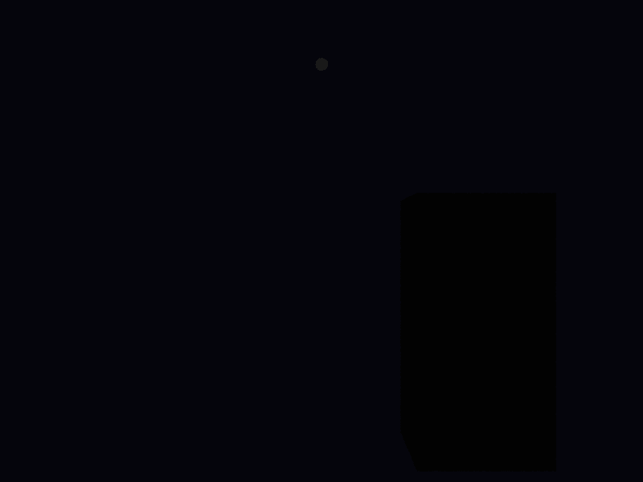

# Propriedades da Simulação



## Objetos (detalhado)

### Objeto 1: Box
- **material**:
  - **ambient**: [0.10000000149011612, 0.10000000149011612, 0.10000000149011612]
  - **diffuse**: [0.5, 0.5, 0.5]
  - **specular**: [1.0, 1.0, 1.0]
  - **shininess**: 50.0

### Objeto 2: Box
- **material**:
  - **ambient**: [0.10000000149011612, 0.10000000149011612, 0.10000000149011612]
  - **diffuse**: [0.5, 0.5, 0.5]
  - **specular**: [1.0, 1.0, 1.0]
  - **shininess**: 50.0

### Objeto 3: Sphere
- **center**: [2.7750000953674316, 5.550000190734863, 2.7750000953674316]
- **radius**: 0.1
- **material**:
  - **ambient**: [1.0, 1.0, 1.0]
  - **diffuse**: [1.0, 1.0, 1.0]
  - **specular**: [0.0, 0.0, 0.0]
  - **shininess**: 0.0

## Luzes (detalhado)

- **Light 1**:
  - pos: [0.699999988079071, 0.699999988079071, 0.699999988079071]
  - power: [2.7750000953674316, 5.550000190734863, 2.7750000953674316]

## Debug (raw JSON)

```json
{
  "objects": [
    {
      "type": "Box",
      "p_min": [
        0.0,
        0.0,
        0.0
      ],
      "p_max": [
        1.649999976158142,
        1.649999976158142,
        1.649999976158142
      ],
      "material": {
        "ambient": [
          0.10000000149011612,
          0.10000000149011612,
          0.10000000149011612
        ],
        "diffuse": [
          0.5,
          0.5,
          0.5
        ],
        "specular": [
          1.0,
          1.0,
          1.0
        ],
        "shininess": 50.0
      }
    },
    {
      "type": "Box",
      "p_min": [
        0.0,
        0.0,
        0.0
      ],
      "p_max": [
        1.649999976158142,
        3.299999952316284,
        1.649999976158142
      ],
      "material": {
        "ambient": [
          0.10000000149011612,
          0.10000000149011612,
          0.10000000149011612
        ],
        "diffuse": [
          0.5,
          0.5,
          0.5
        ],
        "specular": [
          1.0,
          1.0,
          1.0
        ],
        "shininess": 50.0
      }
    },
    {
      "type": "Sphere",
      "center": [
        2.7750000953674316,
        5.550000190734863,
        2.7750000953674316
      ],
      "radius": 0.1,
      "material": {
        "ambient": [
          1.0,
          1.0,
          1.0
        ],
        "diffuse": [
          1.0,
          1.0,
          1.0
        ],
        "specular": [
          0.0,
          0.0,
          0.0
        ],
        "shininess": 0.0
      }
    }
  ],
  "lights": [
    {
      "pos": [
        0.699999988079071,
        0.699999988079071,
        0.699999988079071
      ],
      "power": [
        2.7750000953674316,
        5.550000190734863,
        2.7750000953674316
      ]
    }
  ]
}
```

> Nota: abra este `properties.md` dentro da pasta de saída para visualizar a imagem incorporada.