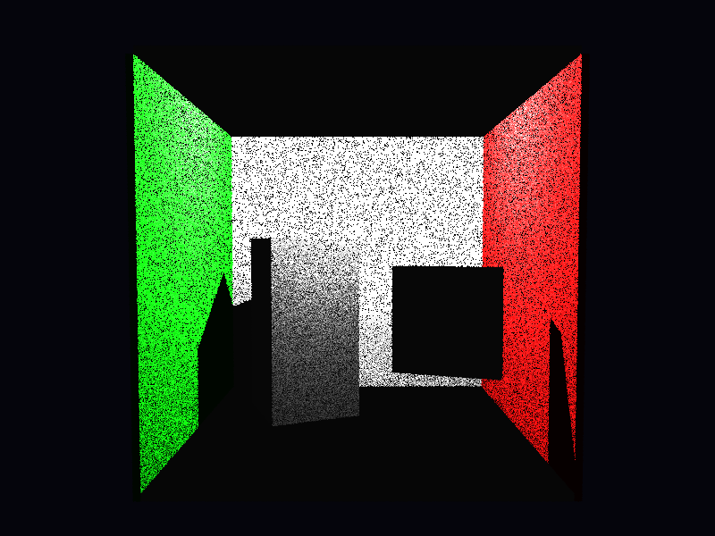

# Propriedades da Simulação



## Objetos (detalhado)

### Objeto 1: Box
- **material**:
  - **ambient**: [0.07999999821186066, 0.07999999821186066, 0.07999999821186066]
  - **diffuse**: [0.75, 0.75, 0.75]
  - **specular**: [0.0, 0.0, 0.0]
  - **shininess**: 1.0

### Objeto 2: Box
- **material**:
  - **ambient**: [0.0, 0.07999999821186066, 0.0]
  - **diffuse**: [0.05000000074505806, 0.75, 0.05000000074505806]
  - **specular**: [0.0, 0.0, 0.0]
  - **shininess**: 1.0

### Objeto 3: Box
- **material**:
  - **ambient**: [0.07999999821186066, 0.0, 0.0]
  - **diffuse**: [0.75, 0.05000000074505806, 0.05000000074505806]
  - **specular**: [0.0, 0.0, 0.0]
  - **shininess**: 1.0

### Objeto 4: Box
- **material**:
  - **ambient**: [0.07999999821186066, 0.07999999821186066, 0.07999999821186066]
  - **diffuse**: [0.75, 0.75, 0.75]
  - **specular**: [0.0, 0.0, 0.0]
  - **shininess**: 1.0

### Objeto 5: Box
- **material**:
  - **ambient**: [0.07999999821186066, 0.07999999821186066, 0.07999999821186066]
  - **diffuse**: [0.75, 0.75, 0.75]
  - **specular**: [0.0, 0.0, 0.0]
  - **shininess**: 1.0

### Objeto 6: Translate

### Objeto 7: Translate

## Luzes (detalhado)

- **Light 1**:
  - pos: [2.7750000953674316, 5.550000190734863, 2.7750000953674316]
  - power: [150.0, 150.0, 150.0]

## Debug (raw JSON)

```json
{
  "objects": [
    {
      "type": "Box",
      "p_min": [
        -0.10000000149011612,
        -0.10000000149011612,
        -0.10000000149011612
      ],
      "p_max": [
        5.650000095367432,
        5.650000095367432,
        0.0
      ],
      "material": {
        "ambient": [
          0.07999999821186066,
          0.07999999821186066,
          0.07999999821186066
        ],
        "diffuse": [
          0.75,
          0.75,
          0.75
        ],
        "specular": [
          0.0,
          0.0,
          0.0
        ],
        "shininess": 1.0
      }
    },
    {
      "type": "Box",
      "p_min": [
        -0.10000000149011612,
        -0.10000000149011612,
        0.0
      ],
      "p_max": [
        0.0,
        5.550000190734863,
        5.550000190734863
      ],
      "material": {
        "ambient": [
          0.0,
          0.07999999821186066,
          0.0
        ],
        "diffuse": [
          0.05000000074505806,
          0.75,
          0.05000000074505806
        ],
        "specular": [
          0.0,
          0.0,
          0.0
        ],
        "shininess": 1.0
      }
    },
    {
      "type": "Box",
      "p_min": [
        5.550000190734863,
        -0.10000000149011612,
        0.0
      ],
      "p_max": [
        5.650000095367432,
        5.550000190734863,
        5.550000190734863
      ],
      "material": {
        "ambient": [
          0.07999999821186066,
          0.0,
          0.0
        ],
        "diffuse": [
          0.75,
          0.05000000074505806,
          0.05000000074505806
        ],
        "specular": [
          0.0,
          0.0,
          0.0
        ],
        "shininess": 1.0
      }
    },
    {
      "type": "Box",
      "p_min": [
        0.0,
        5.550000190734863,
        0.0
      ],
      "p_max": [
        5.550000190734863,
        5.650000095367432,
        5.550000190734863
      ],
      "material": {
        "ambient": [
          0.07999999821186066,
          0.07999999821186066,
          0.07999999821186066
        ],
        "diffuse": [
          0.75,
          0.75,
          0.75
        ],
        "specular": [
          0.0,
          0.0,
          0.0
        ],
        "shininess": 1.0
      }
    },
    {
      "type": "Box",
      "p_min": [
        -0.10000000149011612,
        -0.10000000149011612,
        0.0
      ],
      "p_max": [
        5.650000095367432,
        0.0,
        5.550000190734863
      ],
      "material": {
        "ambient": [
          0.07999999821186066,
          0.07999999821186066,
          0.07999999821186066
        ],
        "diffuse": [
          0.75,
          0.75,
          0.75
        ],
        "specular": [
          0.0,
          0.0,
          0.0
        ],
        "shininess": 1.0
      }
    },
    {
      "type": "Translate"
    },
    {
      "type": "Translate"
    }
  ],
  "lights": [
    {
      "pos": [
        2.7750000953674316,
        5.550000190734863,
        2.7750000953674316
      ],
      "power": [
        150.0,
        150.0,
        150.0
      ]
    }
  ]
}
```

> Nota: abra este `properties.md` dentro da pasta de saída para visualizar a imagem incorporada.