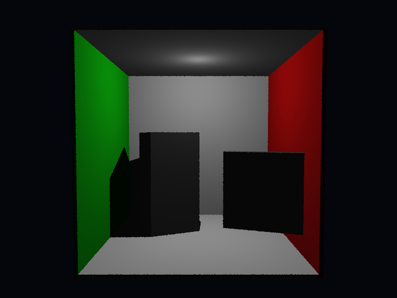

# Propriedades da Simulação



## Render

- **name**: cornell_box
- **width**: 800
- **height**: 600
- **samples_per_pixel**: 1
- **sampling_mode**: jittered
- **seed**: None
- **gamma_fix**: False

## Scene

- **ambient_light**: [0.30000001192092896, 0.30000001192092896, 0.30000001192092896]
- **background_color**: [0.019999999552965164, 0.019999999552965164, 0.05000000074505806]
- **max_depth**: 4
- **ray_epsilon**: 0.001

## Camera

- **eye**: [2.7750000953674316, 3.200000047683716, 12.774999618530273]
- **center**: [2.7750000953674316, 2.7750000953674316, 2.7750000953674316]
- **up**: [0.0, 1.0, 0.0]
- **fov**: 50.0
- **focal_distance**: 1.0
- **aspect**: 1.3333333333333333

## Objetos (detalhado)

### Objeto 1: Box
- **material**:
  - **type**: PhongMaterial
  - **ambient**: [0.07999999821186066, 0.07999999821186066, 0.07999999821186066]
  - **diffuse**: [0.75, 0.75, 0.75]
  - **specular**: [0.0, 0.0, 0.0]
  - **shininess**: 1.0

### Objeto 2: Box
- **material**:
  - **type**: PhongMaterial
  - **ambient**: [0.0, 0.07999999821186066, 0.0]
  - **diffuse**: [0.05000000074505806, 0.75, 0.05000000074505806]
  - **specular**: [0.0, 0.0, 0.0]
  - **shininess**: 1.0

### Objeto 3: Box
- **material**:
  - **type**: PhongMaterial
  - **ambient**: [0.07999999821186066, 0.0, 0.0]
  - **diffuse**: [0.75, 0.05000000074505806, 0.05000000074505806]
  - **specular**: [0.0, 0.0, 0.0]
  - **shininess**: 1.0

### Objeto 4: Box
- **material**:
  - **type**: PhongMaterial
  - **ambient**: [0.07999999821186066, 0.07999999821186066, 0.07999999821186066]
  - **diffuse**: [0.75, 0.75, 0.75]
  - **specular**: [0.0, 0.0, 0.0]
  - **shininess**: 1.0

### Objeto 5: Box
- **material**:
  - **type**: PhongMaterial
  - **ambient**: [0.07999999821186066, 0.07999999821186066, 0.07999999821186066]
  - **diffuse**: [0.75, 0.75, 0.75]
  - **specular**: [0.0, 0.0, 0.0]
  - **shininess**: 1.0

### Objeto 6: Translate
- **shape_chain**: ['Translate', 'Rotate', 'Box']
- **material**:
  - **type**: PhongMaterial
  - **ambient**: [0.10000000149011612, 0.10000000149011612, 0.10000000149011612]
  - **diffuse**: [0.5, 0.5, 0.5]
  - **specular**: [0.0, 0.0, 0.0]
  - **shininess**: 1.0

### Objeto 7: Translate
- **shape_chain**: ['Translate', 'Rotate', 'Box']
- **material**:
  - **type**: PhongMaterial
  - **ambient**: [0.10000000149011612, 0.10000000149011612, 0.10000000149011612]
  - **diffuse**: [0.5, 0.5, 0.5]
  - **specular**: [0.0, 0.0, 0.0]
  - **shininess**: 1.0

### Objeto 8: Sphere
- **center**: [1.0, 1.0, 1.0]
- **radius**: 0.5
- **material**:
  - **type**: TransparentMaterial
  - **ambient**: [0.0, 0.0, 0.0]
  - **diffuse**: [0.0, 0.0, 0.0]
  - **specular**: [0.0, 0.0, 0.0]
  - **shininess**: 1.0
  - **ior**: 1.5

## Luzes (detalhado)

- **Light 1**:
  - pos: [2.7750000953674316, 5.0, 2.7750000953674316]
  - power: [0.699999988079071, 0.699999988079071, 0.699999988079071]

## Debug (raw JSON)

```json
{
  "render": {
    "name": "cornell_box",
    "width": 800,
    "height": 600,
    "samples_per_pixel": 1,
    "sampling_mode": "jittered",
    "seed": null,
    "gamma_fix": false
  },
  "scene": {
    "ambient_light": [
      0.30000001192092896,
      0.30000001192092896,
      0.30000001192092896
    ],
    "background_color": [
      0.019999999552965164,
      0.019999999552965164,
      0.05000000074505806
    ],
    "max_depth": 4,
    "ray_epsilon": 0.001
  },
  "camera": {
    "eye": [
      2.7750000953674316,
      3.200000047683716,
      12.774999618530273
    ],
    "center": [
      2.7750000953674316,
      2.7750000953674316,
      2.7750000953674316
    ],
    "up": [
      0.0,
      1.0,
      0.0
    ],
    "fov": 50.0,
    "focal_distance": 1.0,
    "aspect": 1.3333333333333333
  },
  "objects": [
    {
      "type": "Box",
      "p_min": [
        -0.10000000149011612,
        -0.10000000149011612,
        -0.10000000149011612
      ],
      "p_max": [
        5.650000095367432,
        5.650000095367432,
        0.0
      ],
      "material": {
        "type": "PhongMaterial",
        "ambient": [
          0.07999999821186066,
          0.07999999821186066,
          0.07999999821186066
        ],
        "diffuse": [
          0.75,
          0.75,
          0.75
        ],
        "specular": [
          0.0,
          0.0,
          0.0
        ],
        "shininess": 1.0
      }
    },
    {
      "type": "Box",
      "p_min": [
        -0.10000000149011612,
        -0.10000000149011612,
        0.0
      ],
      "p_max": [
        0.0,
        5.550000190734863,
        5.550000190734863
      ],
      "material": {
        "type": "PhongMaterial",
        "ambient": [
          0.0,
          0.07999999821186066,
          0.0
        ],
        "diffuse": [
          0.05000000074505806,
          0.75,
          0.05000000074505806
        ],
        "specular": [
          0.0,
          0.0,
          0.0
        ],
        "shininess": 1.0
      }
    },
    {
      "type": "Box",
      "p_min": [
        5.550000190734863,
        -0.10000000149011612,
        0.0
      ],
      "p_max": [
        5.650000095367432,
        5.550000190734863,
        5.550000190734863
      ],
      "material": {
        "type": "PhongMaterial",
        "ambient": [
          0.07999999821186066,
          0.0,
          0.0
        ],
        "diffuse": [
          0.75,
          0.05000000074505806,
          0.05000000074505806
        ],
        "specular": [
          0.0,
          0.0,
          0.0
        ],
        "shininess": 1.0
      }
    },
    {
      "type": "Box",
      "p_min": [
        0.0,
        5.550000190734863,
        0.0
      ],
      "p_max": [
        5.550000190734863,
        5.650000095367432,
        5.550000190734863
      ],
      "material": {
        "type": "PhongMaterial",
        "ambient": [
          0.07999999821186066,
          0.07999999821186066,
          0.07999999821186066
        ],
        "diffuse": [
          0.75,
          0.75,
          0.75
        ],
        "specular": [
          0.0,
          0.0,
          0.0
        ],
        "shininess": 1.0
      }
    },
    {
      "type": "Box",
      "p_min": [
        -0.10000000149011612,
        -0.10000000149011612,
        0.0
      ],
      "p_max": [
        5.650000095367432,
        0.0,
        5.550000190734863
      ],
      "material": {
        "type": "PhongMaterial",
        "ambient": [
          0.07999999821186066,
          0.07999999821186066,
          0.07999999821186066
        ],
        "diffuse": [
          0.75,
          0.75,
          0.75
        ],
        "specular": [
          0.0,
          0.0,
          0.0
        ],
        "shininess": 1.0
      }
    },
    {
      "type": "Translate",
      "shape_chain": [
        "Translate",
        "Rotate",
        "Box"
      ],
      "material": {
        "type": "PhongMaterial",
        "ambient": [
          0.10000000149011612,
          0.10000000149011612,
          0.10000000149011612
        ],
        "diffuse": [
          0.5,
          0.5,
          0.5
        ],
        "specular": [
          0.0,
          0.0,
          0.0
        ],
        "shininess": 1.0
      }
    },
    {
      "type": "Translate",
      "shape_chain": [
        "Translate",
        "Rotate",
        "Box"
      ],
      "material": {
        "type": "PhongMaterial",
        "ambient": [
          0.10000000149011612,
          0.10000000149011612,
          0.10000000149011612
        ],
        "diffuse": [
          0.5,
          0.5,
          0.5
        ],
        "specular": [
          0.0,
          0.0,
          0.0
        ],
        "shininess": 1.0
      }
    },
    {
      "type": "Sphere",
      "center": [
        1.0,
        1.0,
        1.0
      ],
      "radius": 0.5,
      "material": {
        "type": "TransparentMaterial",
        "ambient": [
          0.0,
          0.0,
          0.0
        ],
        "diffuse": [
          0.0,
          0.0,
          0.0
        ],
        "specular": [
          0.0,
          0.0,
          0.0
        ],
        "shininess": 1.0,
        "ior": 1.5
      }
    }
  ],
  "lights": [
    {
      "pos": [
        2.7750000953674316,
        5.0,
        2.7750000953674316
      ],
      "power": [
        0.699999988079071,
        0.699999988079071,
        0.699999988079071
      ]
    }
  ]
}
```

> Nota: abra este `properties.md` dentro da pasta de saída para visualizar a imagem incorporada.