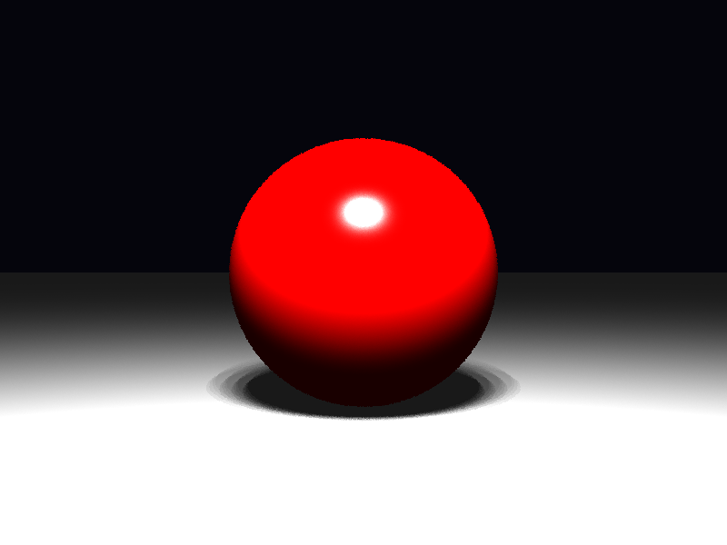

# Propriedades da Simulação



## Render

- **name**: main_area_light
- **width**: 800
- **height**: 600
- **samples_per_pixel**: 1
- **sampling_mode**: stratified
- **seed**: None
- **gamma_fix**: False

## Scene

- **ambient_light**: [1.0, 1.0, 1.0]
- **background_color**: [0.019999999552965164, 0.019999999552965164, 0.05000000074505806]
- **max_depth**: 4
- **ray_epsilon**: 0.001

## Camera

- **eye**: [0.0, 0.0, 5.0]
- **center**: [0.0, 0.0, 0.0]
- **up**: [0.0, 1.0, 0.0]
- **fov**: 45.0
- **focal_distance**: 1.0
- **aspect**: 1.3333333333333333

## Objetos (detalhado)

### Objeto 1: Sphere
- **center**: [0.0, 0.0, 0.0]
- **radius**: 1.0
- **material**:
  - **type**: PhongMaterial
  - **ambient**: [0.10000000149011612, 0.0, 0.0]
  - **diffuse**: [0.699999988079071, 0.0, 0.0]
  - **specular**: [1.0, 1.0, 1.0]
  - **shininess**: 50.0

### Objeto 2: Plane
- **pos**: [0.0, -1.0, 0.0]
- **normal**: [0.0, 1.0, 0.0]
- **material**:
  - **type**: PhongMaterial
  - **ambient**: [0.10000000149011612, 0.10000000149011612, 0.10000000149011612]
  - **diffuse**: [0.5, 0.5, 0.5]
  - **specular**: [0.0, 0.0, 0.0]
  - **shininess**: 1.0

## Luzes (detalhado)

- **Light 1 (AreaLight)**:
  - pos: [-1.0, 5.0, 4.0]
  - power: [150.0, 150.0, 150.0]
  - samples_u: 4
  - samples_v: 4
  - light_sampling_mode: regular

## Debug (raw JSON)

```json
{
  "render": {
    "name": "main_area_light",
    "width": 800,
    "height": 600,
    "samples_per_pixel": 1,
    "sampling_mode": "stratified",
    "seed": null,
    "gamma_fix": false
  },
  "scene": {
    "ambient_light": [
      1.0,
      1.0,
      1.0
    ],
    "background_color": [
      0.019999999552965164,
      0.019999999552965164,
      0.05000000074505806
    ],
    "max_depth": 4,
    "ray_epsilon": 0.001
  },
  "camera": {
    "eye": [
      0.0,
      0.0,
      5.0
    ],
    "center": [
      0.0,
      0.0,
      0.0
    ],
    "up": [
      0.0,
      1.0,
      0.0
    ],
    "fov": 45.0,
    "focal_distance": 1.0,
    "aspect": 1.3333333333333333
  },
  "objects": [
    {
      "type": "Sphere",
      "center": [
        0.0,
        0.0,
        0.0
      ],
      "radius": 1.0,
      "material": {
        "type": "PhongMaterial",
        "ambient": [
          0.10000000149011612,
          0.0,
          0.0
        ],
        "diffuse": [
          0.699999988079071,
          0.0,
          0.0
        ],
        "specular": [
          1.0,
          1.0,
          1.0
        ],
        "shininess": 50.0
      }
    },
    {
      "type": "Plane",
      "pos": [
        0.0,
        -1.0,
        0.0
      ],
      "normal": [
        0.0,
        1.0,
        0.0
      ],
      "material": {
        "type": "PhongMaterial",
        "ambient": [
          0.10000000149011612,
          0.10000000149011612,
          0.10000000149011612
        ],
        "diffuse": [
          0.5,
          0.5,
          0.5
        ],
        "specular": [
          0.0,
          0.0,
          0.0
        ],
        "shininess": 1.0
      }
    }
  ],
  "lights": [
    {
      "type": "AreaLight",
      "pos": [
        -1.0,
        5.0,
        4.0
      ],
      "power": [
        150.0,
        150.0,
        150.0
      ],
      "samples_u": 4,
      "samples_v": 4,
      "light_sampling_mode": "regular"
    }
  ]
}
```

> Nota: abra este `properties.md` dentro da pasta de saída para visualizar a imagem incorporada.