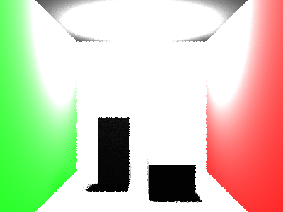

# Propriedades da Simulação



## Objetos (detalhado)

### Objeto 1: Plane
- **pos**: [0.0, -1.0, 0.0]
- **normal**: [0.0, 1.0, 0.0]
- **material**:
  - **ambient**: [0.07999999821186066, 0.07999999821186066, 0.07999999821186066]
  - **diffuse**: [0.75, 0.75, 0.75]
  - **specular**: [0.0, 0.0, 0.0]
  - **shininess**: 1.0

### Objeto 2: Plane
- **pos**: [0.0, 3.0, 0.0]
- **normal**: [0.0, -1.0, 0.0]
- **material**:
  - **ambient**: [0.10000000149011612, 0.10000000149011612, 0.10000000149011612]
  - **diffuse**: [0.5, 0.5, 0.5]
  - **specular**: [0.0, 0.0, 0.0]
  - **shininess**: 1.0

### Objeto 3: Plane
- **pos**: [0.0, 0.0, -4.0]
- **normal**: [0.0, 0.0, 1.0]
- **material**:
  - **ambient**: [0.07999999821186066, 0.07999999821186066, 0.07999999821186066]
  - **diffuse**: [0.75, 0.75, 0.75]
  - **specular**: [0.0, 0.0, 0.0]
  - **shininess**: 1.0

### Objeto 4: Plane
- **pos**: [-2.0, 0.0, 0.0]
- **normal**: [1.0, 0.0, 0.0]
- **material**:
  - **ambient**: [0.0, 0.07999999821186066, 0.0]
  - **diffuse**: [0.05000000074505806, 0.75, 0.05000000074505806]
  - **specular**: [0.0, 0.0, 0.0]
  - **shininess**: 1.0

### Objeto 5: Plane
- **pos**: [2.0, 0.0, 0.0]
- **normal**: [-1.0, 0.0, 0.0]
- **material**:
  - **ambient**: [0.07999999821186066, 0.0, 0.0]
  - **diffuse**: [0.75, 0.05000000074505806, 0.05000000074505806]
  - **specular**: [0.0, 0.0, 0.0]
  - **shininess**: 1.0

### Objeto 6: Instance

### Objeto 7: Instance

## Luzes (detalhado)

- **Light 1**:
  - pos: [-0.75, 2.950000047683716, -2.9000000953674316]
  - power: [220.0, 220.0, 220.0]

## Debug (raw JSON)

```json
{
  "objects": [
    {
      "type": "Plane",
      "pos": [
        0.0,
        -1.0,
        0.0
      ],
      "normal": [
        0.0,
        1.0,
        0.0
      ],
      "material": {
        "ambient": [
          0.07999999821186066,
          0.07999999821186066,
          0.07999999821186066
        ],
        "diffuse": [
          0.75,
          0.75,
          0.75
        ],
        "specular": [
          0.0,
          0.0,
          0.0
        ],
        "shininess": 1.0
      }
    },
    {
      "type": "Plane",
      "pos": [
        0.0,
        3.0,
        0.0
      ],
      "normal": [
        0.0,
        -1.0,
        0.0
      ],
      "material": {
        "ambient": [
          0.10000000149011612,
          0.10000000149011612,
          0.10000000149011612
        ],
        "diffuse": [
          0.5,
          0.5,
          0.5
        ],
        "specular": [
          0.0,
          0.0,
          0.0
        ],
        "shininess": 1.0
      }
    },
    {
      "type": "Plane",
      "pos": [
        0.0,
        0.0,
        -4.0
      ],
      "normal": [
        0.0,
        0.0,
        1.0
      ],
      "material": {
        "ambient": [
          0.07999999821186066,
          0.07999999821186066,
          0.07999999821186066
        ],
        "diffuse": [
          0.75,
          0.75,
          0.75
        ],
        "specular": [
          0.0,
          0.0,
          0.0
        ],
        "shininess": 1.0
      }
    },
    {
      "type": "Plane",
      "pos": [
        -2.0,
        0.0,
        0.0
      ],
      "normal": [
        1.0,
        0.0,
        0.0
      ],
      "material": {
        "ambient": [
          0.0,
          0.07999999821186066,
          0.0
        ],
        "diffuse": [
          0.05000000074505806,
          0.75,
          0.05000000074505806
        ],
        "specular": [
          0.0,
          0.0,
          0.0
        ],
        "shininess": 1.0
      }
    },
    {
      "type": "Plane",
      "pos": [
        2.0,
        0.0,
        0.0
      ],
      "normal": [
        -1.0,
        0.0,
        0.0
      ],
      "material": {
        "ambient": [
          0.07999999821186066,
          0.0,
          0.0
        ],
        "diffuse": [
          0.75,
          0.05000000074505806,
          0.05000000074505806
        ],
        "specular": [
          0.0,
          0.0,
          0.0
        ],
        "shininess": 1.0
      }
    },
    {
      "type": "Instance"
    },
    {
      "type": "Instance"
    }
  ],
  "lights": [
    {
      "pos": [
        -0.75,
        2.950000047683716,
        -2.9000000953674316
      ],
      "power": [
        220.0,
        220.0,
        220.0
      ]
    }
  ]
}
```

> Nota: abra este `properties.md` dentro da pasta de saída para visualizar a imagem incorporada.