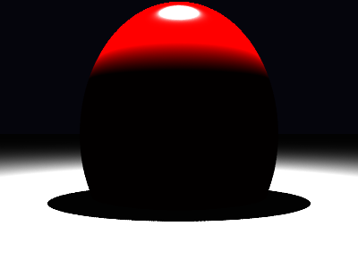

# Propriedades da Simulação



## Objetos (detalhado)

### Objeto 1: Instance

### Objeto 2: Plane
- **pos**: [0.0, -1.0, 0.0]
- **normal**: [0.0, 1.0, 0.0]
- **material**:
  - **ambient**: [0.10000000149011612, 0.10000000149011612, 0.10000000149011612]
  - **diffuse**: [0.5, 0.5, 0.5]
  - **specular**: [0.0, 0.0, 0.0]
  - **shininess**: 1.0

## Luzes (detalhado)

- **Light 1**:
  - pos: [0.0, 5.0, 0.0]
  - power: [150.0, 150.0, 150.0]

## Debug (raw JSON)

```json
{
  "objects": [
    {
      "type": "Instance"
    },
    {
      "type": "Plane",
      "pos": [
        0.0,
        -1.0,
        0.0
      ],
      "normal": [
        0.0,
        1.0,
        0.0
      ],
      "material": {
        "ambient": [
          0.10000000149011612,
          0.10000000149011612,
          0.10000000149011612
        ],
        "diffuse": [
          0.5,
          0.5,
          0.5
        ],
        "specular": [
          0.0,
          0.0,
          0.0
        ],
        "shininess": 1.0
      }
    }
  ],
  "lights": [
    {
      "pos": [
        0.0,
        5.0,
        0.0
      ],
      "power": [
        150.0,
        150.0,
        150.0
      ]
    }
  ]
}
```

> Nota: abra este `properties.md` dentro da pasta de saída para visualizar a imagem incorporada.