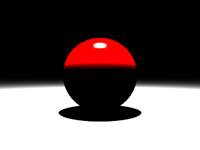

# Propriedades da Simulação



## Objetos (detalhado)

### Objeto 1: Sphere
- **center**: [0.0, 0.0, 0.0]
- **radius**: 1.0
- **material**:
  - **ambient**: [0.019999999552965164, 0.0, 0.0]
  - **diffuse**: [0.699999988079071, 0.0, 0.0]
  - **specular**: [1.0, 1.0, 1.0]
  - **shininess**: 200.0

### Objeto 2: Plane
- **pos**: [0.0, -1.0, 0.0]
- **normal**: [0.0, 1.0, 0.0]
- **material**:
  - **ambient**: [0.009999999776482582, 0.009999999776482582, 0.009999999776482582]
  - **diffuse**: [0.6000000238418579, 0.6000000238418579, 0.6000000238418579]
  - **specular**: [0.15000000596046448, 0.15000000596046448, 0.15000000596046448]
  - **shininess**: 20.0

## Luzes (detalhado)

- **Light 1**:
  - pos: [-0.4000000059604645, 5.0, -0.4000000059604645]
  - power: [50.0, 50.0, 50.0]

- **Light 2**:
  - pos: [-0.4000000059604645, 5.0, 0.0]
  - power: [50.0, 50.0, 50.0]

- **Light 3**:
  - pos: [-0.4000000059604645, 5.0, 0.4000000059604645]
  - power: [50.0, 50.0, 50.0]

- **Light 4**:
  - pos: [0.0, 5.0, -0.4000000059604645]
  - power: [50.0, 50.0, 50.0]

- **Light 5**:
  - pos: [0.0, 5.0, 0.0]
  - power: [50.0, 50.0, 50.0]

- **Light 6**:
  - pos: [0.0, 5.0, 0.4000000059604645]
  - power: [50.0, 50.0, 50.0]

- **Light 7**:
  - pos: [0.4000000059604645, 5.0, -0.4000000059604645]
  - power: [50.0, 50.0, 50.0]

- **Light 8**:
  - pos: [0.4000000059604645, 5.0, 0.0]
  - power: [50.0, 50.0, 50.0]

- **Light 9**:
  - pos: [0.4000000059604645, 5.0, 0.4000000059604645]
  - power: [50.0, 50.0, 50.0]

## Debug (raw JSON)

```json
{
  "objects": [
    {
      "type": "Sphere",
      "center": [
        0.0,
        0.0,
        0.0
      ],
      "radius": 1.0,
      "material": {
        "ambient": [
          0.019999999552965164,
          0.0,
          0.0
        ],
        "diffuse": [
          0.699999988079071,
          0.0,
          0.0
        ],
        "specular": [
          1.0,
          1.0,
          1.0
        ],
        "shininess": 200.0
      }
    },
    {
      "type": "Plane",
      "pos": [
        0.0,
        -1.0,
        0.0
      ],
      "normal": [
        0.0,
        1.0,
        0.0
      ],
      "material": {
        "ambient": [
          0.009999999776482582,
          0.009999999776482582,
          0.009999999776482582
        ],
        "diffuse": [
          0.6000000238418579,
          0.6000000238418579,
          0.6000000238418579
        ],
        "specular": [
          0.15000000596046448,
          0.15000000596046448,
          0.15000000596046448
        ],
        "shininess": 20.0
      }
    }
  ],
  "lights": [
    {
      "pos": [
        -0.4000000059604645,
        5.0,
        -0.4000000059604645
      ],
      "power": [
        50.0,
        50.0,
        50.0
      ]
    },
    {
      "pos": [
        -0.4000000059604645,
        5.0,
        0.0
      ],
      "power": [
        50.0,
        50.0,
        50.0
      ]
    },
    {
      "pos": [
        -0.4000000059604645,
        5.0,
        0.4000000059604645
      ],
      "power": [
        50.0,
        50.0,
        50.0
      ]
    },
    {
      "pos": [
        0.0,
        5.0,
        -0.4000000059604645
      ],
      "power": [
        50.0,
        50.0,
        50.0
      ]
    },
    {
      "pos": [
        0.0,
        5.0,
        0.0
      ],
      "power": [
        50.0,
        50.0,
        50.0
      ]
    },
    {
      "pos": [
        0.0,
        5.0,
        0.4000000059604645
      ],
      "power": [
        50.0,
        50.0,
        50.0
      ]
    },
    {
      "pos": [
        0.4000000059604645,
        5.0,
        -0.4000000059604645
      ],
      "power": [
        50.0,
        50.0,
        50.0
      ]
    },
    {
      "pos": [
        0.4000000059604645,
        5.0,
        0.0
      ],
      "power": [
        50.0,
        50.0,
        50.0
      ]
    },
    {
      "pos": [
        0.4000000059604645,
        5.0,
        0.4000000059604645
      ],
      "power": [
        50.0,
        50.0,
        50.0
      ]
    }
  ]
}
```

> Nota: abra este `properties.md` dentro da pasta de saída para visualizar a imagem incorporada.