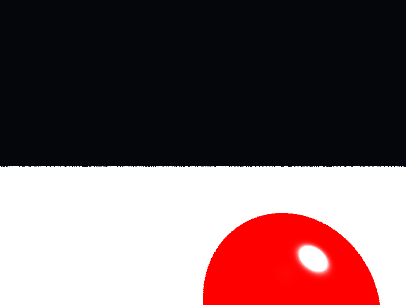

# Propriedades da Simulação



## Objetos (detalhado)

### Objeto 1: Sphere
- **center**: [1.774999976158142, 1.2000000476837158, 6.775000095367432]
- **radius**: 1.0
- **material**:
  - **ambient**: [0.10000000149011612, 0.0, 0.0]
  - **diffuse**: [0.699999988079071, 0.0, 0.0]
  - **specular**: [1.0, 1.0, 1.0]
  - **shininess**: 50.0

### Objeto 2: Plane
- **pos**: [0.0, -1.0, 0.0]
- **normal**: [0.0, 1.0, 0.0]
- **material**:
  - **ambient**: [0.10000000149011612, 0.10000000149011612, 0.10000000149011612]
  - **diffuse**: [0.5, 0.5, 0.5]
  - **specular**: [1.0, 1.0, 1.0]
  - **shininess**: 50.0

## Luzes (detalhado)

- **Light 1**:
  - pos: [2.7750000953674316, 5.550000190734863, 2.7750000953674316]
  - power: [0.699999988079071, 0.699999988079071, 0.699999988079071]

- **Light 2**:
  - pos: [0.0, 5.0, 5.0]
  - power: [150.0, 150.0, 150.0]

## Debug (raw JSON)

```json
{
  "objects": [
    {
      "type": "Sphere",
      "center": [
        1.774999976158142,
        1.2000000476837158,
        6.775000095367432
      ],
      "radius": 1.0,
      "material": {
        "ambient": [
          0.10000000149011612,
          0.0,
          0.0
        ],
        "diffuse": [
          0.699999988079071,
          0.0,
          0.0
        ],
        "specular": [
          1.0,
          1.0,
          1.0
        ],
        "shininess": 50.0
      }
    },
    {
      "type": "Plane",
      "pos": [
        0.0,
        -1.0,
        0.0
      ],
      "normal": [
        0.0,
        1.0,
        0.0
      ],
      "material": {
        "ambient": [
          0.10000000149011612,
          0.10000000149011612,
          0.10000000149011612
        ],
        "diffuse": [
          0.5,
          0.5,
          0.5
        ],
        "specular": [
          1.0,
          1.0,
          1.0
        ],
        "shininess": 50.0
      }
    }
  ],
  "lights": [
    {
      "pos": [
        2.7750000953674316,
        5.550000190734863,
        2.7750000953674316
      ],
      "power": [
        0.699999988079071,
        0.699999988079071,
        0.699999988079071
      ]
    },
    {
      "pos": [
        0.0,
        5.0,
        5.0
      ],
      "power": [
        150.0,
        150.0,
        150.0
      ]
    }
  ]
}
```

> Nota: abra este `properties.md` dentro da pasta de saída para visualizar a imagem incorporada.