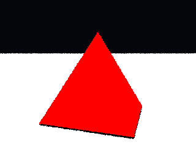

# Propriedades da Simulação



## Render

- **name**: main_triangles
- **width**: 320
- **height**: 240
- **samples_per_pixel**: 1
- **sampling_mode**: jittered
- **seed**: 1
- **gamma_fix**: False

## Scene

- **ambient_light**: [0.30000001192092896, 0.30000001192092896, 0.30000001192092896]
- **background_color**: [0.019999999552965164, 0.019999999552965164, 0.05000000074505806]
- **max_depth**: 4
- **ray_epsilon**: 0.001

## Camera

- **eye**: [0.0, 0.550000011920929, 4.349999904632568]
- **center**: [0.0, 0.05000000074505806, 0.0]
- **up**: [0.0, 1.0, 0.0]
- **fov**: 45.0
- **focal_distance**: 1.0
- **aspect**: 1.3333333333333333

## Objetos (detalhado)

### Objeto 1: Instance
- **shape_chain**: ['Instance', 'TriangleMesh']
- **material**:
  - **type**: PhongMaterial
  - **ambient**: [0.10000000149011612, 0.0, 0.0]
  - **diffuse**: [0.699999988079071, 0.0, 0.0]
  - **specular**: [1.0, 1.0, 1.0]
  - **shininess**: 50.0

### Objeto 2: Plane
- **pos**: [0.0, -1.0, 0.0]
- **normal**: [0.0, 1.0, 0.0]
- **material**:
  - **type**: PhongMaterial
  - **ambient**: [0.10000000149011612, 0.10000000149011612, 0.10000000149011612]
  - **diffuse**: [0.5, 0.5, 0.5]
  - **specular**: [0.0, 0.0, 0.0]
  - **shininess**: 1.0

## Luzes (detalhado)

- **Light 1**:
  - pos: [0.0, 5.5, 0.0]
  - power: [150.0, 150.0, 150.0]

## Debug (raw JSON)

```json
{
  "render": {
    "name": "main_triangles",
    "width": 320,
    "height": 240,
    "samples_per_pixel": 1,
    "sampling_mode": "jittered",
    "seed": 1,
    "gamma_fix": false
  },
  "scene": {
    "ambient_light": [
      0.30000001192092896,
      0.30000001192092896,
      0.30000001192092896
    ],
    "background_color": [
      0.019999999552965164,
      0.019999999552965164,
      0.05000000074505806
    ],
    "max_depth": 4,
    "ray_epsilon": 0.001
  },
  "camera": {
    "eye": [
      0.0,
      0.550000011920929,
      4.349999904632568
    ],
    "center": [
      0.0,
      0.05000000074505806,
      0.0
    ],
    "up": [
      0.0,
      1.0,
      0.0
    ],
    "fov": 45.0,
    "focal_distance": 1.0,
    "aspect": 1.3333333333333333
  },
  "objects": [
    {
      "type": "Instance",
      "vertex_count": 5,
      "face_count": 6,
      "triangle_count": 6,
      "shape_chain": [
        "Instance",
        "TriangleMesh"
      ],
      "material": {
        "type": "PhongMaterial",
        "ambient": [
          0.10000000149011612,
          0.0,
          0.0
        ],
        "diffuse": [
          0.699999988079071,
          0.0,
          0.0
        ],
        "specular": [
          1.0,
          1.0,
          1.0
        ],
        "shininess": 50.0
      }
    },
    {
      "type": "Plane",
      "pos": [
        0.0,
        -1.0,
        0.0
      ],
      "normal": [
        0.0,
        1.0,
        0.0
      ],
      "material": {
        "type": "PhongMaterial",
        "ambient": [
          0.10000000149011612,
          0.10000000149011612,
          0.10000000149011612
        ],
        "diffuse": [
          0.5,
          0.5,
          0.5
        ],
        "specular": [
          0.0,
          0.0,
          0.0
        ],
        "shininess": 1.0
      }
    }
  ],
  "lights": [
    {
      "pos": [
        0.0,
        5.5,
        0.0
      ],
      "power": [
        150.0,
        150.0,
        150.0
      ]
    }
  ]
}
```

> Nota: abra este `properties.md` dentro da pasta de saída para visualizar a imagem incorporada.