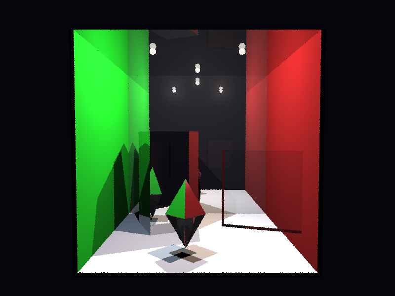

# Propriedades da Simulação

## Render

- **name**: proj1_final
- **width**: 800
- **height**: 600
- **samples_per_pixel**: 1
- **sampling_mode**: jittered
- **seed**: None
- **gamma_fix**: False
- **render_time_seconds**: 144.18893529099296
- **render_time_minutes**: 2.403148921516549

## Estimativa de Raios

- **Raios Primários**: 480,000
- **Raios Secundários**: 66,199
- **Shadow Rays**: 1,196,688
- **Total de Raios**: 1,742,887
- **Throughput**: 27,423 raios/segundo
- **Tempo Estimado**: 63.555s (1.059 min)
- **Tempo Estimado (minutos)**: 1.059
- **Tempo Estimado (interseções)**: 63.555s
- **Primary Hit Ratio**: 0.183
- **Recursive Surface Ratio**: 0.538
- **Shadow Samples/Hit**: 12

### Calibração (rápida)
- **elapsed_seconds**: 0.072
- **samples_tested**: 256
- **rays_traced**: 618
- **intersection_tests**: 25,636
- **shadow_rays**: 1,354
- **measured_throughput**: 27423 raios/segundo

## Qualidade da Estimativa

- **Rays Model (estimado)**: 63.555s
- **Rays Model (real)**: 144.189s
- **Rays Model (erro abs)**: 80.634s
- **Rays Model (erro rel)**: 55.923%
- **Rays Model (fator real/estimado)**: 2.27x
- **Rays Model (acurácia)**: 44.08%
- **Intersection Model (estimado)**: 63.555s
- **Intersection Model (real)**: 144.189s
- **Intersection Model (erro abs)**: 80.634s
- **Intersection Model (erro rel)**: 55.923%
- **Intersection Model (fator real/estimado)**: 2.27x
- **Intersection Model (acurácia)**: 44.08%

## Scene

- **ambient_light**: [0.019999999552965164, 0.019999999552965164, 0.019999999552965164]
- **background_color**: [0.019999999552965164, 0.019999999552965164, 0.05000000074505806]
- **max_depth**: 8
- **ray_epsilon**: 0.001

## Camera

- **eye**: [2.7750000953674316, 3.200000047683716, 12.774999618530273]
- **center**: [2.7750000953674316, 2.7750000953674316, 2.7750000953674316]
- **up**: [0.0, 1.0, 0.0]
- **fov**: 50.0
- **focal_distance**: 1.0
- **aspect**: 1.3333333333333333

## Objetos (detalhado)

### Objeto 1: Box
- **shape_chain**: ['Box']
- **p_min**: [-0.10000000149011612, -0.10000000149011612, -0.10000000149011612]
- **p_max**: [5.650000095367432, 5.650000095367432, 0.0]
- **material**:
  - **type**: ReflectiveMaterial
  - **ambient**: [0.05000000074505806, 0.05000000074505806, 0.05000000074505806]
  - **diffuse**: [0.30000001192092896, 0.30000001192092896, 0.30000001192092896]
  - **specular**: [0.3499999940395355, 0.3499999940395355, 0.3499999940395355]
  - **shininess**: 96.0
  - **reflectivity**: [0.699999988079071, 0.699999988079071, 0.699999988079071]

### Objeto 2: Box
- **shape_chain**: ['Box']
- **p_min**: [-0.10000000149011612, -0.10000000149011612, 0.0]
- **p_max**: [0.0, 5.550000190734863, 5.550000190734863]
- **material**:
  - **type**: PhongMaterial
  - **ambient**: [0.029999999329447746, 0.05000000074505806, 0.029999999329447746]
  - **diffuse**: [0.11999999731779099, 0.7200000286102295, 0.15000000596046448]
  - **specular**: [0.029999999329447746, 0.029999999329447746, 0.029999999329447746]
  - **shininess**: 6.0

### Objeto 3: Box
- **shape_chain**: ['Box']
- **p_min**: [5.550000190734863, -0.10000000149011612, 0.0]
- **p_max**: [5.650000095367432, 5.550000190734863, 5.550000190734863]
- **material**:
  - **type**: PhongMaterial
  - **ambient**: [0.05000000074505806, 0.019999999552965164, 0.019999999552965164]
  - **diffuse**: [0.550000011920929, 0.11999999731779099, 0.11999999731779099]
  - **specular**: [0.949999988079071, 0.949999988079071, 0.949999988079071]
  - **shininess**: 180.0

### Objeto 4: Box
- **shape_chain**: ['Box']
- **p_min**: [0.0, 5.550000190734863, 0.0]
- **p_max**: [5.550000190734863, 5.650000095367432, 5.550000190734863]
- **material**:
  - **type**: ReflectiveMaterial
  - **ambient**: [0.05000000074505806, 0.05000000074505806, 0.05000000074505806]
  - **diffuse**: [0.30000001192092896, 0.30000001192092896, 0.30000001192092896]
  - **specular**: [0.3499999940395355, 0.3499999940395355, 0.3499999940395355]
  - **shininess**: 96.0
  - **reflectivity**: [0.699999988079071, 0.699999988079071, 0.699999988079071]

### Objeto 5: Box
- **shape_chain**: ['Box']
- **p_min**: [-0.10000000149011612, -0.10000000149011612, 0.0]
- **p_max**: [5.650000095367432, 0.0, 5.550000190734863]
- **material**:
  - **type**: PhongMaterial
  - **ambient**: [0.029999999329447746, 0.029999999329447746, 0.029999999329447746]
  - **diffuse**: [0.6800000071525574, 0.6800000071525574, 0.6800000071525574]
  - **specular**: [0.07999999821186066, 0.07999999821186066, 0.07999999821186066]
  - **shininess**: 18.0

### Objeto 6: Translate
- **shape_chain**: ['Translate', 'Rotate', 'Box']
- **material**:
  - **type**: TransparentMaterial
  - **ambient**: [0.0, 0.0, 0.0]
  - **diffuse**: [0.0, 0.0, 0.0]
  - **specular**: [0.0, 0.0, 0.0]
  - **shininess**: 1.0
  - **attenuation**: [0.8600000143051147, 0.9200000166893005, 0.9800000190734863]
  - **ior**: 1.5

### Objeto 7: Translate
- **shape_chain**: ['Translate', 'Rotate', 'Box']
- **material**:
  - **type**: ReflectiveMaterial
  - **ambient**: [0.03999999910593033, 0.03999999910593033, 0.03999999910593033]
  - **diffuse**: [0.25, 0.25, 0.25]
  - **specular**: [0.25, 0.25, 0.25]
  - **shininess**: 80.0
  - **reflectivity**: [0.7200000286102295, 0.7200000286102295, 0.7200000286102295]

### Objeto 8: TriangleMesh
- **shape_chain**: ['TriangleMesh']
- **material**:
  - **type**: ReflectiveMaterial
  - **ambient**: [0.029999999329447746, 0.029999999329447746, 0.029999999329447746]
  - **diffuse**: [0.18000000715255737, 0.18000000715255737, 0.18000000715255737]
  - **specular**: [0.30000001192092896, 0.30000001192092896, 0.30000001192092896]
  - **shininess**: 120.0
  - **reflectivity**: [0.800000011920929, 0.800000011920929, 0.800000011920929]

### Objeto 9: TriangleMesh
- **shape_chain**: ['TriangleMesh']
- **material**:
  - **type**: TransparentMaterial
  - **ambient**: [0.0, 0.0, 0.0]
  - **diffuse**: [0.0, 0.0, 0.0]
  - **specular**: [0.0, 0.0, 0.0]
  - **shininess**: 1.0
  - **attenuation**: [0.8999999761581421, 0.949999988079071, 0.9800000190734863]
  - **ior**: 1.52

### Objeto 10: Instance
- **shape_chain**: ['Instance', 'Sphere']
- **material**:
  - **type**: TransparentMaterial
  - **ambient**: [0.0, 0.0, 0.0]
  - **diffuse**: [0.0, 0.0, 0.0]
  - **specular**: [0.0, 0.0, 0.0]
  - **shininess**: 1.0
  - **attenuation**: [0.9300000071525574, 0.9700000286102295, 1.0]
  - **ior**: 1.48

### Objeto 11: Sphere
- **shape_chain**: ['Sphere']
- **center**: [2.7750000953674316, 5.480000019073486, 1.399999976158142]
- **radius**: 0.09
- **material**:
  - **type**: EmissiveMaterial
  - **emission**: [1.0, 0.9800000190734863, 0.949999988079071]
  - **shadow_passthrough**: True

### Objeto 12: Sphere
- **shape_chain**: ['Sphere']
- **center**: [1.5499999523162842, 5.480000019073486, 3.950000047683716]
- **radius**: 0.09
- **material**:
  - **type**: EmissiveMaterial
  - **emission**: [1.0, 0.9800000190734863, 0.949999988079071]
  - **shadow_passthrough**: True

### Objeto 13: Sphere
- **shape_chain**: ['Sphere']
- **center**: [4.0, 5.480000019073486, 3.950000047683716]
- **radius**: 0.09
- **material**:
  - **type**: EmissiveMaterial
  - **emission**: [1.0, 0.9800000190734863, 0.949999988079071]
  - **shadow_passthrough**: True

## Luzes (detalhado)

- **Light 1 (PointLight)**:
  - pos: [2.7750000953674316, 5.480000019073486, 1.399999976158142]
  - power: [0.6499999761581421, 0.6499999761581421, 0.6200000047683716]

- **Light 2 (PointLight)**:
  - pos: [1.5499999523162842, 5.480000019073486, 3.950000047683716]
  - power: [0.550000011920929, 0.6200000047683716, 0.7200000286102295]

- **Light 3 (PointLight)**:
  - pos: [4.0, 5.480000019073486, 3.950000047683716]
  - power: [0.7200000286102295, 0.6000000238418579, 0.550000011920929]

- **Light 4 (AreaLight)**:
  - pos: [1.2000000476837158, 1.9500000476837158, 13.449999809265137]
  - power: [85.0, 85.0, 85.0]
  - samples_u: 3
  - samples_v: 3
  - light_sampling_mode: stratified
  - e_u: [3.0999999046325684, 0.0, 0.0]
  - e_v: [0.0, 2.3499999046325684, 0.0]

## Artefatos

- [Snapshot JSON](properties.json): payload serializado do render, da câmera, da cena, dos objetos e das luzes.

> Nota: abra este `properties.md` dentro da pasta de saída para visualizar a imagem incorporada e navegar até o snapshot JSON.