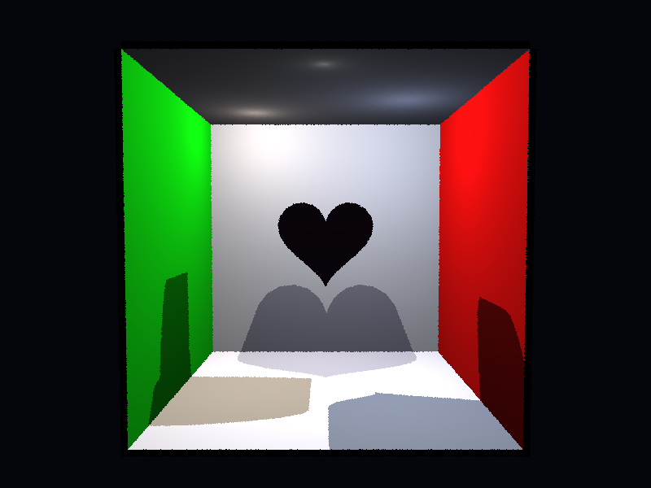

# Propriedades da Simulação

## Render

- **name**: proj1_heart_trianglemesh
- **width**: 800
- **height**: 600
- **samples_per_pixel**: 1
- **sampling_mode**: jittered
- **seed**: None
- **gamma_fix**: False
- **render_time_seconds**: 23.386076458002208
- **render_time_minutes**: 0.3897679409667035

## Estimativa de Raios

- **Raios Primários**: 480,000
- **Raios Secundários**: 44,277
- **Shadow Rays**: 786,415
- **Total de Raios**: 1,310,692
- **Throughput**: 51,547 raios/segundo
- **Tempo Estimado**: 25.427s (0.424 min)
- **Tempo Estimado (minutos)**: 0.424
- **Tempo Estimado (interseções)**: 25.427s
- **Primary Hit Ratio**: 0.500
- **Recursive Surface Ratio**: 0.167
- **Shadow Samples/Hit**: 3

### Calibração (rápida)
- **elapsed_seconds**: 0.013
- **samples_tested**: 256
- **rays_traced**: 260
- **intersection_tests**: 3,900
- **shadow_rays**: 390
- **measured_throughput**: 51547 raios/segundo

## Qualidade da Estimativa

- **Rays Model (estimado)**: 25.427s
- **Rays Model (real)**: 23.386s
- **Rays Model (erro abs)**: 2.041s
- **Rays Model (erro rel)**: 8.727%
- **Rays Model (fator real/estimado)**: 0.92x
- **Rays Model (acurácia)**: 91.27%
- **Intersection Model (estimado)**: 25.427s
- **Intersection Model (real)**: 23.386s
- **Intersection Model (erro abs)**: 2.041s
- **Intersection Model (erro rel)**: 8.727%
- **Intersection Model (fator real/estimado)**: 0.92x
- **Intersection Model (acurácia)**: 91.27%

## Scene

- **ambient_light**: [0.029999999329447746, 0.029999999329447746, 0.029999999329447746]
- **background_color**: [0.019999999552965164, 0.019999999552965164, 0.05000000074505806]
- **max_depth**: 4
- **ray_epsilon**: 0.001

## Camera

- **eye**: [2.7750000953674316, 3.200000047683716, 12.774999618530273]
- **center**: [2.7750000953674316, 2.7750000953674316, 2.7750000953674316]
- **up**: [0.0, 1.0, 0.0]
- **fov**: 50.0
- **focal_distance**: 1.0
- **aspect**: 1.3333333333333333

## Objetos (detalhado)

### Objeto 1: Box
- **shape_chain**: ['Box']
- **p_min**: [-0.10000000149011612, -0.10000000149011612, -0.10000000149011612]
- **p_max**: [5.650000095367432, 5.650000095367432, 0.0]
- **material**:
  - **type**: PhongMaterial
  - **ambient**: [0.07999999821186066, 0.07999999821186066, 0.07999999821186066]
  - **diffuse**: [0.75, 0.75, 0.75]
  - **specular**: [0.0, 0.0, 0.0]
  - **shininess**: 1.0

### Objeto 2: Box
- **shape_chain**: ['Box']
- **p_min**: [-0.10000000149011612, -0.10000000149011612, 0.0]
- **p_max**: [0.0, 5.550000190734863, 5.550000190734863]
- **material**:
  - **type**: PhongMaterial
  - **ambient**: [0.0, 0.07999999821186066, 0.0]
  - **diffuse**: [0.05000000074505806, 0.75, 0.05000000074505806]
  - **specular**: [0.0, 0.0, 0.0]
  - **shininess**: 1.0

### Objeto 3: Box
- **shape_chain**: ['Box']
- **p_min**: [5.550000190734863, -0.10000000149011612, 0.0]
- **p_max**: [5.650000095367432, 5.550000190734863, 5.550000190734863]
- **material**:
  - **type**: PhongMaterial
  - **ambient**: [0.07999999821186066, 0.0, 0.0]
  - **diffuse**: [0.75, 0.05000000074505806, 0.05000000074505806]
  - **specular**: [0.0, 0.0, 0.0]
  - **shininess**: 1.0

### Objeto 4: Box
- **shape_chain**: ['Box']
- **p_min**: [0.0, 5.550000190734863, 0.0]
- **p_max**: [5.550000190734863, 5.650000095367432, 5.550000190734863]
- **material**:
  - **type**: PhongMaterial
  - **ambient**: [0.07999999821186066, 0.07999999821186066, 0.07999999821186066]
  - **diffuse**: [0.75, 0.75, 0.75]
  - **specular**: [0.0, 0.0, 0.0]
  - **shininess**: 1.0

### Objeto 5: Box
- **shape_chain**: ['Box']
- **p_min**: [-0.10000000149011612, -0.10000000149011612, 0.0]
- **p_max**: [5.650000095367432, 0.0, 5.550000190734863]
- **material**:
  - **type**: PhongMaterial
  - **ambient**: [0.07999999821186066, 0.07999999821186066, 0.07999999821186066]
  - **diffuse**: [0.75, 0.75, 0.75]
  - **specular**: [0.0, 0.0, 0.0]
  - **shininess**: 1.0

### Objeto 6: TriangleMesh
- **shape_chain**: ['TriangleMesh']
- **accelerator**: bvh
- **material**:
  - **type**: ReflectiveMaterial
  - **ambient**: [0.07000000029802322, 0.009999999776482582, 0.019999999552965164]
  - **diffuse**: [0.30000001192092896, 0.05000000074505806, 0.10000000149011612]
  - **specular**: [0.6499999761581421, 0.6499999761581421, 0.6499999761581421]
  - **shininess**: 140.0
  - **reflectivity**: [0.6200000047683716, 0.550000011920929, 0.5799999833106995]

## Luzes (detalhado)

- **Light 1 (PointLight)**:
  - pos: [1.25, 5.199999809265137, 1.350000023841858]
  - power: [0.75, 0.6800000071525574, 0.6200000047683716]

- **Light 2 (PointLight)**:
  - pos: [4.349999904632568, 4.849999904632568, 2.549999952316284]
  - power: [0.44999998807907104, 0.5, 0.6499999761581421]

- **Light 3 (PointLight)**:
  - pos: [2.75, 5.449999809265137, 4.849999904632568]
  - power: [0.3499999940395355, 0.3499999940395355, 0.3199999928474426]

## Artefatos

- [Snapshot JSON](properties.json): payload serializado do render, da câmera, da cena, dos objetos e das luzes.

> Nota: abra este `properties.md` dentro da pasta de saída para visualizar a imagem incorporada e navegar até o snapshot JSON.