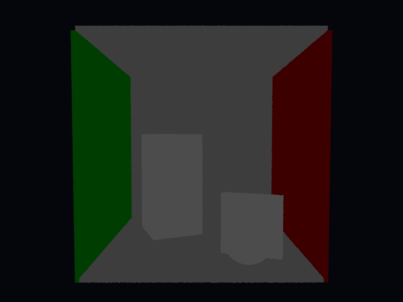

# Propriedades da Simulação

## Render

- **name**: proj1_req1_geometry
- **width**: 800
- **height**: 600
- **samples_per_pixel**: 1
- **sampling_mode**: jittered
- **seed**: None
- **gamma_fix**: False
- **render_time_seconds**: 10.241786624999804
- **render_time_minutes**: 0.17069644374999673

## Estimativa de Raios

- **Raios Primários**: 480,000
- **Raios Secundários**: 0
- **Shadow Rays**: 0
- **Total de Raios**: 480,000
- **Throughput**: 40,021 raios/segundo
- **Tempo Estimado**: 11.994s (0.200 min)
- **Tempo Estimado (minutos)**: 0.200
- **Tempo Estimado (interseções)**: 11.994s
- **Primary Hit Ratio**: 0.050
- **Recursive Surface Ratio**: 0.000
- **Shadow Samples/Hit**: 0

### Calibração (rápida)
- **elapsed_seconds**: 0.006
- **samples_tested**: 256
- **rays_traced**: 256
- **intersection_tests**: 2,048
- **shadow_rays**: 0
- **measured_throughput**: 40022 raios/segundo

## Qualidade da Estimativa

- **Rays Model (estimado)**: 11.994s
- **Rays Model (real)**: 10.242s
- **Rays Model (erro abs)**: 1.752s
- **Rays Model (erro rel)**: 17.104%
- **Rays Model (fator real/estimado)**: 0.85x
- **Rays Model (acurácia)**: 82.90%
- **Intersection Model (estimado)**: 11.994s
- **Intersection Model (real)**: 10.242s
- **Intersection Model (erro abs)**: 1.752s
- **Intersection Model (erro rel)**: 17.104%
- **Intersection Model (fator real/estimado)**: 0.85x
- **Intersection Model (acurácia)**: 82.90%

## Scene

- **ambient_light**: [3.0, 3.0, 3.0]
- **background_color**: [0.019999999552965164, 0.019999999552965164, 0.05000000074505806]
- **max_depth**: 2
- **ray_epsilon**: 0.001

## Camera

- **eye**: [2.7750000953674316, 3.200000047683716, 12.774999618530273]
- **center**: [2.7750000953674316, 2.7750000953674316, 2.7750000953674316]
- **up**: [0.0, 1.0, 0.0]
- **fov**: 50.0
- **focal_distance**: 1.0
- **aspect**: 1.3333333333333333

## Objetos (detalhado)

### Objeto 1: Box
- **shape_chain**: ['Box']
- **p_min**: [-0.10000000149011612, -0.10000000149011612, -0.10000000149011612]
- **p_max**: [5.650000095367432, 5.650000095367432, 0.0]
- **material**:
  - **type**: PhongMaterial
  - **ambient**: [0.07999999821186066, 0.07999999821186066, 0.07999999821186066]
  - **diffuse**: [0.75, 0.75, 0.75]
  - **specular**: [0.0, 0.0, 0.0]
  - **shininess**: 1.0

### Objeto 2: Box
- **shape_chain**: ['Box']
- **p_min**: [-0.10000000149011612, -0.10000000149011612, 0.0]
- **p_max**: [0.0, 5.550000190734863, 5.550000190734863]
- **material**:
  - **type**: PhongMaterial
  - **ambient**: [0.0, 0.07999999821186066, 0.0]
  - **diffuse**: [0.05000000074505806, 0.75, 0.05000000074505806]
  - **specular**: [0.0, 0.0, 0.0]
  - **shininess**: 1.0

### Objeto 3: Box
- **shape_chain**: ['Box']
- **p_min**: [5.550000190734863, -0.10000000149011612, 0.0]
- **p_max**: [5.650000095367432, 5.550000190734863, 5.550000190734863]
- **material**:
  - **type**: PhongMaterial
  - **ambient**: [0.07999999821186066, 0.0, 0.0]
  - **diffuse**: [0.75, 0.05000000074505806, 0.05000000074505806]
  - **specular**: [0.0, 0.0, 0.0]
  - **shininess**: 1.0

### Objeto 4: Box
- **shape_chain**: ['Box']
- **p_min**: [0.0, 5.550000190734863, 0.0]
- **p_max**: [5.550000190734863, 5.650000095367432, 5.550000190734863]
- **material**:
  - **type**: PhongMaterial
  - **ambient**: [0.07999999821186066, 0.07999999821186066, 0.07999999821186066]
  - **diffuse**: [0.75, 0.75, 0.75]
  - **specular**: [0.0, 0.0, 0.0]
  - **shininess**: 1.0

### Objeto 5: Box
- **shape_chain**: ['Box']
- **p_min**: [-0.10000000149011612, -0.10000000149011612, 0.0]
- **p_max**: [5.650000095367432, 0.0, 5.550000190734863]
- **material**:
  - **type**: PhongMaterial
  - **ambient**: [0.07999999821186066, 0.07999999821186066, 0.07999999821186066]
  - **diffuse**: [0.75, 0.75, 0.75]
  - **specular**: [0.0, 0.0, 0.0]
  - **shininess**: 1.0

### Objeto 6: Instance
- **shape_chain**: ['Instance', 'Box']
- **material**:
  - **type**: PhongMaterial
  - **ambient**: [0.10000000149011612, 0.10000000149011612, 0.10000000149011612]
  - **diffuse**: [0.5, 0.5, 0.5]
  - **specular**: [0.0, 0.0, 0.0]
  - **shininess**: 1.0

### Objeto 7: Instance
- **shape_chain**: ['Instance', 'Box']
- **material**:
  - **type**: PhongMaterial
  - **ambient**: [0.10000000149011612, 0.10000000149011612, 0.10000000149011612]
  - **diffuse**: [0.5, 0.5, 0.5]
  - **specular**: [0.0, 0.0, 0.0]
  - **shininess**: 1.0

### Objeto 8: Sphere
- **shape_chain**: ['Sphere']
- **center**: [3.950000047683716, 0.6499999761581421, 4.650000095367432]
- **radius**: 0.65
- **material**:
  - **type**: PhongMaterial
  - **ambient**: [0.10000000149011612, 0.10000000149011612, 0.10000000149011612]
  - **diffuse**: [0.5, 0.5, 0.5]
  - **specular**: [0.0, 0.0, 0.0]
  - **shininess**: 1.0

## Luzes (detalhado)

- (Nenhuma luz detalhada fornecida)

## Artefatos

- [Snapshot JSON](properties.json): payload serializado do render, da câmera, da cena, dos objetos e das luzes.

> Nota: abra este `properties.md` dentro da pasta de saída para visualizar a imagem incorporada e navegar até o snapshot JSON.