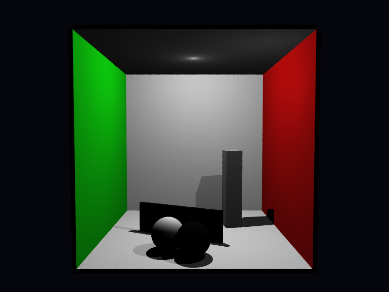

# Propriedades da Simulação

## Render

- **name**: proj1_req4_sampling
- **width**: 800
- **height**: 600
- **samples_per_pixel**: 4
- **sampling_mode**: stratified
- **seed**: 42
- **gamma_fix**: False
- **render_time_seconds**: 84.83859700000903
- **render_time_minutes**: 1.4139766166668173

## Estimativa de Raios

- **Raios Primários**: 1,920,000
- **Raios Secundários**: 0
- **Shadow Rays**: 1,950,000
- **Total de Raios**: 3,870,000
- **Throughput**: 46,562 raios/segundo
- **Tempo Estimado**: 83.114s (1.385 min)
- **Tempo Estimado (minutos)**: 1.385
- **Tempo Estimado (interseções)**: 83.114s
- **Primary Hit Ratio**: 0.508
- **Recursive Surface Ratio**: 0.000
- **Shadow Samples/Hit**: 2

### Calibração (rápida)
- **elapsed_seconds**: 0.044
- **samples_tested**: 1,024
- **rays_traced**: 1,024
- **intersection_tests**: 18,576
- **shadow_rays**: 1,040
- **measured_throughput**: 46562 raios/segundo

## Qualidade da Estimativa

- **Rays Model (estimado)**: 83.114s
- **Rays Model (real)**: 84.839s
- **Rays Model (erro abs)**: 1.724s
- **Rays Model (erro rel)**: 2.033%
- **Rays Model (fator real/estimado)**: 1.02x
- **Rays Model (acurácia)**: 97.97%
- **Intersection Model (estimado)**: 83.114s
- **Intersection Model (real)**: 84.839s
- **Intersection Model (erro abs)**: 1.724s
- **Intersection Model (erro rel)**: 2.033%
- **Intersection Model (fator real/estimado)**: 1.02x
- **Intersection Model (acurácia)**: 97.97%

## Scene

- **ambient_light**: [0.014999999664723873, 0.014999999664723873, 0.014999999664723873]
- **background_color**: [0.019999999552965164, 0.019999999552965164, 0.05000000074505806]
- **max_depth**: 2
- **ray_epsilon**: 0.001

## Camera

- **eye**: [2.7750000953674316, 3.200000047683716, 12.774999618530273]
- **center**: [2.7750000953674316, 2.7750000953674316, 2.7750000953674316]
- **up**: [0.0, 1.0, 0.0]
- **fov**: 50.0
- **focal_distance**: 1.0
- **aspect**: 1.3333333333333333

## Objetos (detalhado)

### Objeto 1: Box
- **shape_chain**: ['Box']
- **p_min**: [-0.10000000149011612, -0.10000000149011612, -0.10000000149011612]
- **p_max**: [5.650000095367432, 5.650000095367432, 0.0]
- **material**:
  - **type**: PhongMaterial
  - **ambient**: [0.07999999821186066, 0.07999999821186066, 0.07999999821186066]
  - **diffuse**: [0.75, 0.75, 0.75]
  - **specular**: [0.0, 0.0, 0.0]
  - **shininess**: 1.0

### Objeto 2: Box
- **shape_chain**: ['Box']
- **p_min**: [-0.10000000149011612, -0.10000000149011612, 0.0]
- **p_max**: [0.0, 5.550000190734863, 5.550000190734863]
- **material**:
  - **type**: PhongMaterial
  - **ambient**: [0.0, 0.07999999821186066, 0.0]
  - **diffuse**: [0.05000000074505806, 0.75, 0.05000000074505806]
  - **specular**: [0.0, 0.0, 0.0]
  - **shininess**: 1.0

### Objeto 3: Box
- **shape_chain**: ['Box']
- **p_min**: [5.550000190734863, -0.10000000149011612, 0.0]
- **p_max**: [5.650000095367432, 5.550000190734863, 5.550000190734863]
- **material**:
  - **type**: PhongMaterial
  - **ambient**: [0.07999999821186066, 0.0, 0.0]
  - **diffuse**: [0.75, 0.05000000074505806, 0.05000000074505806]
  - **specular**: [0.0, 0.0, 0.0]
  - **shininess**: 1.0

### Objeto 4: Box
- **shape_chain**: ['Box']
- **p_min**: [0.0, 5.550000190734863, 0.0]
- **p_max**: [5.550000190734863, 5.650000095367432, 5.550000190734863]
- **material**:
  - **type**: PhongMaterial
  - **ambient**: [0.07999999821186066, 0.07999999821186066, 0.07999999821186066]
  - **diffuse**: [0.75, 0.75, 0.75]
  - **specular**: [0.0, 0.0, 0.0]
  - **shininess**: 1.0

### Objeto 5: Box
- **shape_chain**: ['Box']
- **p_min**: [-0.10000000149011612, -0.10000000149011612, 0.0]
- **p_max**: [5.650000095367432, 0.0, 5.550000190734863]
- **material**:
  - **type**: PhongMaterial
  - **ambient**: [0.07999999821186066, 0.07999999821186066, 0.07999999821186066]
  - **diffuse**: [0.75, 0.75, 0.75]
  - **specular**: [0.0, 0.0, 0.0]
  - **shininess**: 1.0

### Objeto 6: Instance
- **shape_chain**: ['Instance', 'Box']
- **material**:
  - **type**: PhongMaterial
  - **ambient**: [0.0, 0.0, 0.0]
  - **diffuse**: [0.029999999329447746, 0.029999999329447746, 0.029999999329447746]
  - **specular**: [0.0, 0.0, 0.0]
  - **shininess**: 1.0

### Objeto 7: Instance
- **shape_chain**: ['Instance', 'Box']
- **material**:
  - **type**: PhongMaterial
  - **ambient**: [0.019999999552965164, 0.019999999552965164, 0.019999999552965164]
  - **diffuse**: [0.8500000238418579, 0.8500000238418579, 0.8500000238418579]
  - **specular**: [0.019999999552965164, 0.019999999552965164, 0.019999999552965164]
  - **shininess**: 8.0

### Objeto 8: Sphere
- **shape_chain**: ['Sphere']
- **center**: [2.049999952316284, 0.44999998807907104, 4.349999904632568]
- **radius**: 0.45
- **material**:
  - **type**: PhongMaterial
  - **ambient**: [0.019999999552965164, 0.019999999552965164, 0.019999999552965164]
  - **diffuse**: [0.8500000238418579, 0.8500000238418579, 0.8500000238418579]
  - **specular**: [0.019999999552965164, 0.019999999552965164, 0.019999999552965164]
  - **shininess**: 8.0

### Objeto 9: Sphere
- **shape_chain**: ['Sphere']
- **center**: [2.75, 0.44999998807907104, 4.75]
- **radius**: 0.45
- **material**:
  - **type**: PhongMaterial
  - **ambient**: [0.0, 0.0, 0.0]
  - **diffuse**: [0.029999999329447746, 0.029999999329447746, 0.029999999329447746]
  - **specular**: [0.0, 0.0, 0.0]
  - **shininess**: 1.0

## Luzes (detalhado)

- **Light 1 (PointLight)**:
  - pos: [2.75, 5.449999809265137, 2.75]
  - power: [0.8500000238418579, 0.8500000238418579, 0.8500000238418579]

- **Light 2 (PointLight)**:
  - pos: [4.75, 4.349999904632568, 4.550000190734863]
  - power: [0.20000000298023224, 0.20000000298023224, 0.20000000298023224]

## Artefatos

- [Snapshot JSON](properties.json): payload serializado do render, da câmera, da cena, dos objetos e das luzes.

> Nota: abra este `properties.md` dentro da pasta de saída para visualizar a imagem incorporada e navegar até o snapshot JSON.