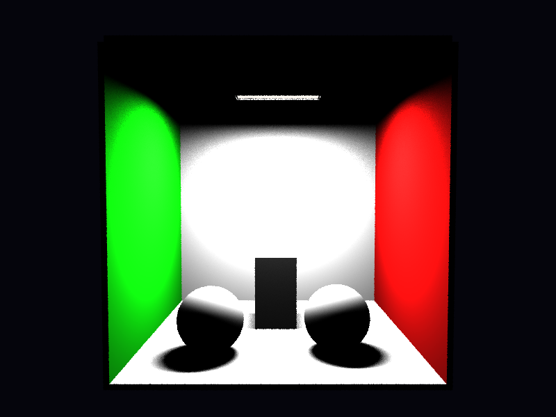

# Propriedades da Simulação

## Render

- **name**: proj1_rext_area_light
- **width**: 800
- **height**: 600
- **samples_per_pixel**: 4
- **sampling_mode**: jittered
- **seed**: None
- **gamma_fix**: False
- **render_time_seconds**: 651.6106086670006
- **render_time_minutes**: 10.860176811116677

## Scene

- **ambient_light**: [0.019999999552965164, 0.019999999552965164, 0.019999999552965164]
- **background_color**: [0.019999999552965164, 0.019999999552965164, 0.05000000074505806]
- **max_depth**: 3
- **ray_epsilon**: 0.001

## Camera

- **eye**: [2.7750000953674316, 3.200000047683716, 12.774999618530273]
- **center**: [2.7750000953674316, 2.7750000953674316, 2.7750000953674316]
- **up**: [0.0, 1.0, 0.0]
- **fov**: 50.0
- **focal_distance**: 1.0
- **aspect**: 1.3333333333333333

## Objetos (detalhado)

### Objeto 1: Box
- **shape_chain**: ['Box']
- **p_min**: [-0.10000000149011612, -0.10000000149011612, -0.10000000149011612]
- **p_max**: [5.650000095367432, 5.650000095367432, 0.0]
- **material**:
  - **type**: PhongMaterial
  - **ambient**: [0.07999999821186066, 0.07999999821186066, 0.07999999821186066]
  - **diffuse**: [0.75, 0.75, 0.75]
  - **specular**: [0.0, 0.0, 0.0]
  - **shininess**: 1.0

### Objeto 2: Box
- **shape_chain**: ['Box']
- **p_min**: [-0.10000000149011612, -0.10000000149011612, 0.0]
- **p_max**: [0.0, 5.550000190734863, 5.550000190734863]
- **material**:
  - **type**: PhongMaterial
  - **ambient**: [0.0, 0.07999999821186066, 0.0]
  - **diffuse**: [0.05000000074505806, 0.75, 0.05000000074505806]
  - **specular**: [0.0, 0.0, 0.0]
  - **shininess**: 1.0

### Objeto 3: Box
- **shape_chain**: ['Box']
- **p_min**: [5.550000190734863, -0.10000000149011612, 0.0]
- **p_max**: [5.650000095367432, 5.550000190734863, 5.550000190734863]
- **material**:
  - **type**: PhongMaterial
  - **ambient**: [0.07999999821186066, 0.0, 0.0]
  - **diffuse**: [0.75, 0.05000000074505806, 0.05000000074505806]
  - **specular**: [0.0, 0.0, 0.0]
  - **shininess**: 1.0

### Objeto 4: Box
- **shape_chain**: ['Box']
- **p_min**: [0.0, 5.550000190734863, 0.0]
- **p_max**: [5.550000190734863, 5.650000095367432, 5.550000190734863]
- **material**:
  - **type**: PhongMaterial
  - **ambient**: [0.07999999821186066, 0.07999999821186066, 0.07999999821186066]
  - **diffuse**: [0.75, 0.75, 0.75]
  - **specular**: [0.0, 0.0, 0.0]
  - **shininess**: 1.0

### Objeto 5: Box
- **shape_chain**: ['Box']
- **p_min**: [-0.10000000149011612, -0.10000000149011612, 0.0]
- **p_max**: [5.650000095367432, 0.0, 5.550000190734863]
- **material**:
  - **type**: PhongMaterial
  - **ambient**: [0.07999999821186066, 0.07999999821186066, 0.07999999821186066]
  - **diffuse**: [0.75, 0.75, 0.75]
  - **specular**: [0.0, 0.0, 0.0]
  - **shininess**: 1.0

### Objeto 6: Sphere
- **shape_chain**: ['Sphere']
- **center**: [1.4500000476837158, 0.6499999761581421, 4.099999904632568]
- **radius**: 0.65
- **material**:
  - **type**: PhongMaterial
  - **ambient**: [0.029999999329447746, 0.029999999329447746, 0.029999999329447746]
  - **diffuse**: [0.7200000286102295, 0.7200000286102295, 0.7200000286102295]
  - **specular**: [0.10000000149011612, 0.10000000149011612, 0.10000000149011612]
  - **shininess**: 24.0

### Objeto 7: Sphere
- **shape_chain**: ['Sphere']
- **center**: [3.950000047683716, 0.6499999761581421, 3.950000047683716]
- **radius**: 0.65
- **material**:
  - **type**: PhongMaterial
  - **ambient**: [0.029999999329447746, 0.029999999329447746, 0.029999999329447746]
  - **diffuse**: [0.7200000286102295, 0.7200000286102295, 0.7200000286102295]
  - **specular**: [0.10000000149011612, 0.10000000149011612, 0.10000000149011612]
  - **shininess**: 24.0

### Objeto 8: Box
- **shape_chain**: ['Box']
- **p_min**: [2.25, 0.0, 1.75]
- **p_max**: [3.200000047683716, 1.649999976158142, 2.6500000953674316]
- **material**:
  - **type**: PhongMaterial
  - **ambient**: [0.029999999329447746, 0.029999999329447746, 0.029999999329447746]
  - **diffuse**: [0.7200000286102295, 0.7200000286102295, 0.7200000286102295]
  - **specular**: [0.10000000149011612, 0.10000000149011612, 0.10000000149011612]
  - **shininess**: 24.0

### Objeto 9: Box
- **shape_chain**: ['Box']
- **p_min**: [1.875, 5.255000114440918, 2.575000047683716]
- **p_max**: [3.674999952316284, 5.265000343322754, 2.9750001430511475]
- **material**:
  - **type**: EmissiveMaterial
  - **emission**: [1.0, 0.9800000190734863, 0.949999988079071]
  - **shadow_passthrough**: True

### Objeto 10: Box
- **shape_chain**: ['Box']
- **p_min**: [1.815000057220459, 5.230000019073486, 2.515000104904175]
- **p_max**: [1.8450000286102295, 5.2900004386901855, 3.0350000858306885]
- **material**:
  - **type**: PhongMaterial
  - **ambient**: [0.009999999776482582, 0.009999999776482582, 0.009999999776482582]
  - **diffuse**: [0.029999999329447746, 0.029999999329447746, 0.029999999329447746]
  - **specular**: [0.0, 0.0, 0.0]
  - **shininess**: 1.0

### Objeto 11: Box
- **shape_chain**: ['Box']
- **p_min**: [3.7049999237060547, 5.230000019073486, 2.515000104904175]
- **p_max**: [3.734999895095825, 5.2900004386901855, 3.0350000858306885]
- **material**:
  - **type**: PhongMaterial
  - **ambient**: [0.009999999776482582, 0.009999999776482582, 0.009999999776482582]
  - **diffuse**: [0.029999999329447746, 0.029999999329447746, 0.029999999329447746]
  - **specular**: [0.0, 0.0, 0.0]
  - **shininess**: 1.0

### Objeto 12: Box
- **shape_chain**: ['Box']
- **p_min**: [1.8450000286102295, 5.230000019073486, 2.515000104904175]
- **p_max**: [3.7049999237060547, 5.2900004386901855, 2.5450000762939453]
- **material**:
  - **type**: PhongMaterial
  - **ambient**: [0.009999999776482582, 0.009999999776482582, 0.009999999776482582]
  - **diffuse**: [0.029999999329447746, 0.029999999329447746, 0.029999999329447746]
  - **specular**: [0.0, 0.0, 0.0]
  - **shininess**: 1.0

### Objeto 13: Box
- **shape_chain**: ['Box']
- **p_min**: [1.8450000286102295, 5.230000019073486, 3.005000114440918]
- **p_max**: [3.7049999237060547, 5.2900004386901855, 3.0350000858306885]
- **material**:
  - **type**: PhongMaterial
  - **ambient**: [0.009999999776482582, 0.009999999776482582, 0.009999999776482582]
  - **diffuse**: [0.029999999329447746, 0.029999999329447746, 0.029999999329447746]
  - **specular**: [0.0, 0.0, 0.0]
  - **shininess**: 1.0

## Luzes (detalhado)

- **Light 1 (AreaLight)**:
  - pos: [1.875, 5.260000228881836, 2.575000047683716]
  - power: [85.0, 85.0, 85.0]
  - samples_u: 4
  - samples_v: 4
  - light_sampling_mode: stratified
  - e_u: [1.7999999523162842, 0.0, 0.0]
  - e_v: [0.0, 0.0, 0.4000000059604645]

## Artefatos

- [Snapshot JSON](properties.json): payload serializado do render, da câmera, da cena, dos objetos e das luzes.

> Nota: abra este `properties.md` dentro da pasta de saída para visualizar a imagem incorporada e navegar até o snapshot JSON.