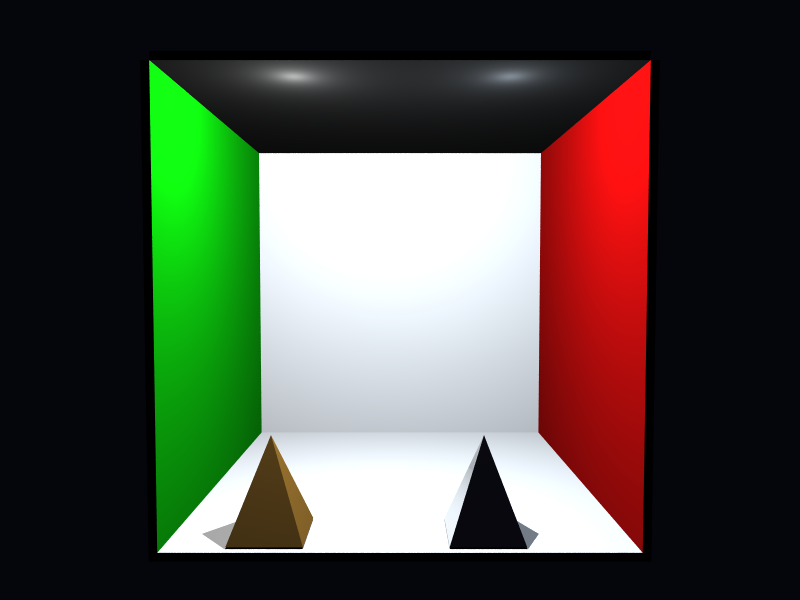

# Propriedades da Simulação

## Render

- **name**: proj1_rext_bvh
- **width**: 800
- **height**: 600
- **samples_per_pixel**: 25
- **sampling_mode**: stratified
- **seed**: None
- **gamma_fix**: False
- **render_time_seconds**: 389.65563670900156
- **render_time_minutes**: 6.494260611816693

## Estimativa de Raios

- **Raios Primários**: 12,000,000
- **Raios Secundários**: 942,208
- **Shadow Rays**: 13,042,535
- **Total de Raios**: 25,984,743
- **Throughput**: 64,578 raios/segundo
- **Tempo Estimado**: 402.373s (6.706 min)
- **Tempo Estimado (minutos)**: 6.706
- **Tempo Estimado (interseções)**: 402.373s
- **Primary Hit Ratio**: 0.504
- **Recursive Surface Ratio**: 0.143
- **Shadow Samples/Hit**: 2

### Calibração (rápida)
- **elapsed_seconds**: 0.201
- **samples_tested**: 6,400
- **rays_traced**: 6,450
- **intersection_tests**: 90,650
- **shadow_rays**: 6,500
- **measured_throughput**: 64579 raios/segundo

## Qualidade da Estimativa

- **Rays Model (estimado)**: 402.373s
- **Rays Model (real)**: 389.656s
- **Rays Model (erro abs)**: 12.718s
- **Rays Model (erro rel)**: 3.264%
- **Rays Model (fator real/estimado)**: 0.97x
- **Rays Model (acurácia)**: 96.74%
- **Intersection Model (estimado)**: 402.373s
- **Intersection Model (real)**: 389.656s
- **Intersection Model (erro abs)**: 12.718s
- **Intersection Model (erro rel)**: 3.264%
- **Intersection Model (fator real/estimado)**: 0.97x
- **Intersection Model (acurácia)**: 96.74%

## Scene

- **ambient_light**: [0.029999999329447746, 0.029999999329447746, 0.029999999329447746]
- **background_color**: [0.019999999552965164, 0.019999999552965164, 0.05000000074505806]
- **max_depth**: 4
- **ray_epsilon**: 0.001

## Camera

- **eye**: [2.7750000953674316, 3.200000047683716, 12.774999618530273]
- **center**: [2.7750000953674316, 2.7750000953674316, 2.7750000953674316]
- **up**: [0.0, 1.0, 0.0]
- **fov**: 50.0
- **focal_distance**: 1.0
- **aspect**: 1.3333333333333333

## Objetos (detalhado)

### Objeto 1: Box
- **shape_chain**: ['Box']
- **p_min**: [-0.10000000149011612, -0.10000000149011612, -0.10000000149011612]
- **p_max**: [5.650000095367432, 5.650000095367432, 0.0]
- **material**:
  - **type**: PhongMaterial
  - **ambient**: [0.07999999821186066, 0.07999999821186066, 0.07999999821186066]
  - **diffuse**: [0.75, 0.75, 0.75]
  - **specular**: [0.0, 0.0, 0.0]
  - **shininess**: 1.0

### Objeto 2: Box
- **shape_chain**: ['Box']
- **p_min**: [-0.10000000149011612, -0.10000000149011612, 0.0]
- **p_max**: [0.0, 5.550000190734863, 5.550000190734863]
- **material**:
  - **type**: PhongMaterial
  - **ambient**: [0.0, 0.07999999821186066, 0.0]
  - **diffuse**: [0.05000000074505806, 0.75, 0.05000000074505806]
  - **specular**: [0.0, 0.0, 0.0]
  - **shininess**: 1.0

### Objeto 3: Box
- **shape_chain**: ['Box']
- **p_min**: [5.550000190734863, -0.10000000149011612, 0.0]
- **p_max**: [5.650000095367432, 5.550000190734863, 5.550000190734863]
- **material**:
  - **type**: PhongMaterial
  - **ambient**: [0.07999999821186066, 0.0, 0.0]
  - **diffuse**: [0.75, 0.05000000074505806, 0.05000000074505806]
  - **specular**: [0.0, 0.0, 0.0]
  - **shininess**: 1.0

### Objeto 4: Box
- **shape_chain**: ['Box']
- **p_min**: [0.0, 5.550000190734863, 0.0]
- **p_max**: [5.550000190734863, 5.650000095367432, 5.550000190734863]
- **material**:
  - **type**: PhongMaterial
  - **ambient**: [0.07999999821186066, 0.07999999821186066, 0.07999999821186066]
  - **diffuse**: [0.75, 0.75, 0.75]
  - **specular**: [0.0, 0.0, 0.0]
  - **shininess**: 1.0

### Objeto 5: Box
- **shape_chain**: ['Box']
- **p_min**: [-0.10000000149011612, -0.10000000149011612, 0.0]
- **p_max**: [5.650000095367432, 0.0, 5.550000190734863]
- **material**:
  - **type**: PhongMaterial
  - **ambient**: [0.07999999821186066, 0.07999999821186066, 0.07999999821186066]
  - **diffuse**: [0.75, 0.75, 0.75]
  - **specular**: [0.0, 0.0, 0.0]
  - **shininess**: 1.0

### Objeto 6: TriangleMesh
- **shape_chain**: ['TriangleMesh']
- **accelerator**: bvh
- **material**:
  - **type**: PhongMaterial
  - **ambient**: [0.05000000074505806, 0.029999999329447746, 0.0]
  - **diffuse**: [0.699999988079071, 0.5, 0.20000000298023224]
  - **specular**: [0.20000000298023224, 0.20000000298023224, 0.20000000298023224]
  - **shininess**: 32.0

### Objeto 7: TriangleMesh
- **shape_chain**: ['TriangleMesh']
- **accelerator**: bvh
- **material**:
  - **type**: ReflectiveMaterial
  - **ambient**: [0.03999999910593033, 0.03999999910593033, 0.03999999910593033]
  - **diffuse**: [0.20000000298023224, 0.20000000298023224, 0.20000000298023224]
  - **specular**: [0.30000001192092896, 0.30000001192092896, 0.30000001192092896]
  - **shininess**: 96.0
  - **reflectivity**: [0.7799999713897705, 0.7799999713897705, 0.7799999713897705]

## Luzes (detalhado)

- **Light 1 (PointLight)**:
  - pos: [1.5, 5.349999904632568, 4.949999809265137]
  - power: [0.8999999761581421, 0.8999999761581421, 0.8999999761581421]

- **Light 2 (PointLight)**:
  - pos: [4.099999904632568, 5.349999904632568, 4.949999809265137]
  - power: [0.6000000238418579, 0.6499999761581421, 0.699999988079071]

## Artefatos

- [Snapshot JSON](properties.json): payload serializado do render, da câmera, da cena, dos objetos e das luzes.

> Nota: abra este `properties.md` dentro da pasta de saída para visualizar a imagem incorporada e navegar até o snapshot JSON.