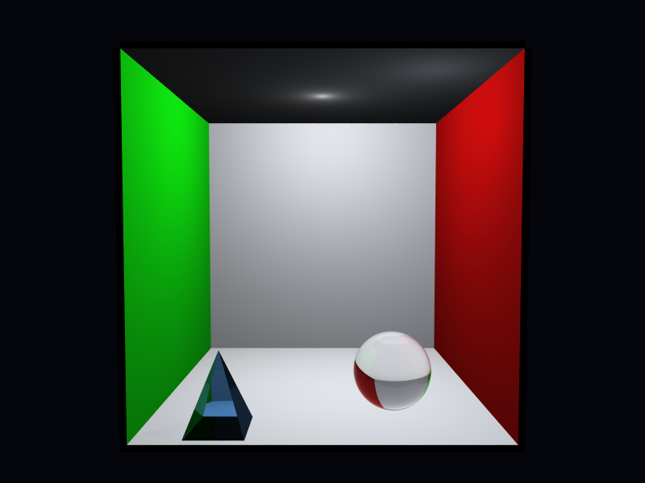

# Propriedades da Simulação

## Render

- **name**: proj1_rext_refractive
- **width**: 800
- **height**: 600
- **samples_per_pixel**: 25
- **sampling_mode**: stratified
- **seed**: None
- **gamma_fix**: False
- **render_time_seconds**: 588.6566085419981
- **render_time_minutes**: 9.810943475699968

## Estimativa de Raios

- **Raios Primários**: 12,000,000
- **Raios Secundários**: 1,939,998
- **Shadow Rays**: 13,229,058
- **Total de Raios**: 27,169,056
- **Throughput**: 56,956 raios/segundo
- **Tempo Estimado**: 477.017s (7.950 min)
- **Tempo Estimado (minutos)**: 7.950
- **Tempo Estimado (interseções)**: 477.017s
- **Primary Hit Ratio**: 0.474
- **Recursive Surface Ratio**: 0.286
- **Shadow Samples/Hit**: 2

### Calibração (rápida)
- **elapsed_seconds**: 0.274
- **samples_tested**: 6,400
- **rays_traced**: 8,000
- **intersection_tests**: 109,144
- **shadow_rays**: 7,592
- **measured_throughput**: 56956 raios/segundo

## Qualidade da Estimativa

- **Rays Model (estimado)**: 477.017s
- **Rays Model (real)**: 588.657s
- **Rays Model (erro abs)**: 111.640s
- **Rays Model (erro rel)**: 18.965%
- **Rays Model (fator real/estimado)**: 1.23x
- **Rays Model (acurácia)**: 81.03%
- **Intersection Model (estimado)**: 477.017s
- **Intersection Model (real)**: 588.657s
- **Intersection Model (erro abs)**: 111.640s
- **Intersection Model (erro rel)**: 18.965%
- **Intersection Model (fator real/estimado)**: 1.23x
- **Intersection Model (acurácia)**: 81.03%

## Scene

- **ambient_light**: [0.029999999329447746, 0.029999999329447746, 0.029999999329447746]
- **background_color**: [0.019999999552965164, 0.019999999552965164, 0.05000000074505806]
- **max_depth**: 8
- **ray_epsilon**: 0.001

## Camera

- **eye**: [2.7750000953674316, 3.200000047683716, 12.774999618530273]
- **center**: [2.7750000953674316, 2.7750000953674316, 2.7750000953674316]
- **up**: [0.0, 1.0, 0.0]
- **fov**: 50.0
- **focal_distance**: 1.0
- **aspect**: 1.3333333333333333

## Objetos (detalhado)

### Objeto 1: Box
- **shape_chain**: ['Box']
- **p_min**: [-0.10000000149011612, -0.10000000149011612, -0.10000000149011612]
- **p_max**: [5.650000095367432, 5.650000095367432, 0.0]
- **material**:
  - **type**: PhongMaterial
  - **ambient**: [0.07999999821186066, 0.07999999821186066, 0.07999999821186066]
  - **diffuse**: [0.75, 0.75, 0.75]
  - **specular**: [0.0, 0.0, 0.0]
  - **shininess**: 1.0

### Objeto 2: Box
- **shape_chain**: ['Box']
- **p_min**: [-0.10000000149011612, -0.10000000149011612, 0.0]
- **p_max**: [0.0, 5.550000190734863, 5.550000190734863]
- **material**:
  - **type**: PhongMaterial
  - **ambient**: [0.0, 0.07999999821186066, 0.0]
  - **diffuse**: [0.05000000074505806, 0.75, 0.05000000074505806]
  - **specular**: [0.0, 0.0, 0.0]
  - **shininess**: 1.0

### Objeto 3: Box
- **shape_chain**: ['Box']
- **p_min**: [5.550000190734863, -0.10000000149011612, 0.0]
- **p_max**: [5.650000095367432, 5.550000190734863, 5.550000190734863]
- **material**:
  - **type**: PhongMaterial
  - **ambient**: [0.07999999821186066, 0.0, 0.0]
  - **diffuse**: [0.75, 0.05000000074505806, 0.05000000074505806]
  - **specular**: [0.0, 0.0, 0.0]
  - **shininess**: 1.0

### Objeto 4: Box
- **shape_chain**: ['Box']
- **p_min**: [0.0, 5.550000190734863, 0.0]
- **p_max**: [5.550000190734863, 5.650000095367432, 5.550000190734863]
- **material**:
  - **type**: PhongMaterial
  - **ambient**: [0.07999999821186066, 0.07999999821186066, 0.07999999821186066]
  - **diffuse**: [0.75, 0.75, 0.75]
  - **specular**: [0.0, 0.0, 0.0]
  - **shininess**: 1.0

### Objeto 5: Box
- **shape_chain**: ['Box']
- **p_min**: [-0.10000000149011612, -0.10000000149011612, 0.0]
- **p_max**: [5.650000095367432, 0.0, 5.550000190734863]
- **material**:
  - **type**: PhongMaterial
  - **ambient**: [0.07999999821186066, 0.07999999821186066, 0.07999999821186066]
  - **diffuse**: [0.75, 0.75, 0.75]
  - **specular**: [0.0, 0.0, 0.0]
  - **shininess**: 1.0

### Objeto 6: Sphere
- **shape_chain**: ['Sphere']
- **center**: [3.950000047683716, 0.6499999761581421, 4.099999904632568]
- **radius**: 0.65
- **material**:
  - **type**: TransparentMaterial
  - **ambient**: [0.0, 0.0, 0.0]
  - **diffuse**: [0.0, 0.0, 0.0]
  - **specular**: [0.0, 0.0, 0.0]
  - **shininess**: 1.0
  - **attenuation**: [1.0, 1.0, 1.0]
  - **ior**: 1.5

### Objeto 7: TriangleMesh
- **shape_chain**: ['TriangleMesh']
- **material**:
  - **type**: TransparentMaterial
  - **ambient**: [0.0, 0.0, 0.0]
  - **diffuse**: [0.0, 0.0, 0.0]
  - **specular**: [0.0, 0.0, 0.0]
  - **shininess**: 1.0
  - **attenuation**: [0.8799999952316284, 0.9399999976158142, 0.9800000190734863]
  - **ior**: 1.5

## Luzes (detalhado)

- **Light 1 (PointLight)**:
  - pos: [2.7750000953674316, 5.400000095367432, 2.7750000953674316]
  - power: [0.8999999761581421, 0.8999999761581421, 0.8999999761581421]

- **Light 2 (PointLight)**:
  - pos: [4.550000190734863, 4.849999904632568, 4.550000190734863]
  - power: [0.30000001192092896, 0.3199999928474426, 0.3499999940395355]

## Artefatos

- [Snapshot JSON](properties.json): payload serializado do render, da câmera, da cena, dos objetos e das luzes.

> Nota: abra este `properties.md` dentro da pasta de saída para visualizar a imagem incorporada e navegar até o snapshot JSON.