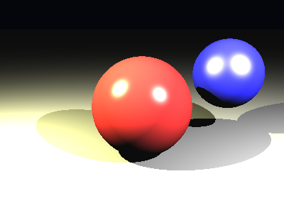

# Propriedades da Simulação



## Valores usados (numéricos)

```json
{
  "spheres": [
    {
      "center": [
        0.0,
        0.0,
        0.0
      ],
      "radius": 1.0,
      "material": {
        "ambient": [
          0.5,
          0.5,
          0.5
        ],
        "diffuse": [
          0.5,
          0.1,
          0.1
        ],
        "specular": [
          0.5,
          0.5,
          0.5
        ],
        "shininess": 32
      }
    },
    {
      "center": [
        2.0,
        0.5,
        -1.0
      ],
      "radius": 0.8,
      "material": {
        "ambient": [
          0.5,
          0.5,
          0.5
        ],
        "diffuse": [
          0.1,
          0.1,
          0.7
        ],
        "specular": [
          0.5,
          0.5,
          0.5
        ],
        "shininess": 8
      }
    }
  ],
  "plane": {
    "y": -1.0,
    "material": {
      "ambient": [
        0.5,
        0.5,
        0.5
      ],
      "diffuse": [
        0.4,
        0.4,
        0.4
      ],
      "specular": [
        0.1,
        0.1,
        0.1
      ],
      "shininess": 4
    }
  },
  "lights": [
    {
      "pos": [
        5,
        5,
        5
      ],
      "power": [
        180,
        180,
        180
      ]
    },
    {
      "pos": [
        -4,
        4,
        2
      ],
      "power": [
        120,
        120,
        80
      ]
    }
  ]
}
```

## O que significa cada valor (explicação para leigos)

- **Spheres**: lista de esferas; cada uma tem `center` (posição [x,y,z]) e `radius` (tamanho).
- **Plane - `y`**: altura do piso; valores menores colocam o piso mais abaixo.
- **Material - `ambient`**: iluminação ambiente (suave).
- **Material - `diffuse`**: cor principal sob luz direta.
- **Material - `specular`**: cor/intensidade do brilho (pequenos reflexos).
- **Material - `shininess`**: controla quão pequeno/afiado é o brilho especular.
- **Lights - `pos`**: posição da fonte; **power**: intensidade por canal (R,G,B).

> Nota: abra este `properties.md` dentro da pasta de saída para visualizar a imagem incorporada.