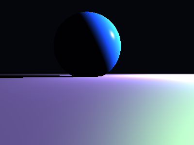

# Propriedades da Simulação


## Valores usados (numéricos)

```json
{
  "sphere": {
    "center": [
      -0.2673103830855257,
      0.7407021747095459,
      0.0
    ],
    "radius": 0.9388042307760003
  },
  "plane": {
    "y": -0.10795592191612391,
    "normal": [
      0.0,
      1.0,
      0.0
    ]
  },
  "material_sphere": {
    "ambient": [
      0.0666837990283966,
      0.038177911192178726,
      0.13433434069156647
    ],
    "diffuse": [
      0.14320263266563416,
      0.19917601346969604,
      0.6350992918014526
    ],
    "specular": [
      0.32693028450012207,
      0.06706300377845764,
      0.49940934777259827
    ],
    "shininess": 82.66563313845299
  },
  "material_plane": {
    "ambient": [
      0.0663568302989006,
      0.08459242433309555,
      0.06208861619234085
    ],
    "diffuse": [
      0.727451503276825,
      0.25508227944374084,
      0.4620089828968048
    ],
    "specular": [
      0.3904995620250702,
      0.31567591428756714,
      0.09646026045084
    ],
    "shininess": 5.401235675740018
  },
  "lights": [
    {
      "pos": [
        5.331666867477422,
        3.494745437575405,
        -0.38482532587340446
      ],
      "power": [
        81.11592102050781,
        193.13059997558594,
        192.9215545654297
      ]
    }
  ]
}
```

## O que significa cada valor (explicação para leigos)

- **Esfera - `center`**: posição da esfera no espaço 3D. Ex.: `[x, y, z]` — move a esfera para a esquerda/direita, para cima/baixo ou para frente/trás.
- **Esfera - `radius`**: tamanho da esfera; quanto maior, mais volumosa ela aparece na imagem.
- **Plano - `y`**: altura do piso. Valores menores (mais negativos) colocam o plano mais abaixo; valores próximos de zero posicionam o piso próximo da origem.
- **Material - `ambient`**: cor que representa a iluminação ambiente geral — pequena quantidade que ilumina objetos mesmo quando não recebem luz direta. É um componente suave e difuso.
- **Material - `diffuse`**: cor principal do objeto sob luz direta. Controla a aparência básica (por exemplo, azul, verde, vermelho).
- **Material - `specular`**: cor e intensidade dos brilhos (reflexos pequenos). Valores maiores tornam o brilho mais aparente.
- **Material - `shininess`**: controla o tamanho e nitidez do brilho especular. Valores altos produzem brilhos pequenos e intensos (superfícies muito brilhantes); valores baixos produzem brilhos largos e suaves (superfícies foscas).
- **Luzes - `pos`**: posição da fonte de luz no espaço; deslocar a luz muda a direção das sombras e onde aparecem os brilhos.
- **Luzes - `power`**: intensidade da luz por canal (R,G,B). Valores maiores tornam a cena mais iluminada; diferenças entre R/G/B podem dar tons coloridos à iluminação.

> Dica: experimente aumentar o `power` de uma luz para ver sombras mais claras, ou aumentar `shininess` da esfera para ver reflexos mais nítidos.