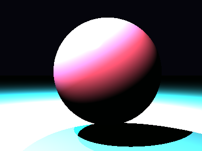

# Propriedades da Simulação


## Valores usados (numéricos)

```json
{
  "sphere": {
    "center": [
      0.16448448819273986,
      0.10529835032995738,
      0.0
    ],
    "radius": 1.4164853096771002
  },
  "plane": {
    "y": -1.6563826910056867,
    "normal": [
      0.0,
      1.0,
      0.0
    ]
  },
  "material_sphere": {
    "ambient": [
      0.0315549410879612,
      0.09331302344799042,
      0.05153585597872734
    ],
    "diffuse": [
      0.6811339855194092,
      0.27412503957748413,
      0.27517345547676086
    ],
    "specular": [
      0.8342947959899902,
      0.9239559173583984,
      0.07884706556797028
    ],
    "shininess": 121.55489976906512
  },
  "material_plane": {
    "ambient": [
      0.00017599448619876057,
      0.07960060238838196,
      0.024157138541340828
    ],
    "diffuse": [
      0.2697589695453644,
      0.8175318241119385,
      0.6578872203826904
    ],
    "specular": [
      0.09856104850769043,
      0.026234250515699387,
      0.18794530630111694
    ],
    "shininess": 34.87533192461107
  },
  "lights": [
    {
      "pos": [
        -2.818401298288482,
        6.174677020662567,
        4.281940807851564
      ],
      "power": [
        189.1110382080078,
        154.82504272460938,
        210.91000366210938
      ]
    },
    {
      "pos": [
        -3.7451567285874927,
        5.931601855710112,
        0.8468660153498657
      ],
      "power": [
        67.72644805908203,
        142.05027770996094,
        279.0523681640625
      ]
    },
    {
      "pos": [
        -0.5702786785045273,
        3.0816990592103632,
        -1.4984451667085428
      ],
      "power": [
        239.8551483154297,
        264.69720458984375,
        296.7200927734375
      ]
    }
  ]
}
```

## O que significa cada valor (explicação para leigos)

- **Esfera - `center`**: posição da esfera no espaço 3D. Ex.: `[x, y, z]` — move a esfera para a esquerda/direita, para cima/baixo ou para frente/trás.
- **Esfera - `radius`**: tamanho da esfera; quanto maior, mais volumosa ela aparece na imagem.
- **Plano - `y`**: altura do piso. Valores menores (mais negativos) colocam o plano mais abaixo; valores próximos de zero posicionam o piso próximo da origem.
- **Material - `ambient`**: cor que representa a iluminação ambiente geral — pequena quantidade que ilumina objetos mesmo quando não recebem luz direta. É um componente suave e difuso.
- **Material - `diffuse`**: cor principal do objeto sob luz direta. Controla a aparência básica (por exemplo, azul, verde, vermelho).
- **Material - `specular`**: cor e intensidade dos brilhos (reflexos pequenos). Valores maiores tornam o brilho mais aparente.
- **Material - `shininess`**: controla o tamanho e nitidez do brilho especular. Valores altos produzem brilhos pequenos e intensos (superfícies muito brilhantes); valores baixos produzem brilhos largos e suaves (superfícies foscas).
- **Luzes - `pos`**: posição da fonte de luz no espaço; deslocar a luz muda a direção das sombras e onde aparecem os brilhos.
- **Luzes - `power`**: intensidade da luz por canal (R,G,B). Valores maiores tornam a cena mais iluminada; diferenças entre R/G/B podem dar tons coloridos à iluminação.

> Dica: experimente aumentar o `power` de uma luz para ver sombras mais claras, ou aumentar `shininess` da esfera para ver reflexos mais nítidos.