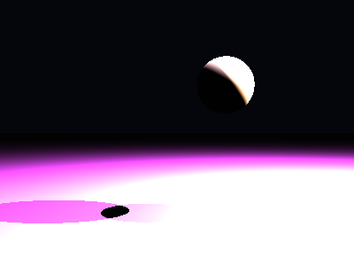

# Propriedades da Simulação


## Valores usados (numéricos)

```json
{
  "sphere": {
    "center": [
      0.7545380490648133,
      0.7424414577909157,
      0.0
    ],
    "radius": 0.44317651186467055
  },
  "plane": {
    "y": -1.2825414324109508,
    "normal": [
      0.0,
      1.0,
      0.0
    ]
  },
  "material_sphere": {
    "ambient": [
      0.061140235513448715,
      0.06729927659034729,
      0.09682154655456543
    ],
    "diffuse": [
      0.9019643664360046,
      0.848270833492279,
      0.5030078887939453
    ],
    "specular": [
      0.061676375567913055,
      0.3989733159542084,
      0.23378944396972656
    ],
    "shininess": 85.16503406118879
  },
  "material_plane": {
    "ambient": [
      0.05632349103689194,
      0.09693960100412369,
      0.06338398158550262
    ],
    "diffuse": [
      0.8771678805351257,
      0.34880051016807556,
      0.8347291350364685
    ],
    "specular": [
      0.05135037750005722,
      0.036041200160980225,
      0.321844220161438
    ],
    "shininess": 24.11591195227723
  },
  "lights": [
    {
      "pos": [
        4.399295231697785,
        3.501407674278281,
        0.4417410845823504
      ],
      "power": [
        237.1726837158203,
        171.6528778076172,
        196.62648010253906
      ]
    },
    {
      "pos": [
        4.147189378591378,
        6.247087432150323,
        0.5968779415419156
      ],
      "power": [
        196.5315399169922,
        163.9613494873047,
        281.8917236328125
      ]
    }
  ]
}
```

## O que significa cada valor (explicação para leigos)

- **Esfera - `center`**: posição da esfera no espaço 3D. Ex.: `[x, y, z]` — move a esfera para a esquerda/direita, para cima/baixo ou para frente/trás.
- **Esfera - `radius`**: tamanho da esfera; quanto maior, mais volumosa ela aparece na imagem.
- **Plano - `y`**: altura do piso. Valores menores (mais negativos) colocam o plano mais abaixo; valores próximos de zero posicionam o piso próximo da origem.
- **Material - `ambient`**: cor que representa a iluminação ambiente geral — pequena quantidade que ilumina objetos mesmo quando não recebem luz direta. É um componente suave e difuso.
- **Material - `diffuse`**: cor principal do objeto sob luz direta. Controla a aparência básica (por exemplo, azul, verde, vermelho).
- **Material - `specular`**: cor e intensidade dos brilhos (reflexos pequenos). Valores maiores tornam o brilho mais aparente.
- **Material - `shininess`**: controla o tamanho e nitidez do brilho especular. Valores altos produzem brilhos pequenos e intensos (superfícies muito brilhantes); valores baixos produzem brilhos largos e suaves (superfícies foscas).
- **Luzes - `pos`**: posição da fonte de luz no espaço; deslocar a luz muda a direção das sombras e onde aparecem os brilhos.
- **Luzes - `power`**: intensidade da luz por canal (R,G,B). Valores maiores tornam a cena mais iluminada; diferenças entre R/G/B podem dar tons coloridos à iluminação.

> Dica: experimente aumentar o `power` de uma luz para ver sombras mais claras, ou aumentar `shininess` da esfera para ver reflexos mais nítidos.