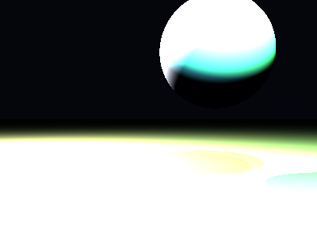

# Propriedades da Simulação


## Valores usados (numéricos)

```json
{
  "sphere": {
    "center": [
      0.9944506049157731,
      1.1606109781344973,
      0.0
    ],
    "radius": 0.9759133682904428
  },
  "plane": {
    "y": -1.0733774594520484,
    "normal": [
      0.0,
      1.0,
      0.0
    ]
  },
  "material_sphere": {
    "ambient": [
      0.028308220207691193,
      0.014345524832606316,
      0.08092030137777328
    ],
    "diffuse": [
      0.9310981035232544,
      0.8357102870941162,
      0.84926438331604
    ],
    "specular": [
      0.5030529499053955,
      0.7705866694450378,
      0.1413153111934662
    ],
    "shininess": 17.318347900167026
  },
  "material_plane": {
    "ambient": [
      0.020954130217432976,
      0.07451106607913971,
      0.07728834450244904
    ],
    "diffuse": [
      0.8144243955612183,
      0.5752440094947815,
      0.3974498212337494
    ],
    "specular": [
      0.05475805699825287,
      0.04891800880432129,
      0.3152832090854645
    ],
    "shininess": 48.37962544574608
  },
  "lights": [
    {
      "pos": [
        -5.265223017620275,
        6.263493322061242,
        -1.3983354173776341
      ],
      "power": [
        231.54710388183594,
        267.30291748046875,
        282.75567626953125
      ]
    },
    {
      "pos": [
        1.4091515578237246,
        6.745610250675026,
        5.239613183734491
      ],
      "power": [
        56.30903625488281,
        230.37307739257812,
        55.883270263671875
      ]
    },
    {
      "pos": [
        0.3715319774555468,
        6.458277791566545,
        5.818241594332324
      ],
      "power": [
        66.78407287597656,
        221.30979919433594,
        241.1147918701172
      ]
    }
  ]
}
```

## O que significa cada valor (explicação para leigos)

- **Esfera - `center`**: posição da esfera no espaço 3D. Ex.: `[x, y, z]` — move a esfera para a esquerda/direita, para cima/baixo ou para frente/trás.
- **Esfera - `radius`**: tamanho da esfera; quanto maior, mais volumosa ela aparece na imagem.
- **Plano - `y`**: altura do piso. Valores menores (mais negativos) colocam o plano mais abaixo; valores próximos de zero posicionam o piso próximo da origem.
- **Material - `ambient`**: cor que representa a iluminação ambiente geral — pequena quantidade que ilumina objetos mesmo quando não recebem luz direta. É um componente suave e difuso.
- **Material - `diffuse`**: cor principal do objeto sob luz direta. Controla a aparência básica (por exemplo, azul, verde, vermelho).
- **Material - `specular`**: cor e intensidade dos brilhos (reflexos pequenos). Valores maiores tornam o brilho mais aparente.
- **Material - `shininess`**: controla o tamanho e nitidez do brilho especular. Valores altos produzem brilhos pequenos e intensos (superfícies muito brilhantes); valores baixos produzem brilhos largos e suaves (superfícies foscas).
- **Luzes - `pos`**: posição da fonte de luz no espaço; deslocar a luz muda a direção das sombras e onde aparecem os brilhos.
- **Luzes - `power`**: intensidade da luz por canal (R,G,B). Valores maiores tornam a cena mais iluminada; diferenças entre R/G/B podem dar tons coloridos à iluminação.

> Dica: experimente aumentar o `power` de uma luz para ver sombras mais claras, ou aumentar `shininess` da esfera para ver reflexos mais nítidos.