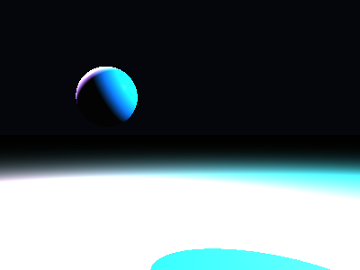

# Propriedades da Simulação


## Valores usados (numéricos)

```json
{
  "sphere": {
    "center": [
      -1.1152153775742697,
      0.5842411373485643,
      0.0
    ],
    "radius": 0.45941894034419706
  },
  "plane": {
    "y": -1.6410839257581737,
    "normal": [
      0.0,
      1.0,
      0.0
    ]
  },
  "material_sphere": {
    "ambient": [
      0.12370171397924423,
      0.12751713395118713,
      0.11783304065465927
    ],
    "diffuse": [
      0.15241485834121704,
      0.2544719874858856,
      0.5889301896095276
    ],
    "specular": [
      0.2672266662120819,
      0.8248859643936157,
      0.1994369477033615
    ],
    "shininess": 149.5392895646075
  },
  "material_plane": {
    "ambient": [
      0.049883801490068436,
      0.038642220199108124,
      0.014964522793889046
    ],
    "diffuse": [
      0.4577464759349823,
      0.7206984758377075,
      0.8158048391342163
    ],
    "specular": [
      0.23296578228473663,
      0.4735701382160187,
      0.11866699904203415
    ],
    "shininess": 6.114737517255072
  },
  "lights": [
    {
      "pos": [
        -2.9191699851935167,
        2.7851510764954073,
        -1.2616529596387238
      ],
      "power": [
        215.75384521484375,
        85.36226654052734,
        84.82977294921875
      ]
    },
    {
      "pos": [
        5.265075490516745,
        4.017172334924473,
        0.6891611036837313
      ],
      "power": [
        43.8719482421875,
        259.12017822265625,
        242.0721435546875
      ]
    }
  ]
}
```

## O que significa cada valor (explicação para leigos)

- **Esfera - `center`**: posição da esfera no espaço 3D. Ex.: `[x, y, z]` — move a esfera para a esquerda/direita, para cima/baixo ou para frente/trás.
- **Esfera - `radius`**: tamanho da esfera; quanto maior, mais volumosa ela aparece na imagem.
- **Plano - `y`**: altura do piso. Valores menores (mais negativos) colocam o plano mais abaixo; valores próximos de zero posicionam o piso próximo da origem.
- **Material - `ambient`**: cor que representa a iluminação ambiente geral — pequena quantidade que ilumina objetos mesmo quando não recebem luz direta. É um componente suave e difuso.
- **Material - `diffuse`**: cor principal do objeto sob luz direta. Controla a aparência básica (por exemplo, azul, verde, vermelho).
- **Material - `specular`**: cor e intensidade dos brilhos (reflexos pequenos). Valores maiores tornam o brilho mais aparente.
- **Material - `shininess`**: controla o tamanho e nitidez do brilho especular. Valores altos produzem brilhos pequenos e intensos (superfícies muito brilhantes); valores baixos produzem brilhos largos e suaves (superfícies foscas).
- **Luzes - `pos`**: posição da fonte de luz no espaço; deslocar a luz muda a direção das sombras e onde aparecem os brilhos.
- **Luzes - `power`**: intensidade da luz por canal (R,G,B). Valores maiores tornam a cena mais iluminada; diferenças entre R/G/B podem dar tons coloridos à iluminação.

> Dica: experimente aumentar o `power` de uma luz para ver sombras mais claras, ou aumentar `shininess` da esfera para ver reflexos mais nítidos.