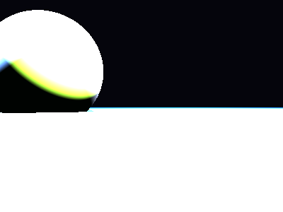

# Propriedades da Simulação


## Valores usados (numéricos)

```json
{
  "sphere": {
    "center": [
      -1.8682829357614175,
      0.6867133269184942,
      0.0
    ],
    "radius": 1.11373795177227
  },
  "plane": {
    "y": -0.1087007056919338,
    "normal": [
      0.0,
      1.0,
      0.0
    ]
  },
  "material_sphere": {
    "ambient": [
      0.0021179495379328728,
      0.13272804021835327,
      0.06560894846916199
    ],
    "diffuse": [
      0.9626047015190125,
      0.784697413444519,
      0.7761569023132324
    ],
    "specular": [
      0.7085445523262024,
      0.5808082222938538,
      0.7079489231109619
    ],
    "shininess": 97.62614317664021
  },
  "material_plane": {
    "ambient": [
      0.045887984335422516,
      0.08365173637866974,
      0.07984304428100586
    ],
    "diffuse": [
      0.22417998313903809,
      0.5356054306030273,
      0.8279533982276917
    ],
    "specular": [
      0.003321611788123846,
      0.23762308061122894,
      0.3123888075351715
    ],
    "shininess": 40.33360808568566
  },
  "lights": [
    {
      "pos": [
        2.884227072878904,
        5.138542422295509,
        -2.2011857053566573
      ],
      "power": [
        167.55197143554688,
        215.6198272705078,
        264.8604736328125
      ]
    },
    {
      "pos": [
        -3.956178752638795,
        3.7927574758568126,
        1.0908864288651925
      ],
      "power": [
        79.32147216796875,
        146.8976593017578,
        240.9044952392578
      ]
    },
    {
      "pos": [
        0.13707531998801414,
        2.609605619735869,
        1.5013106476927511
      ],
      "power": [
        101.40980529785156,
        182.82962036132812,
        45.669227600097656
      ]
    }
  ]
}
```

## O que significa cada valor (explicação para leigos)

- **Esfera - `center`**: posição da esfera no espaço 3D. Ex.: `[x, y, z]` — move a esfera para a esquerda/direita, para cima/baixo ou para frente/trás.
- **Esfera - `radius`**: tamanho da esfera; quanto maior, mais volumosa ela aparece na imagem.
- **Plano - `y`**: altura do piso. Valores menores (mais negativos) colocam o plano mais abaixo; valores próximos de zero posicionam o piso próximo da origem.
- **Material - `ambient`**: cor que representa a iluminação ambiente geral — pequena quantidade que ilumina objetos mesmo quando não recebem luz direta. É um componente suave e difuso.
- **Material - `diffuse`**: cor principal do objeto sob luz direta. Controla a aparência básica (por exemplo, azul, verde, vermelho).
- **Material - `specular`**: cor e intensidade dos brilhos (reflexos pequenos). Valores maiores tornam o brilho mais aparente.
- **Material - `shininess`**: controla o tamanho e nitidez do brilho especular. Valores altos produzem brilhos pequenos e intensos (superfícies muito brilhantes); valores baixos produzem brilhos largos e suaves (superfícies foscas).
- **Luzes - `pos`**: posição da fonte de luz no espaço; deslocar a luz muda a direção das sombras e onde aparecem os brilhos.
- **Luzes - `power`**: intensidade da luz por canal (R,G,B). Valores maiores tornam a cena mais iluminada; diferenças entre R/G/B podem dar tons coloridos à iluminação.

> Dica: experimente aumentar o `power` de uma luz para ver sombras mais claras, ou aumentar `shininess` da esfera para ver reflexos mais nítidos.