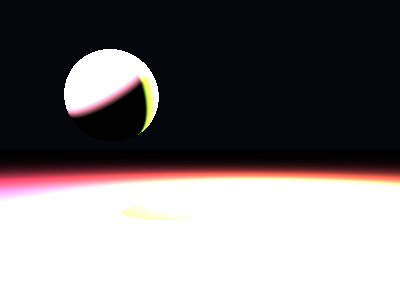

# Propriedades da Simulação


## Valores usados (numéricos)

```json
{
  "sphere": {
    "center": [
      -1.2030014323566092,
      0.7399554780261139,
      0.0
    ],
    "radius": 0.6301038122955513
  },
  "plane": {
    "y": -0.9753150623918387,
    "normal": [
      0.0,
      1.0,
      0.0
    ]
  },
  "material_sphere": {
    "ambient": [
      0.010895642451941967,
      0.05873531848192215,
      0.0355219729244709
    ],
    "diffuse": [
      0.6463454961776733,
      0.8992215991020203,
      0.4680691659450531
    ],
    "specular": [
      0.32432639598846436,
      0.7417454123497009,
      0.29036110639572144
    ],
    "shininess": 115.47382100225693
  },
  "material_plane": {
    "ambient": [
      0.05838480964303017,
      0.008004531264305115,
      0.052754003554582596
    ],
    "diffuse": [
      0.4968433082103729,
      0.20495933294296265,
      0.27619612216949463
    ],
    "specular": [
      0.42241209745407104,
      0.16022075712680817,
      0.1922559291124344
    ],
    "shininess": 29.988619955130947
  },
  "lights": [
    {
      "pos": [
        1.9518240805936413,
        2.0493581515111834,
        -2.7408894147784966
      ],
      "power": [
        247.7555389404297,
        255.1339569091797,
        101.32735443115234
      ]
    },
    {
      "pos": [
        -3.3395880221342886,
        4.668034239486978,
        2.441418831802551
      ],
      "power": [
        293.7546081542969,
        125.98751831054688,
        282.6540222167969
      ]
    }
  ]
}
```

## O que significa cada valor (explicação para leigos)

- **Esfera - `center`**: posição da esfera no espaço 3D. Ex.: `[x, y, z]` — move a esfera para a esquerda/direita, para cima/baixo ou para frente/trás.
- **Esfera - `radius`**: tamanho da esfera; quanto maior, mais volumosa ela aparece na imagem.
- **Plano - `y`**: altura do piso. Valores menores (mais negativos) colocam o plano mais abaixo; valores próximos de zero posicionam o piso próximo da origem.
- **Material - `ambient`**: cor que representa a iluminação ambiente geral — pequena quantidade que ilumina objetos mesmo quando não recebem luz direta. É um componente suave e difuso.
- **Material - `diffuse`**: cor principal do objeto sob luz direta. Controla a aparência básica (por exemplo, azul, verde, vermelho).
- **Material - `specular`**: cor e intensidade dos brilhos (reflexos pequenos). Valores maiores tornam o brilho mais aparente.
- **Material - `shininess`**: controla o tamanho e nitidez do brilho especular. Valores altos produzem brilhos pequenos e intensos (superfícies muito brilhantes); valores baixos produzem brilhos largos e suaves (superfícies foscas).
- **Luzes - `pos`**: posição da fonte de luz no espaço; deslocar a luz muda a direção das sombras e onde aparecem os brilhos.
- **Luzes - `power`**: intensidade da luz por canal (R,G,B). Valores maiores tornam a cena mais iluminada; diferenças entre R/G/B podem dar tons coloridos à iluminação.

> Dica: experimente aumentar o `power` de uma luz para ver sombras mais claras, ou aumentar `shininess` da esfera para ver reflexos mais nítidos.