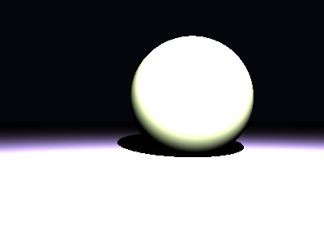

# Propriedades da Simulação


## Valores usados (numéricos)

```json
{
  "sphere": {
    "center": [
      0.48742829713519464,
      0.3894834254576143,
      0.0
    ],
    "radius": 1.0261679159405834
  },
  "plane": {
    "y": -0.5581835198910015,
    "normal": [
      0.0,
      1.0,
      0.0
    ]
  },
  "material_sphere": {
    "ambient": [
      0.054391078650951385,
      0.06853295862674713,
      0.05202546715736389
    ],
    "diffuse": [
      0.4554460942745209,
      0.440307080745697,
      0.24359504878520966
    ],
    "specular": [
      0.4789028465747833,
      0.5469380617141724,
      0.4804569482803345
    ],
    "shininess": 189.3648077659195
  },
  "material_plane": {
    "ambient": [
      0.08976763486862183,
      0.08239477127790451,
      0.08928190171718597
    ],
    "diffuse": [
      0.7437695264816284,
      0.5831432938575745,
      0.6210474371910095
    ],
    "specular": [
      0.014764211140573025,
      0.232587069272995,
      0.4313946068286896
    ],
    "shininess": 37.60140158142659
  },
  "lights": [
    {
      "pos": [
        0.5725403841977821,
        2.388119838971889,
        4.878757556256883
      ],
      "power": [
        149.7102508544922,
        166.8391571044922,
        229.79627990722656
      ]
    }
  ]
}
```

## O que significa cada valor (explicação para leigos)

- **Esfera - `center`**: posição da esfera no espaço 3D. Ex.: `[x, y, z]` — move a esfera para a esquerda/direita, para cima/baixo ou para frente/trás.
- **Esfera - `radius`**: tamanho da esfera; quanto maior, mais volumosa ela aparece na imagem.
- **Plano - `y`**: altura do piso. Valores menores (mais negativos) colocam o plano mais abaixo; valores próximos de zero posicionam o piso próximo da origem.
- **Material - `ambient`**: cor que representa a iluminação ambiente geral — pequena quantidade que ilumina objetos mesmo quando não recebem luz direta. É um componente suave e difuso.
- **Material - `diffuse`**: cor principal do objeto sob luz direta. Controla a aparência básica (por exemplo, azul, verde, vermelho).
- **Material - `specular`**: cor e intensidade dos brilhos (reflexos pequenos). Valores maiores tornam o brilho mais aparente.
- **Material - `shininess`**: controla o tamanho e nitidez do brilho especular. Valores altos produzem brilhos pequenos e intensos (superfícies muito brilhantes); valores baixos produzem brilhos largos e suaves (superfícies foscas).
- **Luzes - `pos`**: posição da fonte de luz no espaço; deslocar a luz muda a direção das sombras e onde aparecem os brilhos.
- **Luzes - `power`**: intensidade da luz por canal (R,G,B). Valores maiores tornam a cena mais iluminada; diferenças entre R/G/B podem dar tons coloridos à iluminação.

> Dica: experimente aumentar o `power` de uma luz para ver sombras mais claras, ou aumentar `shininess` da esfera para ver reflexos mais nítidos.