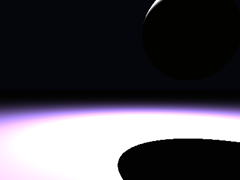

# Propriedades da Simulação


## Valores usados (numéricos)

```json
{
  "sphere": {
    "center": [
      1.5838165229608605,
      1.2854172144813663,
      0.0
    ],
    "radius": 1.0689236710227612
  },
  "plane": {
    "y": -1.2573418920416988,
    "normal": [
      0.0,
      1.0,
      0.0
    ]
  },
  "material_sphere": {
    "ambient": [
      0.11123290657997131,
      0.08256492763757706,
      0.021189304068684578
    ],
    "diffuse": [
      0.528093695640564,
      0.967083215713501,
      0.4283306300640106
    ],
    "specular": [
      0.5151389837265015,
      0.23082378506660461,
      0.0045904433354735374
    ],
    "shininess": 70.97623521218038
  },
  "material_plane": {
    "ambient": [
      0.06836682558059692,
      0.09414786845445633,
      0.0454147607088089
    ],
    "diffuse": [
      0.3865779638290405,
      0.551949143409729,
      0.43871137499809265
    ],
    "specular": [
      0.40753185749053955,
      0.42470303177833557,
      0.2510770857334137
    ],
    "shininess": 40.354253312722555
  },
  "lights": [
    {
      "pos": [
        1.297461795807326,
        5.154612314118383,
        -1.7829510042886882
      ],
      "power": [
        224.27342224121094,
        124.32671356201172,
        284.4433288574219
      ]
    }
  ]
}
```

## O que significa cada valor (explicação para leigos)

- **Esfera - `center`**: posição da esfera no espaço 3D. Ex.: `[x, y, z]` — move a esfera para a esquerda/direita, para cima/baixo ou para frente/trás.
- **Esfera - `radius`**: tamanho da esfera; quanto maior, mais volumosa ela aparece na imagem.
- **Plano - `y`**: altura do piso. Valores menores (mais negativos) colocam o plano mais abaixo; valores próximos de zero posicionam o piso próximo da origem.
- **Material - `ambient`**: cor que representa a iluminação ambiente geral — pequena quantidade que ilumina objetos mesmo quando não recebem luz direta. É um componente suave e difuso.
- **Material - `diffuse`**: cor principal do objeto sob luz direta. Controla a aparência básica (por exemplo, azul, verde, vermelho).
- **Material - `specular`**: cor e intensidade dos brilhos (reflexos pequenos). Valores maiores tornam o brilho mais aparente.
- **Material - `shininess`**: controla o tamanho e nitidez do brilho especular. Valores altos produzem brilhos pequenos e intensos (superfícies muito brilhantes); valores baixos produzem brilhos largos e suaves (superfícies foscas).
- **Luzes - `pos`**: posição da fonte de luz no espaço; deslocar a luz muda a direção das sombras e onde aparecem os brilhos.
- **Luzes - `power`**: intensidade da luz por canal (R,G,B). Valores maiores tornam a cena mais iluminada; diferenças entre R/G/B podem dar tons coloridos à iluminação.

> Dica: experimente aumentar o `power` de uma luz para ver sombras mais claras, ou aumentar `shininess` da esfera para ver reflexos mais nítidos.