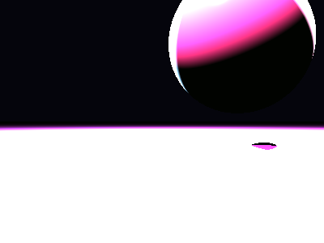

# Propriedades da Simulação


## Valores usados (numéricos)

```json
{
  "sphere": {
    "center": [
      1.2926060369444303,
      1.321891566114985,
      0.0
    ],
    "radius": 1.1818975560877902
  },
  "plane": {
    "y": -0.35026169705788956,
    "normal": [
      0.0,
      1.0,
      0.0
    ]
  },
  "material_sphere": {
    "ambient": [
      0.04147028550505638,
      0.13387086987495422,
      0.02283479832112789
    ],
    "diffuse": [
      0.9964993596076965,
      0.6636215448379517,
      0.7563705444335938
    ],
    "specular": [
      0.30631333589553833,
      0.6077507734298706,
      0.6921402812004089
    ],
    "shininess": 90.27752879440352
  },
  "material_plane": {
    "ambient": [
      0.008430593647062778,
      0.052432045340538025,
      0.036697324365377426
    ],
    "diffuse": [
      0.7690627574920654,
      0.3107770085334778,
      0.7716315984725952
    ],
    "specular": [
      0.46675851941108704,
      0.3520314395427704,
      0.34429824352264404
    ],
    "shininess": 42.81113838273398
  },
  "lights": [
    {
      "pos": [
        -1.3145403532846363,
        2.2820373956453492,
        -2.354796854079616
      ],
      "power": [
        108.79793548583984,
        225.70310974121094,
        248.71678161621094
      ]
    },
    {
      "pos": [
        3.8234107287852552,
        3.622769173701641,
        -0.5197720199770903
      ],
      "power": [
        267.4326477050781,
        251.52395629882812,
        292.6164855957031
      ]
    },
    {
      "pos": [
        -1.7578007240540616,
        6.929349539358656,
        2.866261578238044
      ],
      "power": [
        278.75689697265625,
        81.834716796875,
        191.09693908691406
      ]
    }
  ]
}
```

## O que significa cada valor (explicação para leigos)

- **Esfera - `center`**: posição da esfera no espaço 3D. Ex.: `[x, y, z]` — move a esfera para a esquerda/direita, para cima/baixo ou para frente/trás.
- **Esfera - `radius`**: tamanho da esfera; quanto maior, mais volumosa ela aparece na imagem.
- **Plano - `y`**: altura do piso. Valores menores (mais negativos) colocam o plano mais abaixo; valores próximos de zero posicionam o piso próximo da origem.
- **Material - `ambient`**: cor que representa a iluminação ambiente geral — pequena quantidade que ilumina objetos mesmo quando não recebem luz direta. É um componente suave e difuso.
- **Material - `diffuse`**: cor principal do objeto sob luz direta. Controla a aparência básica (por exemplo, azul, verde, vermelho).
- **Material - `specular`**: cor e intensidade dos brilhos (reflexos pequenos). Valores maiores tornam o brilho mais aparente.
- **Material - `shininess`**: controla o tamanho e nitidez do brilho especular. Valores altos produzem brilhos pequenos e intensos (superfícies muito brilhantes); valores baixos produzem brilhos largos e suaves (superfícies foscas).
- **Luzes - `pos`**: posição da fonte de luz no espaço; deslocar a luz muda a direção das sombras e onde aparecem os brilhos.
- **Luzes - `power`**: intensidade da luz por canal (R,G,B). Valores maiores tornam a cena mais iluminada; diferenças entre R/G/B podem dar tons coloridos à iluminação.

> Dica: experimente aumentar o `power` de uma luz para ver sombras mais claras, ou aumentar `shininess` da esfera para ver reflexos mais nítidos.