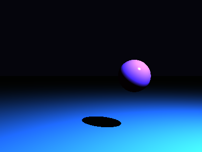

# Propriedades da Simulação


## Valores usados (numéricos)

```json
{
  "sphere": {
    "center": [
      0.9075725263113901,
      0.002354531417072536,
      0.0
    ],
    "radius": 0.4386684542396441
  },
  "plane": {
    "y": -1.546970991749275,
    "normal": [
      0.0,
      1.0,
      0.0
    ]
  },
  "material_sphere": {
    "ambient": [
      0.13869519531726837,
      0.03316805511713028,
      0.08180331438779831
    ],
    "diffuse": [
      0.6263809204101562,
      0.17460262775421143,
      0.6896692514419556
    ],
    "specular": [
      0.8910220265388489,
      0.3564326763153076,
      0.2339300662279129
    ],
    "shininess": 181.32310458850634
  },
  "material_plane": {
    "ambient": [
      0.0725107416510582,
      0.09915710240602493,
      0.042834244668483734
    ],
    "diffuse": [
      0.2242279350757599,
      0.35602766275405884,
      0.5220733880996704
    ],
    "specular": [
      0.1472807675600052,
      0.31052160263061523,
      0.04768747836351395
    ],
    "shininess": 10.260211632709316
  },
  "lights": [
    {
      "pos": [
        3.6584873992571687,
        4.832573139508082,
        3.883040212152059
      ],
      "power": [
        70.2175521850586,
        155.21612548828125,
        256.1215515136719
      ]
    }
  ]
}
```

## O que significa cada valor (explicação para leigos)

- **Esfera - `center`**: posição da esfera no espaço 3D. Ex.: `[x, y, z]` — move a esfera para a esquerda/direita, para cima/baixo ou para frente/trás.
- **Esfera - `radius`**: tamanho da esfera; quanto maior, mais volumosa ela aparece na imagem.
- **Plano - `y`**: altura do piso. Valores menores (mais negativos) colocam o plano mais abaixo; valores próximos de zero posicionam o piso próximo da origem.
- **Material - `ambient`**: cor que representa a iluminação ambiente geral — pequena quantidade que ilumina objetos mesmo quando não recebem luz direta. É um componente suave e difuso.
- **Material - `diffuse`**: cor principal do objeto sob luz direta. Controla a aparência básica (por exemplo, azul, verde, vermelho).
- **Material - `specular`**: cor e intensidade dos brilhos (reflexos pequenos). Valores maiores tornam o brilho mais aparente.
- **Material - `shininess`**: controla o tamanho e nitidez do brilho especular. Valores altos produzem brilhos pequenos e intensos (superfícies muito brilhantes); valores baixos produzem brilhos largos e suaves (superfícies foscas).
- **Luzes - `pos`**: posição da fonte de luz no espaço; deslocar a luz muda a direção das sombras e onde aparecem os brilhos.
- **Luzes - `power`**: intensidade da luz por canal (R,G,B). Valores maiores tornam a cena mais iluminada; diferenças entre R/G/B podem dar tons coloridos à iluminação.

> Dica: experimente aumentar o `power` de uma luz para ver sombras mais claras, ou aumentar `shininess` da esfera para ver reflexos mais nítidos.