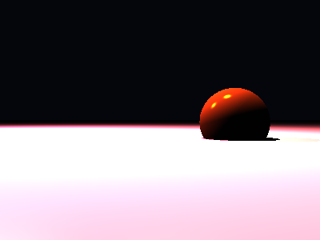

# Propriedades da Simulação


## Valores usados (numéricos)

```json
{
  "sphere": {
    "center": [
      1.275192368763002,
      -0.035288574117823046,
      0.0
    ],
    "radius": 0.586907149550014
  },
  "plane": {
    "y": -0.31680958316225083,
    "normal": [
      0.0,
      1.0,
      0.0
    ]
  },
  "material_sphere": {
    "ambient": [
      0.049325089901685715,
      0.041863441467285156,
      0.06810613721609116
    ],
    "diffuse": [
      0.13878603279590607,
      0.046155013144016266,
      0.019285166636109352
    ],
    "specular": [
      0.5524479150772095,
      0.5954305529594421,
      0.07937255501747131
    ],
    "shininess": 199.66617174779435
  },
  "material_plane": {
    "ambient": [
      0.01249047089368105,
      0.05615387111902237,
      0.08333922922611237
    ],
    "diffuse": [
      0.473016619682312,
      0.28986215591430664,
      0.5954214334487915
    ],
    "specular": [
      0.32592079043388367,
      0.494377464056015,
      0.3972597122192383
    ],
    "shininess": 37.72354844584831
  },
  "lights": [
    {
      "pos": [
        -5.0479653759698575,
        5.696943922264255,
        -2.0897761755154285
      ],
      "power": [
        292.0146789550781,
        166.69247436523438,
        119.58635711669922
      ]
    },
    {
      "pos": [
        0.13910280378277484,
        4.7944913506004685,
        -0.4826670152067347
      ],
      "power": [
        177.9311065673828,
        116.18647766113281,
        52.20701217651367
      ]
    }
  ]
}
```

## O que significa cada valor (explicação para leigos)

- **Esfera - `center`**: posição da esfera no espaço 3D. Ex.: `[x, y, z]` — move a esfera para a esquerda/direita, para cima/baixo ou para frente/trás.
- **Esfera - `radius`**: tamanho da esfera; quanto maior, mais volumosa ela aparece na imagem.
- **Plano - `y`**: altura do piso. Valores menores (mais negativos) colocam o plano mais abaixo; valores próximos de zero posicionam o piso próximo da origem.
- **Material - `ambient`**: cor que representa a iluminação ambiente geral — pequena quantidade que ilumina objetos mesmo quando não recebem luz direta. É um componente suave e difuso.
- **Material - `diffuse`**: cor principal do objeto sob luz direta. Controla a aparência básica (por exemplo, azul, verde, vermelho).
- **Material - `specular`**: cor e intensidade dos brilhos (reflexos pequenos). Valores maiores tornam o brilho mais aparente.
- **Material - `shininess`**: controla o tamanho e nitidez do brilho especular. Valores altos produzem brilhos pequenos e intensos (superfícies muito brilhantes); valores baixos produzem brilhos largos e suaves (superfícies foscas).
- **Luzes - `pos`**: posição da fonte de luz no espaço; deslocar a luz muda a direção das sombras e onde aparecem os brilhos.
- **Luzes - `power`**: intensidade da luz por canal (R,G,B). Valores maiores tornam a cena mais iluminada; diferenças entre R/G/B podem dar tons coloridos à iluminação.

> Dica: experimente aumentar o `power` de uma luz para ver sombras mais claras, ou aumentar `shininess` da esfera para ver reflexos mais nítidos.