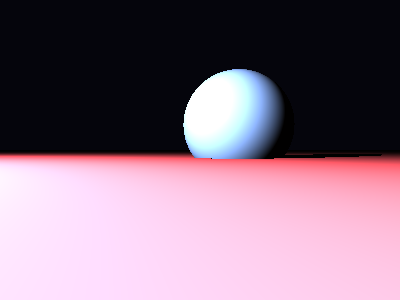

# Propriedades da Simulação


## Valores usados (numéricos)

```json
{
  "sphere": {
    "center": [
      0.5260469164455452,
      0.3457558780841947,
      0.0
    ],
    "radius": 0.7536753584210437
  },
  "plane": {
    "y": -0.10641652059199957,
    "normal": [
      0.0,
      1.0,
      0.0
    ]
  },
  "material_sphere": {
    "ambient": [
      0.07027523964643478,
      0.007429923862218857,
      0.0010168320732191205
    ],
    "diffuse": [
      0.26905491948127747,
      0.8996630311012268,
      0.8387424945831299
    ],
    "specular": [
      0.8371081948280334,
      0.8239574432373047,
      0.01844431273639202
    ],
    "shininess": 87.4391779927279
  },
  "material_plane": {
    "ambient": [
      0.017282066866755486,
      0.051143623888492584,
      0.03318772464990616
    ],
    "diffuse": [
      0.6040723323822021,
      0.5431383848190308,
      0.4154343903064728
    ],
    "specular": [
      0.3666055202484131,
      0.2997031509876251,
      0.23785705864429474
    ],
    "shininess": 49.769236228898144
  },
  "lights": [
    {
      "pos": [
        -4.786961217711841,
        2.868132094941318,
        5.907514732043726
      ],
      "power": [
        257.41748046875,
        98.97569274902344,
        149.45391845703125
      ]
    }
  ]
}
```

## O que significa cada valor (explicação para leigos)

- **Esfera - `center`**: posição da esfera no espaço 3D. Ex.: `[x, y, z]` — move a esfera para a esquerda/direita, para cima/baixo ou para frente/trás.
- **Esfera - `radius`**: tamanho da esfera; quanto maior, mais volumosa ela aparece na imagem.
- **Plano - `y`**: altura do piso. Valores menores (mais negativos) colocam o plano mais abaixo; valores próximos de zero posicionam o piso próximo da origem.
- **Material - `ambient`**: cor que representa a iluminação ambiente geral — pequena quantidade que ilumina objetos mesmo quando não recebem luz direta. É um componente suave e difuso.
- **Material - `diffuse`**: cor principal do objeto sob luz direta. Controla a aparência básica (por exemplo, azul, verde, vermelho).
- **Material - `specular`**: cor e intensidade dos brilhos (reflexos pequenos). Valores maiores tornam o brilho mais aparente.
- **Material - `shininess`**: controla o tamanho e nitidez do brilho especular. Valores altos produzem brilhos pequenos e intensos (superfícies muito brilhantes); valores baixos produzem brilhos largos e suaves (superfícies foscas).
- **Luzes - `pos`**: posição da fonte de luz no espaço; deslocar a luz muda a direção das sombras e onde aparecem os brilhos.
- **Luzes - `power`**: intensidade da luz por canal (R,G,B). Valores maiores tornam a cena mais iluminada; diferenças entre R/G/B podem dar tons coloridos à iluminação.

> Dica: experimente aumentar o `power` de uma luz para ver sombras mais claras, ou aumentar `shininess` da esfera para ver reflexos mais nítidos.