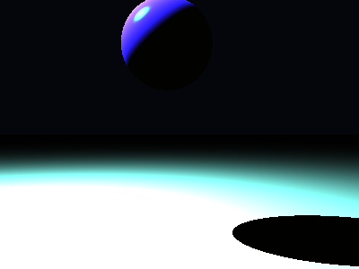

# Propriedades da Simulação


## Valores usados (numéricos)

```json
{
  "sphere": {
    "center": [
      -0.19229913287337563,
      1.3842537641900154,
      0.0
    ],
    "radius": 0.6963947837902333
  },
  "plane": {
    "y": -1.578563239339731,
    "normal": [
      0.0,
      1.0,
      0.0
    ]
  },
  "material_sphere": {
    "ambient": [
      0.10621808469295502,
      0.09392210096120834,
      0.06489573419094086
    ],
    "diffuse": [
      0.096537746489048,
      0.07814398407936096,
      0.6898297667503357
    ],
    "specular": [
      0.03832549601793289,
      0.82110595703125,
      0.06862524896860123
    ],
    "shininess": 84.31804533998584
  },
  "material_plane": {
    "ambient": [
      0.06266003102064133,
      0.04078631475567818,
      0.037094470113515854
    ],
    "diffuse": [
      0.38699761033058167,
      0.8430778980255127,
      0.7508647441864014
    ],
    "specular": [
      0.013820238411426544,
      0.057857684791088104,
      0.1410025954246521
    ],
    "shininess": 5.0965334334245505
  },
  "lights": [
    {
      "pos": [
        -3.515165434694407,
        5.379876215441238,
        0.12621381180549385
      ],
      "power": [
        235.9414520263672,
        210.0548553466797,
        225.9339599609375
      ]
    }
  ]
}
```

## O que significa cada valor (explicação para leigos)

- **Esfera - `center`**: posição da esfera no espaço 3D. Ex.: `[x, y, z]` — move a esfera para a esquerda/direita, para cima/baixo ou para frente/trás.
- **Esfera - `radius`**: tamanho da esfera; quanto maior, mais volumosa ela aparece na imagem.
- **Plano - `y`**: altura do piso. Valores menores (mais negativos) colocam o plano mais abaixo; valores próximos de zero posicionam o piso próximo da origem.
- **Material - `ambient`**: cor que representa a iluminação ambiente geral — pequena quantidade que ilumina objetos mesmo quando não recebem luz direta. É um componente suave e difuso.
- **Material - `diffuse`**: cor principal do objeto sob luz direta. Controla a aparência básica (por exemplo, azul, verde, vermelho).
- **Material - `specular`**: cor e intensidade dos brilhos (reflexos pequenos). Valores maiores tornam o brilho mais aparente.
- **Material - `shininess`**: controla o tamanho e nitidez do brilho especular. Valores altos produzem brilhos pequenos e intensos (superfícies muito brilhantes); valores baixos produzem brilhos largos e suaves (superfícies foscas).
- **Luzes - `pos`**: posição da fonte de luz no espaço; deslocar a luz muda a direção das sombras e onde aparecem os brilhos.
- **Luzes - `power`**: intensidade da luz por canal (R,G,B). Valores maiores tornam a cena mais iluminada; diferenças entre R/G/B podem dar tons coloridos à iluminação.

> Dica: experimente aumentar o `power` de uma luz para ver sombras mais claras, ou aumentar `shininess` da esfera para ver reflexos mais nítidos.