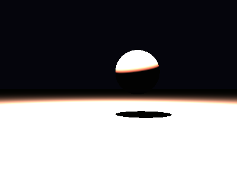

# Propriedades da Simulação


## Valores usados (numéricos)

```json
{
  "sphere": {
    "center": [
      0.4384775204640303,
      0.3876842491494912,
      0.0
    ],
    "radius": 0.513517153804631
  },
  "plane": {
    "y": -0.6109733603387411,
    "normal": [
      0.0,
      1.0,
      0.0
    ]
  },
  "material_sphere": {
    "ambient": [
      0.07900452613830566,
      0.08246709406375885,
      0.09808395802974701
    ],
    "diffuse": [
      0.7854862213134766,
      0.4372131824493408,
      0.6159830093383789
    ],
    "specular": [
      0.7772881388664246,
      0.6797993183135986,
      0.14525236189365387
    ],
    "shininess": 95.22361993256591
  },
  "material_plane": {
    "ambient": [
      0.061803121119737625,
      0.0938534364104271,
      0.02653924562036991
    ],
    "diffuse": [
      0.6786226630210876,
      0.5780634880065918,
      0.8920062184333801
    ],
    "specular": [
      0.4203212857246399,
      0.21955858170986176,
      0.19394078850746155
    ],
    "shininess": 43.473241288787406
  },
  "lights": [
    {
      "pos": [
        -0.09210546082516391,
        3.871670582111429,
        0.7218952468384101
      ],
      "power": [
        229.8150177001953,
        186.9329071044922,
        101.04721069335938
      ]
    }
  ]
}
```

## O que significa cada valor (explicação para leigos)

- **Esfera - `center`**: posição da esfera no espaço 3D. Ex.: `[x, y, z]` — move a esfera para a esquerda/direita, para cima/baixo ou para frente/trás.
- **Esfera - `radius`**: tamanho da esfera; quanto maior, mais volumosa ela aparece na imagem.
- **Plano - `y`**: altura do piso. Valores menores (mais negativos) colocam o plano mais abaixo; valores próximos de zero posicionam o piso próximo da origem.
- **Material - `ambient`**: cor que representa a iluminação ambiente geral — pequena quantidade que ilumina objetos mesmo quando não recebem luz direta. É um componente suave e difuso.
- **Material - `diffuse`**: cor principal do objeto sob luz direta. Controla a aparência básica (por exemplo, azul, verde, vermelho).
- **Material - `specular`**: cor e intensidade dos brilhos (reflexos pequenos). Valores maiores tornam o brilho mais aparente.
- **Material - `shininess`**: controla o tamanho e nitidez do brilho especular. Valores altos produzem brilhos pequenos e intensos (superfícies muito brilhantes); valores baixos produzem brilhos largos e suaves (superfícies foscas).
- **Luzes - `pos`**: posição da fonte de luz no espaço; deslocar a luz muda a direção das sombras e onde aparecem os brilhos.
- **Luzes - `power`**: intensidade da luz por canal (R,G,B). Valores maiores tornam a cena mais iluminada; diferenças entre R/G/B podem dar tons coloridos à iluminação.

> Dica: experimente aumentar o `power` de uma luz para ver sombras mais claras, ou aumentar `shininess` da esfera para ver reflexos mais nítidos.