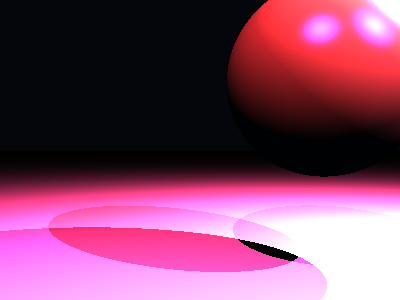

# Propriedades da Simulação


## Valores usados (numéricos)

```json
{
  "sphere": {
    "center": [
      1.6794271049517402,
      0.9452116599296336,
      0.0
    ],
    "radius": 1.3086606564257641
  },
  "plane": {
    "y": -1.7530273475827016,
    "normal": [
      0.0,
      1.0,
      0.0
    ]
  },
  "material_sphere": {
    "ambient": [
      0.03158344700932503,
      0.05590778589248657,
      0.09780603647232056
    ],
    "diffuse": [
      0.19911254942417145,
      0.20876748859882355,
      0.07648535072803497
    ],
    "specular": [
      0.27823424339294434,
      0.42687270045280457,
      0.8903087377548218
    ],
    "shininess": 38.53282162546214
  },
  "material_plane": {
    "ambient": [
      0.03786475956439972,
      0.08464262634515762,
      0.00705002062022686
    ],
    "diffuse": [
      0.7571328282356262,
      0.8576645255088806,
      0.6916665434837341
    ],
    "specular": [
      0.27201271057128906,
      0.03474068269133568,
      0.28239375352859497
    ],
    "shininess": 5.980990828229677
  },
  "lights": [
    {
      "pos": [
        -0.3163236038026369,
        6.24171138824913,
        5.6511461847204085
      ],
      "power": [
        272.6766052246094,
        47.53535842895508,
        144.8480224609375
      ]
    },
    {
      "pos": [
        4.899932385132079,
        4.280574515158211,
        0.5263656654133122
      ],
      "power": [
        285.53302001953125,
        70.57160949707031,
        144.77786254882812
      ]
    },
    {
      "pos": [
        5.383954655834945,
        5.574301042705282,
        4.600151456107039
      ],
      "power": [
        256.88836669921875,
        58.200347900390625,
        199.2198486328125
      ]
    }
  ]
}
```

## O que significa cada valor (explicação para leigos)

- **Esfera - `center`**: posição da esfera no espaço 3D. Ex.: `[x, y, z]` — move a esfera para a esquerda/direita, para cima/baixo ou para frente/trás.
- **Esfera - `radius`**: tamanho da esfera; quanto maior, mais volumosa ela aparece na imagem.
- **Plano - `y`**: altura do piso. Valores menores (mais negativos) colocam o plano mais abaixo; valores próximos de zero posicionam o piso próximo da origem.
- **Material - `ambient`**: cor que representa a iluminação ambiente geral — pequena quantidade que ilumina objetos mesmo quando não recebem luz direta. É um componente suave e difuso.
- **Material - `diffuse`**: cor principal do objeto sob luz direta. Controla a aparência básica (por exemplo, azul, verde, vermelho).
- **Material - `specular`**: cor e intensidade dos brilhos (reflexos pequenos). Valores maiores tornam o brilho mais aparente.
- **Material - `shininess`**: controla o tamanho e nitidez do brilho especular. Valores altos produzem brilhos pequenos e intensos (superfícies muito brilhantes); valores baixos produzem brilhos largos e suaves (superfícies foscas).
- **Luzes - `pos`**: posição da fonte de luz no espaço; deslocar a luz muda a direção das sombras e onde aparecem os brilhos.
- **Luzes - `power`**: intensidade da luz por canal (R,G,B). Valores maiores tornam a cena mais iluminada; diferenças entre R/G/B podem dar tons coloridos à iluminação.

> Dica: experimente aumentar o `power` de uma luz para ver sombras mais claras, ou aumentar `shininess` da esfera para ver reflexos mais nítidos.